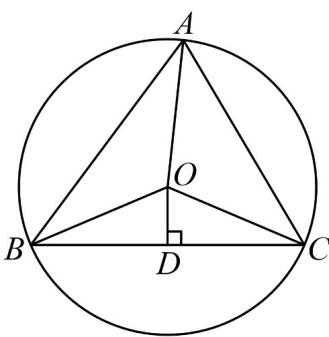

## 知识点 02 利用导数研究函数的单调性

利用导数判断函数单调性的基本方法

设函数 $y = f(x)$ 在区间 $(a, b)$ 内可导，

(1) 如果恒有 $f'(x) > 0$ ，则函数 $f(x)$ 在 $(a, b)$ 内单调递增；

(2) 如果恒有 $f'(x) < 0$ ，则函数 $f(x)$ 在 $(a, b)$ 内单调递减；

(3) 如果恒有 $f'(x) = 0$ ，则函数 $f(x)$ 在 $(a, b)$ 内为常数函数。

注意（1）若函数 $f(x)$ 在区间 $(a,b)$ 内单调递增，则 $f'(x) = 0$ ，若函数 $f(x)$ 在 $(a,b)$ 内单调递减，则 $f'(x) \leq 0$

(2) $f'(x) = 0$ 或 $f'(x) \leq 0$ 恒成立，求参数值的范围的方法——分离参数法： $a \leq g(x)$ 或 $a \leq g(x)$

【即学即练】

1. 设 $f(x) = 2\sin x + \sin (2x), x \in \mathbb{R}$

(1)求函数 $f(x)$ 的单调区间；

(2)若VABC的三个顶点均在半径为2的圆周上，求VABC面积的最大值.

【答案】(1)单调增区间为 $\left(-\frac{\pi}{3} + 2k\pi, \frac{\pi}{3} + 2k\pi\right)(k \in \mathbb{Z})$ ，单调减区间为 $\left(\frac{\pi}{3} + 2k\pi, \frac{5\pi}{3} + 2k\pi\right)(k \in \mathbb{Z})$

(2) $3\sqrt{3}$

【分析】（ $^{1}$ ）通过求导，根据导数的正负来确定函数的单调区间；

(2) 结合三角形面积公式和三角函数的性质求出面积的最大值.

【详解】（1） $f'(x)=2\cos x+2\cos(2x)=2(2\cos^{2}x+\cos x-1)=2(2\cos x-1)(\cos x+1)$ ，令 $f'(x)>0,\quad\cos x>\frac{1}{2}$

$x\in \left(-\frac{\pi}{3} +2k\pi ,\frac{\pi}{3} +2k\pi\right)(k\in Z)$ ， $f(x)$ 的单调增区间为 $\left(-\frac{\pi}{3} +2k\pi ,\frac{\pi}{3} +2k\pi\right)(k\in Z)$

令 $f'(x) < 0$ ， $-1 < \cos x < \frac{1}{2}$ ， $x \in \left( \frac{\pi}{3} + 2k\pi, \frac{5\pi}{3} + 2k\pi \right) (k \in \mathbb{Z})$ ， $f(x)$ 的单调减区间为

$$
\left(\frac {\pi}{3} + 2 k \pi , \frac {5 \pi}{3} + 2 k \pi\right) (k \in Z)
$$

综上所述，函数 $f(x)$ 的单调增区间为 $\left(-\frac{\pi}{3} + 2k\pi, \frac{\pi}{3} + 2k\pi\right)(k \in \mathbb{Z})$ ，单调减区间为 $\left(\frac{\pi}{3} + 2k\pi, \frac{5\pi}{3} + 2k\pi\right)(k \in \mathbb{Z})$ 。

(2) 不妨设 A = x 为锐角，设 O 为圆心，如图所示，

$$
S _ {\triangle A B C} \leq \frac {1}{2} | B C | (| O A | + | O D |) = \frac {1}{2} \cdot 2 \cdot 2 \sin x (2 + 2 \cos x) = 2 f (x) \quad x \in \left(0, \frac {\pi}{2}\right)
$$

由第（1）问可知，函数 $f(x)$ 在 $\left(0, \frac{\pi}{3}\right)$ 上单调递增，在 $\left(\frac{\pi}{3}, \frac{\pi}{2}\right)$ 上单调递减，

所以 $S_{\triangle ABC} \leq 2f(x) \leq 2f\left(\frac{\pi}{3}\right) = 3\sqrt{3}, x \in \left(0, \frac{\pi}{2}\right)$

当VABC为等边三角形时， $S_{\triangle ABC} = 3\sqrt{3}$

综上所述，VABC 面积的最大值为 $3 \sqrt{3}$

2. 已知函数 $f(x) = \ln x - 3x + a (a \in \mathbf{R})$ ，则 $f(x)$ 的单调递增区间为（）A. $\left(0, \frac{1}{3}\right)$ B. $\left(\frac{1}{3}, +\infty\right)$ C. $(0,3)$ D. $(3, +\infty)$

【答案】A

【分析】求出函数 $f(x)$ 的定义域，解不等式 $f'(x) > 0$ ，即可得出函数 $f(x)$ 的增区间。
【详解】函数 $f(x)=\ln x-3x+a(a\in\mathbb{R})$ 的定义域为 $(0,+\infty)$ ，则 $f'(x)=\frac{1}{x}-3=\frac{1-3x}{x}$ 因为 $x > 0$ ，由 $f^{\prime}(x) = \frac{1 - 3x}{x} >0$ ，可得 $0 <   x <   \frac{1}{3}$

故函数 $f(x)$ 的单调递增区间为 $\left(0, \frac{1}{3}\right)$ .

故选：A.
