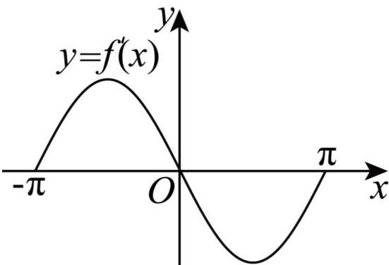

## 题型02 函数图象与导函数图象的关系

【典例1】已知定义在区间 $\left[-\pi, \pi\right]$ 上的函数 $y = f(x)$ 是偶函数，其导函数 $y = f'(x)$ 的大致图像如图·若

$f\left(\frac{\pi}{2}\right)=0$ ，则不等式 $xf(x)<0$ 的解集为\_\_\_\_.

【答案】 $\left(-\frac{\pi}{2},0\right)\cup\left(\frac{\pi}{2},\pi\right]$

【分析】根据导函数图象可得函数 $y = f(x)$ 的单调性，结合单调性分段解不等式即得

【详解】在区间 $\left[-\pi, \pi\right]$ 上的函数 $y = f(x)$ 是偶函数， $f\left(\frac{\pi}{2}\right) = 0$

$$
\therefore f \left(- \frac {\pi}{2}\right) = 0
$$

由图知 $f(x)$ 在 $[-π,0]$ 单调递增， $[0,π]$ 单调递减.

不等式 $xf(x) < 0$

当 $x < 0$ 时， $f(x) > 0 = f\left(-\frac{\pi}{2}\right)$ ，则有 $-\frac{\pi}{2} < x < 0$

当 $x > 0$ 时， $f(x) < 0 = f\left(\frac{\pi}{2}\right)$ ，则有 $\frac{\pi}{2} < x \leq \pi$

所以不等式 $xf(x) < 0$ 的解集为 $\left(-\frac{\pi}{2}, 0\right) \cup \left(\frac{\pi}{2}, \pi\right]$ .

故答案为： $\left(-\frac{\pi}{2},0\right)\cup\left(\frac{\pi}{2},\pi\right]$

## 方法技巧

（1）函数的单调性与其导函数的正负之间的关系：在某个区间 $(a,b)$ 内，若 $f^{\prime}(x) > 0$ ，则 $y = f(x)$ 在 $(a,b)$ 上单调递增；如果 $f^{\prime}(x) <   0$ ，则 $y = f(x)$ 在这个区间上单调递减；若恒有 $f^{\prime}(x) = 0$ ，则 $y = f(x)$ 是常数函数，不具有单调性.

(2) 函数图象变化得越快， $f'(x)$ 的绝对值越大，不是 $f'(x)$ 的值越大。

![[高中/课堂同步/题库/人教A版高中数学同步讲义(2026)/04_选择性必修第二册/第五章一元函数的导数及其应用/讲义/专题5_3_1_函数的单调性_高效培优讲义_数学人教A版2019高二选/_compact/Q00061408.md]]
![[高中/课堂同步/题库/人教A版高中数学同步讲义(2026)/04_选择性必修第二册/第五章一元函数的导数及其应用/讲义/专题5_3_1_函数的单调性_高效培优讲义_数学人教A版2019高二选/_compact/Q00061409.md]]
![[高中/课堂同步/题库/人教A版高中数学同步讲义(2026)/04_选择性必修第二册/第五章一元函数的导数及其应用/讲义/专题5_3_1_函数的单调性_高效培优讲义_数学人教A版2019高二选/_compact/Q00061410.md]]
