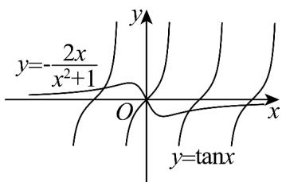

> [!faq]- 《专题5_3_2_函数的极值与最大__小__值_高效培优讲义_数学人教A》官方解析
>
> > [!success]- **【答案】** BCD
>
> > [!note]- **【分析】**
> > 对 A，由 $f\left(\frac{\pi}{2}\right) < f(2\pi)$ ，举反例可判断；对 B，由 $\left|f(x)\right| \leq \frac{1}{x^{2} + 1} \leq 1$ 可判断；对 C，由 $f(0) = 1$ ，结合 $\left|f(x)\right| \leq 1$ ，结合极大值定义判断；对 D，求导，令 $f'(x) = 0$ ，即 $\tan x = -\frac{2x}{x^{2} + 1}$ ，利用图象分析判断得解.
>
> > [!note]- **【解析】**
> > 对于A，由 $f\left(\frac{\pi}{2}\right)=\frac{\cos\frac{\pi}{2}}{\left(\frac{\pi}{2}\right)^{2}+1}=0$ ， $f(2\pi)=\frac{\cos 2\pi}{(2\pi)^{2}+1}=\frac{1}{4\pi^{2}+1}$ ，则 $f\left(\frac{\pi}{2}\right)<f(2\pi)$ ，
> >
> > 所以 $f(x)$ 在 $(0, +\infty)$ 上不是单调递减函数，故A错误；
> >
> > 对于B，因为 $\left|f(x)\right| \leq \frac{1}{x^2 + 1} \leq 1$ ，故B正确；
> >
> > 对于 C，由 $f(0)=1$ ，结合 $\left|f(x)\right|\leq1$ ，在 x=0 附近，均有 $f(x)\leq1$ ，由极大值的定义可得 0 是极大值点，故 C
> >
> > 正确；
> >
> > 对于 D，由 $f'(x)=\frac{-\sin x(x^{2}+1)-2x\cdot\cos x}{(x^{2}+1)^{2}}$ ，令 $f'(x)=0$ ，
> >
> > 所以 $-\sin x(x^2 + 1) - 2x \cdot \cos x = 0$ ，即 $\tan x = -\frac{2x}{x^2 + 1}$ ，
> >
> > 
> >
> > 如图，则 $f'(x) = 0$ 有无数个解，所以函数 $f(x)$ 有无数个极大值点，故D正确.
> >
> > 故选 **BCD**.
