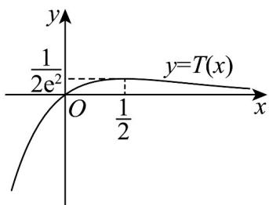

> [!faq]- 《专题5_3_2_函数的极值与最大__小__值_高效培优讲义_数学人教A》官方解析
>
> > [!success]- **【答案】** (1)极大值为 1，无极小值 (2)答案见解析 (3)证明见解析
>
> > [!note]- **【分析】**
> > （1）对 $g(x)$ 求导，得到 $g'(x) = -\ln x$ ，利用导数与函数单调性间的关系，得出 $g(x)$ 的单调区间，
> >
> > 再利用极值的定义，即可求解；
> >
> > （2）根据条件，将问题转化成 $Q(x)=a$ 与 $T(x)=\frac{x}{\mathrm{e}^{2x+1}}$ 的图象有两个交点，对 $T(x)$ 求导，利用导数与函数单调性间的关系，求出 $T(x)$ 的单调区间，进而得其图象，数形结合，即可求解；
> >
> > （3）构造函数 $m(x) = 2x - \ln x + 1$ ，利用导数与函数单调性，可得 $2x > \ln x - 1 > 1$ ，构造函数 $n(x) = \frac{\mathrm{e}^x}{x}$ ，利用
> >
> > 导数与函数单调性，可得 $\frac{\mathrm{e}^{2x + 1}}{2x} >\frac{x}{\ln x - 1}$ ，即可求解
>
> > [!note]- **【解析】**
> > （1）当 $a = 0$ 时， $g(x) = -x\ln x + x, (a \in \mathbb{R})$ ，所以 $g'(x) = -\ln x$
> >
> > 又 $g(x)$ 的定义域为 $(0, +\infty)$
> >
> > 令 $g'(x)=0$ ，得到 x=1 ，由 $g'(x)>0$ ，解得 0<x<1 ，由 $g'(x)<0$ ，解得 x>1 ，
> >
> > 所以当 $a = 0$ 时， $g(x)$ 的增区间为 $(0,1]$ ， $g(x)$ 的减区间为 $(1, +\infty)$ ，
> >
> > 则 $g(x)$ 的极大值为 $g(1)=1$ ，无极小值。
> >
> > (2) 因为 $f(x) = a \cdot \mathrm{e}^{2x + 1} - x (a \in \mathbb{R})$ 有两个零点，即方程 $a \cdot \mathrm{e}^{2x + 1} - x = 0$ 有两个解，
> >
> > 等价于方程 $a=\frac{x}{e^{2x+1}}$ 有两个解；等价于 $Q(x)=a$ 与 $T(x)=\frac{x}{e^{2x+1}}$ 的图象有两个交点，
> >
> > 因为 $T^{\prime}(x) = \frac{x^{\prime}\mathrm{e}^{2x + 1} - x\left(\mathrm{e}^{2x + 1}\right)^{\prime}}{\left(\mathrm{e}^{2x + 1}\right)^{2}} = \frac{1 - 2x}{\mathrm{e}^{2x + 1}}$ ，令 $T^{\prime}(x) = 0$ ，解得 $x = \frac{1}{2}$
> >
> > 当 $x < \frac{1}{2}$ 时， $T'(x) > 0$ ，所以 $T(x) = \frac{x}{\mathrm{e}^{2x + 1}}$ 在区间 $\left(-\infty, \frac{1}{2}\right)$ 上单调递增，
> >
> > 当 $x > \frac{1}{2}$ 时， $T'(x) < 0$ ，所以 $T(x) = \frac{x}{\mathrm{e}^{2x+1}}$ 在区间 $\left(\frac{1}{2}, +\infty\right)$ 上单调递减，
> >
> > <!-- source-part:2 pages:51-91 -->
> >
> > 则当 $x = \frac{1}{2}$ 时， $T(x)$ 取到最大值，且 $T\left(\frac{1}{2}\right) = \frac{1}{2\mathrm{e}^2}$
> >
> > 又当 $x > 0$ 时， $T(x) > 0$ 且 $x \to +\infty$ 时， $T(x) \to 0$
> >
> > 当 $x < 0$ 时， $T(x) < 0$ ，且 $x \to -\infty$ 时， $T(x) \to -\infty$
> >
> > $T(x)=\frac{x}{e^{2x+1}}$ 的图象如图所示，
> >
> > 
> >
> > 所以当 $a > \frac{1}{2\mathrm{e}^2}$ 时， $f(x)$ 有没有零点；
> >
> > 当 $a \leq 0$ 或 $a = \frac{1}{2\mathrm{e}^2}$ 时， $f(x)$ 有1个零点；
> >
> > 当 $0 < a < \frac{1}{2\mathrm{e}^2}$ 时， $f(x)$ 有两个零点。
> >
> > (3) 当 $a > 0, x > \mathrm{e}^2$ 时，要证明不等式 $(\ln x - 1)f(x) > g(x)$ 恒成立，
> >
> > 即证明 $\left(\ln x-1\right)\left(a\cdot\mathrm{e}^{2x+1}-x\right)>2a\cdot x^{2}-x\ln x+x$ 恒成立；
> >
> > 令 $m(x)=2x-\ln x+1$ ，∴ $m'(x)=2-\frac{1}{x}=\frac{2x-1}{x}$
> >
> > 当 $x > \frac{1}{2}$ ， $\therefore m'(x) = \frac{2x - 1}{x} > 0$ ，即 $m(x)$ 在 $\left(\frac{1}{2}, +\infty\right)$ 上单调递增，
> >
> > $m(x) > m\left(\frac{1}{2}\right) = 1 + \ln 2 + 1 > 0, m(x) = 2x - \ln x + 1 > 0$ 即 $2x > \ln x - 1 > 1$
> >
> > $$
> > n (x) = \frac {\mathrm{e} ^ {x}}{x}, \quad n ^ {\prime} (x) = \frac {x \cdot \mathrm{e} ^ {x} - \mathrm{e} ^ {x}}{x ^ {2}} = \frac {(x - 1) \mathrm{e} ^ {x}}{x ^ {2}}
> > $$
> >
> > $\because x>1,\therefore n^{\prime}(x)=\frac{(x-1)e^{x}}{x^{2}}>0$ ，即 $n(x)$ 在 $(1,+\infty)$ 上单调递增，
> >
> > $$
> > \therefore n (2 x) > n (\ln x - 1), \quad \frac {\mathrm{e} ^ {2 x}}{2 x} > \frac {\mathrm{e} ^ {\ln x - 1}}{\ln x - 1}, \quad \frac {\mathrm{e} ^ {2 x + 1}}{2 x} > \frac {x}{\ln x - 1}
> > $$
> >
> > $$
> > \therefore a > 0, x > \mathrm{e} ^ {2}, \therefore a \cdot \mathrm{e} ^ {2 x + 1} > \frac {2 a \cdot x ^ {2}}{\ln x - 1}
> > $$
> >
> > $a\cdot \mathrm{e}^{2x + 1} - x > \frac{2a\cdot x^2}{\ln x - 1} -x$ ， $\left(\ln x - 1\right)\left(a\cdot \mathrm{e}^{2x + 1} - x\right) > 2a\cdot x^2 -x\ln x + x$ 成立，
> >
> > 即当 $a > 0, x > \mathrm{e}^2$ 时，不等式 $(\ln x - 1)f(x) > g(x)$ 恒成立。
