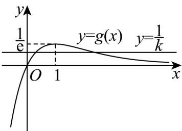

> [!faq]- 《专题5_3_2_函数的极值与最大__小__值_高效培优讲义_数学人教A》官方解析
>
> > [!success]- **【答案】** B
>
> > [!note]- **【分析】**
> > 求出函数 $f(x)$ 的导数 $f'(x)$ ，由 $f'(x)=0$ ，得 $\frac{1}{k}=\frac{x}{e^{x}}$ ，利用导数确定方程根的个数，进而求出极值
> > 点个数.
>
> > [!note]- **【解析】**
> > 函数 $f(x) = -k^{2}x^{2} - 2k(x - 2)e^{x} + e^{2x}(k > 0)$ ，求导得 $f'(x) = -2k^{2}x - 2k(x - 1)e^{x} + 2e^{2x}$ $= 2(e^{x} + k)(e^{x} - kx)$ ，由 $f'(x) = 0$ ，得 $\frac{1}{k} = \frac{x}{e^{x}}$ ，令函数 $g(x) = \frac{x}{e^{x}}$ ，求导得 $g'(x) = \frac{1 - x}{e^{x}}$ ，
> >
> > 当 x<1 时， $g'(x)>0$ ；当 x>1 时， $g'(x)<0$ ，函数 $g(x)$ 在 $(-∞,1)$ 上递增，在 $(1,+∞)$ 上递减， $g(x)_{\max}=g(1)=\frac{1}{e}$ ，函数 $g(x)$ 的大致图象如图，
> >
> > 
> >
> > 由 $\mathrm{e} < k$ ，得 $0 < \frac{1}{k} < \frac{1}{\mathrm{e}}$ ，方程 $\frac{1}{k} = \frac{x}{\mathrm{e}^x}$ 必有两个根，即函数 $h(x) = \mathrm{e}^{x} - kx$ 必有两个零点 $x_{1}, x_{2}, x_{1} < x_{2}$ 当 $x < x_{1}$ 或 $x > x_{2}$ 时， $h(x) > 0$ ， $f'(x) > 0$ ；当 $x_{1} < x < x_{2}$ 时， $h(x) < 0$ ， $f'(x) < 0$
> >
> > 因此函数 $f(x)$ 恰有 2 个极值点，B 正确.
> >
> > 故选 **B**
