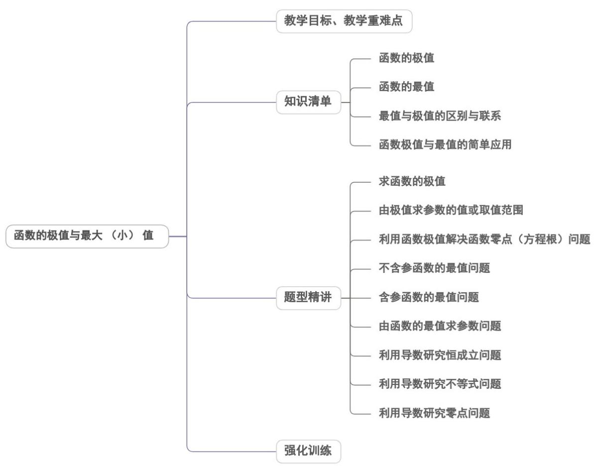

## 专题5.3.2 函数的极值与最大（小）值

## 内容概览

## 教学目标、教学重难点

<table><tr><td>教学目标</td><td>1.理解函数极值最值的概念,了解其与函数极值的区别与联系。2.掌握函数极值的判定及求法。3.掌握函数在某一点取得极值的条件。4.能根据极值点与极值的情况求参数范围。5.会利用极值解决方程的根与函数图象的交点个数问题。6.会求某闭区间上函数的最值</td></tr></table>

<table><tr><td></td><td>7.理解极值与最值的关系,并能利用其求参数的范围</td></tr><tr><td>教学重难点</td><td>1.重点求会求函数的极值、极值点;能解决与极值点相关的参数问题;并能利用极值解决方程的根与函数的交点问题..2.难点求函数在局部区间的最大(小)值,能利用函数的导数解决恒成立问题与存在性问题;</td></tr></table>
