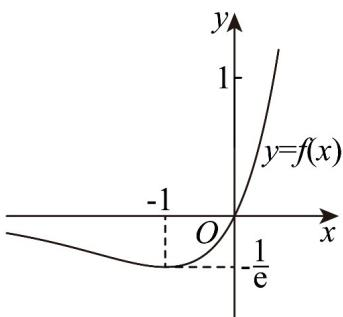
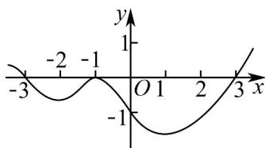

> [!faq]- 《专题5_3_2_函数的极值与最大__小__值_高效培优讲义_数学人教A》官方解析
>
> > [!success]- **【答案】** D
>
> > [!note]- **【分析】**
> > 求导，判断函数 $f(x)$ 的单调性、极值，作出 $f(x)$ 的图象，由 $F(x)=0$ ，得 $f(x)=1$ 或 $f(x)=a$ ，结合 $f(x)$ 图象得解.
>
> > [!note]- **【解析】**
> > 由 $f(x)=xe^{x}$ ，则 $f'(x)=(x+1)e^{x}$ ，当 x<-1 时， $f'(x)<0$ ，即 $f(x)$ 在 $(-∞,-1)$ 上单调递减，
> >
> > 当 x> -1 时， $f'(x)>0$ ，即 $f(x)$ 在 $(-1,+∞)$ 上单调递增，
> >
> > 所以 $f(x) \quad f(-1)=-\frac{1}{e}$ ，又 x<0， $f(x)<0$ ，x>0, $f(x)>0$ ，
> >
> > 
> >
> > $$
> > \text {令} F (x) = [ f (x) ] ^ {2} - (a + 1) f (x) + a = 0 \quad , \text {得} [ f (x) - 1 ] [ f (x) - a ] = 0
> > $$
> >
> > $\therefore f(x) = 1$ 或 $f(x) = a$
> >
> > 当 $f(x) = 1$ 时，仅存在唯一的 $x$ 满足；因此， $f(x) = a$ 必须有两个根，
> >
> > 结合 $f(x)$ 的图象，可得 $-\frac{1}{\mathrm{e}} < a < 0$
> >
> > 所以实数 a 的取值范围为 $\left(-\frac{1}{e},0\right)$ .
> >
> > 故选：D.
> >
> > 12. 函数 $y = f(x)$ 的导函数的图象如图所示，则下列说法正确的是（）
> >
> > 
> >
> > A. 3 是 $f(x)$ 的极小值
> >
> > B. $f(x)$ 的极值点有3个
> >
> > C. $f(x)$ 在区间 $(- \infty, 3)$ 上单调递减
> >
> > D．曲线 $y = f(x)$ 在 x = 1 处的切线斜率小于零
> >
> > 【答案】D
> >
> > 【分析】根据导数的几何意义与极值、极值点的定义分别判断各选项.
> >
> > 【详解】A 选项：由导函数图象可知3是函数 $f(x)$ 的极小值点，
> >
> > $f(x)$ 的极小值为 $f(3)$ ，A 选项错误；
> >
> > B 选项： $f(x)$ 的极值点有两个，极大值点 -3，极小值点 3，B 选项错误；
> >
> > C 选项：由导函数图象可知，当 $x \in (-\infty, -3)$ 时， $f'(x) > 0$ ，函数单调递增，
> >
> > 当 $x \in (-3, 3)$ 时， $f'(x) < 0$ ，函数单调递减，C选项错误；
> >
> > D 选项：由图象可知 $f'(1) < 0$ ，即函数 $f(x)$ 在 $x = 1$ 处切线斜率小于零，D 选项正确.
> >
> > 故选 **D**.
