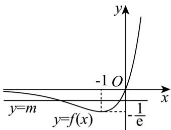
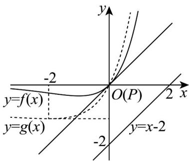

> [!faq]- 《专题5_3_2_函数的极值与最大__小__值_高效培优讲义_数学人教A》官方解析
>
> > [!success]- **【答案】** (1)答案见解析 (2)证明见解析 (3) $\sqrt{2}$
>
> > [!note]- **【分析】**
> > （1）对 $f(x)$ 求导，作出 $f(x)$ 的图象，利用数形结合思想可解；
> >
> > (2) 注意 $\ln \sqrt{2} = \frac{\ln 2}{2}$ , $\frac{4 - \ln 4}{\mathrm{e}^2} = \frac{\ln \frac{\mathrm{e}^2}{2}}{\frac{\mathrm{e}^2}{2}}$ ，构造函数 $g(x) = \frac{\ln x}{x}$ ，利用单调性即可判断与 $4 - \ln 4$ 的大小，结合 $f(x)$ 的单调性即可判断；
> >
> > (3) 根据条件，过点 $P$ 的切线与 $y = x - 2$ 平行时距离的最小，利用导数几何意义求出切点即可.
>
> > [!note]- **【解析】**
> > （1）因为 $f(x)=xe^{x}$ ，则 $f'(x)=(x+1)e^{x}$ ，
> >
> > 当 $x < -1$ 时， $f'(x) < 0$ ，当 $x > -1$ 时， $f'(x) > 0$
> >
> > 则 $f(x)$ 在 $(- \infty, -1)$ 上单调递减，在 $(-1, +\infty)$ 上单调递增，
> >
> > 故 $x = -1$ 时， $f(x)$ 取得极小值 $f(-1) = -\frac{1}{\mathrm{e}}$
> >
> > 且当 $x \to -\infty$ 时， $f(x) \to 0$ ，当 $x \to +\infty$ 时， $f(x) \to +\infty$ ， $f(x) = x e^x$ 的图象如图：
> >
> > 
> >
> > 因方程 $f(x) = m$ 的根个数即函数 $f(x) = x\mathrm{e}^{x}$ 图象与直线 $y = m$ 的交点个数.由图知，
> >
> > 当 $-\frac{1}{\mathrm{e}} < m < 0$ 时， $y = m$ 与 $f(x) = x\mathrm{e}^x$ 有两个交点，此时方程 $f(x) = m$ 有2个实根；
> >
> > 当 $m = 0$ 和 $m = -\frac{1}{\mathrm{e}}$ 时， $y = m$ 与 $f(x) = x\mathrm{e}^x$ 只有一个交点，此时方程 $f(x) = m$ 有1个实根；
> >
> > 当 $m < -\frac{1}{\mathrm{e}}$ 时， $y = m$ 与 $f(x) = x\mathrm{e}^x$ 没有交点，此时方程 $f(x) = m$ 没有实根。
> >
> > (2) 由 $\ln \sqrt{2} = \frac{\ln 2}{2} = \frac{\ln 4}{4}$ , $\frac{4 - \ln 4}{\mathrm{e}^2} = \frac{2(2 - \ln 2)}{\mathrm{e}^2} = \frac{\ln \frac{\mathrm{e}^2}{2}}{\frac{\mathrm{e}^2}{2}}$ ,
> >
> > 故可构造函数 $g(x) = \frac{\ln x}{x}$ ，则 $g'(x) = \frac{1 - \ln x}{x^2}$ ，
> >
> > 当 $0 < x < \mathrm{e}$ 时， $g'(x) > 0$ ，当 $x > \mathrm{e}$ 时， $g'(x) < 0$ 。
> >
> > 故 $g(x) = \frac{\ln x}{x}$ 上 $(0, e)$ 上为增函数，在 $(e, +\infty)$ 上为减函数
> >
> > ∴由 $e < \frac{e^{2}}{2} < 4$ ，可得 $0 < g(2) = g(4) < g(\frac{e^{2}}{2})$
> >
> > ∴由 $f(x)$ 在 $(-1,+\infty)$ 上为增函数，可得 $f(g(2))<f(g(\frac{\mathrm{e}^{2}}{2}))$
> >
> > 故得 $f\left(\ln\sqrt{2}\right)<f\left(\frac{4-\ln4}{e^{2}}\right)$ .
> >
> > (3) 设点 $P(x_0, y_0)$ ，易知当曲线在 $P(x_0, y_0)$ 处的切线与 $y = x - 2$ 平行时，
> >
> > 点 $P(x_0, y_0)$ 到直线 $y = x - 2$ 的距离最小，
> >
> > 又 $f'(x)=(x+1)\mathrm{e}^{x}$ ，则有 $f'(x_{0})=(x_{0}+1)\mathrm{e}^{x_{0}}=1$ .
> >
> > 令 $g(x)=(x+1)e^{x}-1$ ，则 $g'(x)=(x+2)e^{x}$
> >
> > 易知，当 $x < -2$ 时， $g'(x) < 0$ ，当 $x > -2$ 时， $g'(x) > 0$
> >
> > 所以 $g(x)$ 在区间 $(-∞,-2)$ 上单调递减，在区间 $(-2,+∞)$ 上单调递增
> >
> > 且 $x < -1$ 时， $g(x) < 0$ ，又 $g(0) = \mathrm{e}^0 - 1 = 0$ ，所以 $x_0 = 0$ ，则 $f(0) = 0$
> >
> > 故 $P(0,0)$ 到直线 $y = x - 2$ 的距离即点 $P$ 到直线 $y = x - 2$ 距离的最小值，为 $d = \frac{2}{\sqrt{2}} = \sqrt{2}$
> >
> > 
