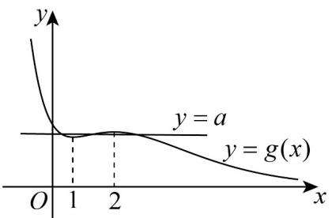

## 知识点 04 函数极值与最值的简单应用

1、不等式恒成立，求参数范围问题。

一些含参不等式，一般形如 $f(x,m) > 0$

若能分离参数，即可化为： $m > g(x)$ （或 $m < g(x)$ ）的形式．若其恒成立，则可转化成 $m - g(x)_{\max}$ （或 $m\leq g(x)_{\max}$ ）从而转化为求函数 $g(x)$ 的最值问题．

若不能分离参数，就是求含参函数 $f(x,m)$ 的最小值 $f(x,m)_{\min}$ ，使 $f(x,m)_{\min} = 0$ 所以仍为求函数 $g(x)$ 的最

值问题，只是再求最值时可能需要对参数进行分类讨论。

2、证不等式问题.

当所要证的不等式中只含一个未知数时，一般形式为 $f(x) > g(x)$ 则可化为 $f(x) - g(x) > 0$ 一般设 $F(x) = f(x) - g(x)$ 然后求 $F(x)$ 的最小值 $F(x)_{\min}$ 证 $F(x)_{\min} > 0$ 即可．所以证不等式问题也可转化为求函数，

最小值问题.

3、两曲线的交点个数问题（方程解的个数问题）

一般可转化为方程 $f(x) = g(x)$ 的问题，即 $f(x) - g(x) = 0$ 的解的个数问题，

我们可以设 $F(x) = f(x) - g(x)$ ，然后求出 $F(x)$ 的极大值、极小值，根据解的个数讨论极大值、极小值与0的

大小关系即可．所以此类问题可转化为求函数的极值问题．

【即学即练】

1. 已知函数 $f(x) = x(x - 1) \ln x - \frac{1}{2} x^2$

(1)证明： $\frac{f(x)}{x}+\frac{1}{2}x\quad0$ ;

(2)判断 $f'(x)$ 的零点个数.

【答案】(1)证明见解析

(2)2

【分析】（1）令 $h(x) = \frac{f(x)}{x} +\frac{1}{2} x = (x - 1)\ln x$ ，利用导数求出 $h(x)$ 的单调区间，求出 $h(x)$ 的最小值证明；

(2) 求出 $f'(x)$ ，令 $g(x) = f'(x)$ ，求出 $g'(x)$ 的单调区间，根据零点存在定理得到 $g'(x)$ 的零点，求出 $g(x)$

的单调区间，求出 $g(x)_{\min}$ ，求出 $f'(x)$ 的零点个数.

【详解】（1）令 $h(x) = \frac{f(x)}{x} +\frac{1}{2} x = (x - 1)\ln x$

则只需证明 $h(x)$ 0 ，则 $h'(x)=\ln x-\frac{1}{x}+1$

易知 $h^{\prime}(x)$ 在区间 $(0, + \infty)$ 单调递增，

又 $h'(1)=0$ ，所以当 $x\in(0,1)$ 时， $h'(x)<0$ ，当 $x\in(1,+\infty)$ 时， $h'(x)>0$ ，

则 $h(x)$ 在区间 $(0,1)$ 上单调递减，在区间 $(1, +\infty)$ 上单调递增，

所以 $h(x)$ $h(1)=0$ ;

(2) $f'(x) = (2x - 1)\ln x - 1 (x > 0)$

令 $g(x) = f'(x)$ ，则 $g'(x) = 2\ln x - \frac{1}{x} + 2$

易知 $g'(x)$ 在区间 $(0, +\infty)$ 单调递增，

又 $g^{\prime}\left(\frac{1}{2}\right) = -2\ln 2\left\langle 0,g^{\prime}(1) = 1\right\rangle 0$

所以 $\exists x_0\in \left(\frac{1}{2},1\right)$ 使得 $g^{\prime}\big(x_{0}\big) = 0$

即 $\ln x_0 = \frac{1}{2x_0} - 1$ ，当 $x\in (0,x_0)$ 时， $g^{\prime}(x) <   0$ ，当 $x\in (x_0, + \infty)$ 时， $g^{\prime}(x) > 0$

所以 $g(x)$ 在区间 $(0, x_{0})$ 上单调递减，在区间 $(x_{0}, +\infty)$ 内单调递增，

所以 $g(x)_{\min}=g(x_{0})=(2x_{0}-1)\ln x_{0}-1=1-2x_{0}-\frac{1}{2x_{0}},x_{0}\in\left(\frac{1}{2},1\right)$

又由对勾函数的单调性可知 $y = x + \frac{1}{x}$ 在区间(1,2)上单调递增，

所以 $g(x)_{\min}=1-2x_{0}-\frac{1}{2x_{0}}<-1<0$

$$
g \left(\frac {1}{1 0}\right) = \frac {4}{5} \ln 1 0 - 1 > \frac {4}{5} \mathrm{ln} \mathrm{e} ^ {2} - 1 > 0, g (2) = 3 \ln 2 - 1 = \ln \frac {8}{\mathrm{e}} > 0
$$

所以 $g(x)$ 在区间 $\left(\frac{1}{10}, x_{0}\right)$ 和 $(x_{0}, 2)$ 上各有一个零点．故 $f'(x)$ 的零点个数为 2．

2. 已知函数 $f(x) = x^{2} - x + 1 - ae^{x}$

(1)当 $a = -1$ ，求 $f(x)$ 的单调区间；

(2)若 $f(x)$ 有三个零点，求 $a$ 的取值范围.

【答案】(1)单调递减区间为 $(-∞,0)$ ，单调递增区间为 $(0,+∞)$

(2) $\left(\frac{1}{e},\frac{3}{e^{2}}\right)$

【分析】（1）利用导数研究函数的单调性即可得到答案；

(2) 由 $f(x) = 0$ ，把函数 $f(x)$ 的零点个数问题等价转化为，两个函数的交点个数问题，令 $g(x) = \frac{x^2 - x + 1}{\mathrm{e}^x}$

利用导数法研究函数 $g(x)$ 的单调性和极值，进而结合函数图象得到实数 $a$ 的取值范围。

【详解】（1）将 $a = -1$ 代入可得 $f(x) = x^2 - x + 1 + \mathrm{e}^x$ ，其定义域为 $\mathbf{R}$ ，则 $f'(x) = 2x - 1 + \mathrm{e}^x$ .

$y = 2x - 1$ 和 $y = \mathrm{e}^x$ 都在 $\mathbf{R}$ 上增函数，所以 $f^{\prime}(x) = 2x - 1 + \mathrm{e}^{x}$ 在 $\mathbf{R}$ 上单调递增且 $f^{\prime}(0) = 0$

因此，当 $x \in (-\infty, 0)$ 时， $f'(x) < 0$ ，函数 $f(x)$ 为单调递减；

当 $x \in (0, +\infty)$ 时， $f'(x) > 0$ ，函数 $f(x)$ 为单调递增；

综上所述，函数 $f(x)$ 的单调递减区间为 $(- \infty, 0)$ ，单调递增区间为 $(0, +\infty)$ 。

(2) (2) 由 $f(x) = 0$ 得， $a = \frac{x^2 - x + 1}{\mathrm{e}^x}$ ，令 $g(x) = \frac{x^2 - x + 1}{\mathrm{e}^x}$ ，

$$
\text {则} g ^ {\prime} (x) = \frac {(2 x - 1) \mathrm{e} ^ {x} - (x ^ {2} - x + 1) \mathrm{e} ^ {x}}{\mathrm{e} ^ {2 x}} = \frac {- (x ^ {2} - 3 x + 2)}{\mathrm{e} ^ {x}} = \frac {- (x - 1) (x - 2)}{\mathrm{e} ^ {x}}
$$

$x\in(-\infty,1)$ 时， $g'(x)<0,g(x)$ 单调递减；

$x\in(1,2)$ 时， $g'(x)>0,g(x)$ 单调递增；

$x\in(2,+\infty)$ 时， $g'(x)<0,g(x)$ 单调递减；

由单调性可知，当 $x \to -\infty$ 时， $g(x) \to +\infty$ ；

当 $x \to +\infty$ 时， $g(x) \to 0$ ；

当 x=1 时，取得极小值，即 $g(1)=\frac{1}{e}$ ;

当 x=2 时，取得极大值，即 $g(2)=\frac{3}{\mathrm{e}^{2}}$ .

所以 $y = g(x)$ 和 $y = a$ 的大致图象如下：

综上所述，若 $f(x)$ 有三个零点，则 $a$ 的取值范围为 $\left(\frac{1}{\mathrm{e}},\frac{3}{\mathrm{e}^2}\right)$
