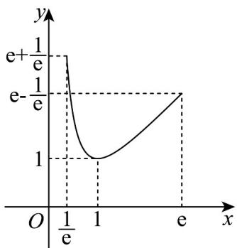

## 题型01 求函数的极值

【典例1】设函数 $f(x) = -x^{2} + ax + \ln x (a \in \mathbf{R})$ .

(1)若 $a = 1$ ，求函数 $f(x)$ 的极值点；

(2)设函数 $f(x)$ 在 $\left[\frac{1}{\mathrm{e}},\mathrm{e}\right]$ 上有两个零点，求实数 $a$ 的取值范围.（其中 $\mathbf{e}$ 是自然对数的底数）.

【答案】(1)函数 $f(x)$ 的极大值点为 x=1 ，函数 $f(x)$ 没有极小值点；

(2) $1 < a \leq e - \frac{1}{e}$ .

【分析】（1）由题可得 $f(x)$ 单调性，据此可得 $f(x)$ 的极值点；

(2) 由 $f(x) = 0$ ，可得 $a = x - \frac{\ln x}{x}$ . 令 $g(x) = x - \frac{\ln x}{x}, x \in \left[\frac{1}{\mathrm{e}}, \mathrm{e}\right]$ ，由导数知识可得

$g(x)$ 大致图像，随后由 $g(x)$ 图象与 y = a 有 2 个交点可得答案.

【详解】（1） $f(x)=-x^{2}+x+\ln x,x>0$

则 $f^{\prime}(x) = -2x + 1 + \frac{1}{x} = \frac{-2x^{2} + x + 1}{x} = \frac{-(x - 1)(2x + 1)}{x}$

$$
f ^ {\prime} (x) > 0 \Rightarrow 0 <   x <   1; f ^ {\prime} (x) \langle 0 \Rightarrow x \rangle 1
$$

则 $f(x)$ 在 $(0,1)$ 上单调递增，在 $(1,+\infty)$ 上单调递减.

则 $f(x)$ 在 x=1 时取极大值 $f(1)=0$ ；

所以函数 $f(x)$ 的极大值点为 $x = 1$ ，函数 $f(x)$ 没有极小值点；

(2) 令 $f(x) = -x^2 + ax + \ln x = 0 \Rightarrow ax = x^2 - \ln x$ ，因 $x > 0$ ，

则 $a = x - \frac{\ln x}{x}$ 令 $g(x) = x - \frac{\ln x}{x}, x \in \left[\frac{1}{\mathrm{e}}, \mathrm{e}\right]$ ，则 $g'(x) = 1 - \frac{1 - \ln x}{x^2} = \frac{x^2 - 1 + \ln x}{x^2}$ .

$$
h (x) = x ^ {2} - 1 + \ln x, x \in \left[ \frac {1}{\mathrm{e}}, \mathrm{e} \right] \text {, 则} h ^ {\prime} (x) = 2 x + \frac {1}{x} > 0
$$

从而 $h(x)$ 在 $\left[\frac{1}{\mathrm{e}},\mathrm{e}\right]$ 上递增，又注意到 $h(1) = 0$

$$
h (x) > 0 \Rightarrow x \in (1, \mathrm{e} ]; h (x) <   0 \Rightarrow x \in \left[ \frac {1}{\mathrm{e}}, 1\right),
$$

$$
g ^ {\prime} (x) > 0 \Rightarrow x \in (1, \mathrm{e} ]; g ^ {\prime} (x) <   0 \Rightarrow x \in \left[ \frac {1}{\mathrm{e}}, 1\right)
$$

从而 $g(x)$ 在 $\left[\frac{1}{\mathrm{e}}, 1\right]$ 上单调递减，在 $(1, \mathrm{e}]$ 上单调递增，

又 $g\left(\frac{1}{e}\right)=e+\frac{1}{e}$ ， $g(e)=e-\frac{1}{e}$ ， $g(1)=1$ ，可画出 $g(x)$ 大致图象.

又 $f(x)$ 在 $\left[\frac{1}{\mathrm{e}},\mathrm{e}\right]$ 上有两个零点等价于 $g(x)$ 图象与 $y = a$ 有2个交点.

则由图可得 $1 < a \leq e - \frac{1}{e}$ .

## 方法技巧

函数极值和极值点的求解步骤

(1) 确定函数的定义域.

(2) 求方程 $f'(x)=0$ 的根.

(3) 用方程 $f'(x) = 0$ 的根顺次将函数的定义域分成若干个小开区间，并列成表格.

（4）由 $f^{\prime}(x)$ 在方程 $f^{\prime}(x) = 0$ 的根左右的符号，来判断 $f(x)$ 在这个根处取极值的情况.

![[高中/课堂同步/题库/人教A版高中数学同步讲义(2026)/04_选择性必修第二册/第五章一元函数的导数及其应用/讲义/专题5_3_2_函数的极值与最大__小__值_高效培优讲义_数学人教A/_compact/Q00061435.md]]
![[高中/课堂同步/题库/人教A版高中数学同步讲义(2026)/04_选择性必修第二册/第五章一元函数的导数及其应用/讲义/专题5_3_2_函数的极值与最大__小__值_高效培优讲义_数学人教A/_compact/Q00061436.md]]
![[高中/课堂同步/题库/人教A版高中数学同步讲义(2026)/04_选择性必修第二册/第五章一元函数的导数及其应用/讲义/专题5_3_2_函数的极值与最大__小__值_高效培优讲义_数学人教A/_compact/Q00061437.md]]
