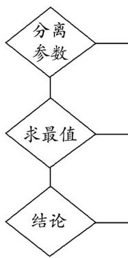

## 题型 07 利用导数研究恒成立问题

【典例1】若 $x \in \left(0, \frac{1}{\mathrm{e}}\right)$ 时， $\mathrm{e}^{x - 1} > a \ln x - x + \mathrm{e} > \mathrm{e} - 1$ ，则 $a$ 的取值范围是（）A. $(- \infty, -\mathrm{e}]$ B. $\left(-\infty, -\frac{1}{\mathrm{e}}\right]$ C. $\left(-\mathrm{e}, -\frac{1}{\mathrm{e}}\right]$ D. $\left[-\frac{1}{\mathrm{e}}, 0\right)$

【答案】B

【分析】由题可得 $\mathrm{e}^{a\ln x - x + 1} - (a\ln x - x + 1) > \mathrm{e} - 1$ ，令 $a\ln x - x + 1 = t$ ，由已知可得 $t > 0$ ，设 $f(t) = \mathrm{e}^t -t$ ，利用

导数可得函数 $f(t)$ 在 $(0, +\infty)$ 上s单调递增，且有 $f(t) > f(1)$ ，从而得 $t > 1$ ， $a < \frac{x}{\ln x}$ ，令 $g(x) = \frac{x}{\ln x}$ ，

$x \in \left(0, \frac{1}{\mathrm{e}}\right)$ ，利用导数求出函数 $g(x)$ 的取值范围，即可得答案.

【详解】 $\frac{x^a}{\mathrm{e}^{x - 1}} >a\ln x - x + \mathrm{e}$ 即 $\mathrm{e}^{a\ln x - x + 1} - (a\ln x - x + 1) > \mathrm{e} - 1.$

设 $a \ln x - x + 1 = t$ ，则 $e^{t} - t > e - 1$ .

由 $a\ln x - x + \mathrm{e} > \mathrm{e} - 1$ ，得 $t > 0$

设 $f(t) = \mathrm{e}^{t} - t$ ，则 $f'(t) = \mathrm{e}^{t} - 1 > 0$

所以 $f(t)$ 在 $(0, +\infty)$ 上单调递增，

由 $e^{t}-t>e-1$ 知 $f(t)>f(1)$ ，所以 t>1

即 $a\ln x - x + 1 > 1$ ， $x\in \left(0,\frac{1}{\mathrm{e}}\right)$ ， $\ln x <   0$ ，所以 $a <   \frac{x}{\ln x}$

设 $g(x) = \frac{x}{\ln x}$ ， $x \in \left(0, \frac{1}{\mathrm{e}}\right)$ ，则 $g'(x) = \frac{\ln x - 1}{(\ln x)^2} < 0$

所以 $g(x)$ 在 $\left(0, \frac{1}{\mathrm{e}}\right)$ 单调递减，所以 $a \leq g\left(\frac{1}{\mathrm{e}}\right) = -\frac{1}{\mathrm{e}}$

所以 $a$ 的取值范围是 $\left(-\infty, -\frac{1}{\mathrm{e}}\right]$

故选：B.

## 方法技巧

解决不等式恒成立问题，有两种求解方法．一种是转化为求最值，另一种是分离参数．

分离参数求解不等式恒成立问题的步骤分离参数，转化为 $f(x)\geqslant a$ 恒成立，即 $f(x)_{\mathrm{min}}\geqslant a$ ；或 $f(x)\leqslant a$ 恒成立，即 $f(x)_{\mathrm{max}}\leqslant a$

$$
\mathrm{求} f (x) _ {\min} \text {或} f (x) _ {\max}
$$

写出参数的取值范围

![[高中/课堂同步/题库/人教A版高中数学同步讲义(2026)/04_选择性必修第二册/第五章一元函数的导数及其应用/讲义/专题5_3_2_函数的极值与最大__小__值_高效培优讲义_数学人教A/_compact/Q00061453.md]]
![[高中/课堂同步/题库/人教A版高中数学同步讲义(2026)/04_选择性必修第二册/第五章一元函数的导数及其应用/讲义/专题5_3_2_函数的极值与最大__小__值_高效培优讲义_数学人教A/_compact/Q00061454.md]]
![[高中/课堂同步/题库/人教A版高中数学同步讲义(2026)/04_选择性必修第二册/第五章一元函数的导数及其应用/讲义/专题5_3_2_函数的极值与最大__小__值_高效培优讲义_数学人教A/_compact/Q00061455.md]]
