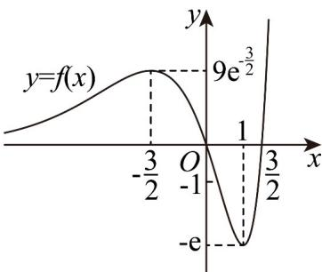

> [!faq]- 《第五章_一元函数的导数及其应用_高效培优讲义_数学人教A版2019高二》官方解析
>
> > [!success]- **【答案】** AD
>
> > [!note]- **【分析】**
> > 对函数求导，即可得到函数的单调区间，然后得到函数的极值点，结合函数解析式画出函数大致图
> >
> > 象，从而判断 A、B、C；令 y=0 解得 $f(x)$ 的值，结合函数的极值点及函数图象得到零点个数，从而判断 D.
>
> > [!note]- **【解析】**
> > $f^{\prime}(x) = (2x^{2} + x - 3)\cdot \mathrm{e}^{x} = (x - 1)(2x + 3)\mathrm{e}^{x}$
> >
> > 当 $x \in \left(-\infty, -\frac{3}{2}\right) \cup (1, +\infty)$ 时， $f'(x) > 0$ ；当 $x \in \left(-\frac{3}{2}, 1\right)$ 时， $f'(x) < 0$
> >
> > 所以 $f(x)$ 在 $\left(-\infty, -\frac{3}{2}\right)$ ， $(1, +\infty)$ 上为增函数，在 $\left(-\frac{3}{2}, 1\right)$ 上为减函数，
> >
> > 当 $x = -\frac{3}{2}$ 时，函数有极大值 $f\left(-\frac{3}{2}\right) = 9 \cdot \mathrm{e}^{-\frac{3}{2}}$ ，当 $x = 1$ 时，函数有极小值 $f(1) = -\mathrm{e}$
> >
> > 由 $f(x) = (2x^{2} - 3x)\cdot \mathrm{e}^{x} > 0$ ，即 $2x^{2} - 3x > 0$ ，得 $x <   0$ 或 $x > \frac{3}{2}$
> >
> > 所以当 $x \in (-\infty, 0) \cup \left(\frac{3}{2}, +\infty\right)$ 时函数 $f(x)$ 的图象在 $x$ 轴上方，画出函数图象，如图
> >
> > 
> >
> > 由图知，A 正确，B 错误；
> >
> > 若函数 $f(x)$ 在 $\left(-\frac{3}{2}, a\right)$ 上是减函数，实数 $a$ 的取值范围是 $\left(-\frac{3}{2}, 1\right]$ ，故 $^C$ 错误；
> >
> > 由 $y = 3 \left[ f(x) \right]^2 + 2f(x) - 1 = 0$ 得 $f(x) = -1 \frac{1}{3}$ .
> >
> > 因为 $f\left(-\frac{3}{2}\right) = 9 \cdot \mathrm{e}^{-\frac{3}{2}} > \frac{1}{3}, f(1) = -\mathrm{e} < -1$
> >
> > 所以 $y = f(x)$ 与 y = -1， $y = \frac{1}{3}$ 的图象共有 5 个交点，
> >
> > 所以函数 $y=3\left[f(x)\right]^{2}+2f(x)-1$ 有 5 个零点，故 D 正确.
> >
> > 故选 **AD**.
