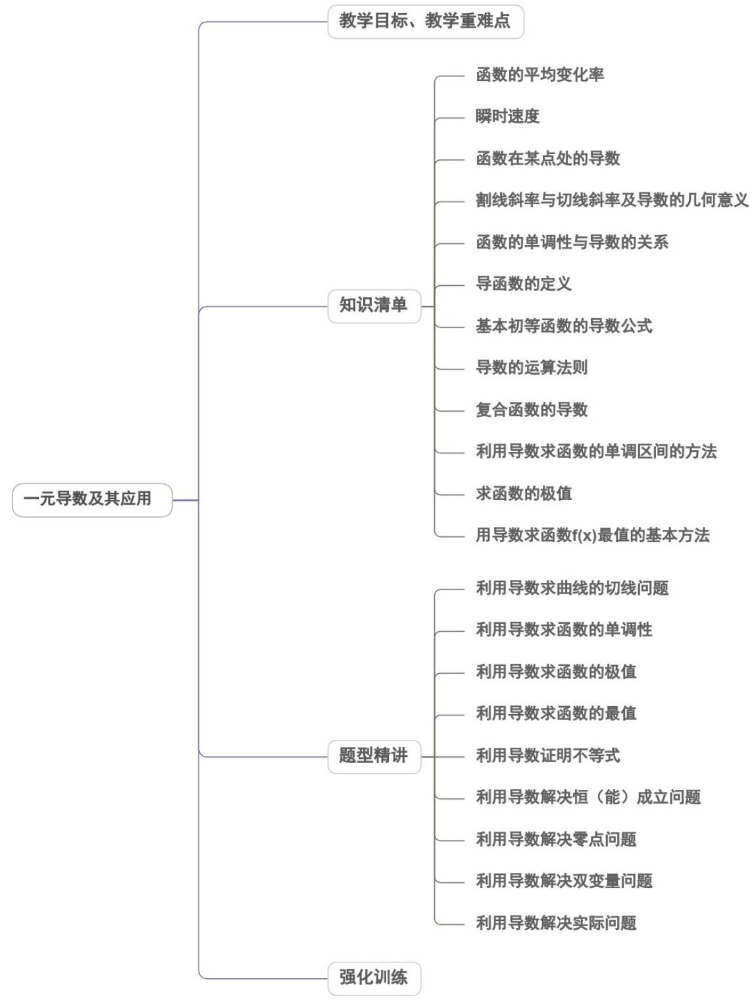

<!-- source-part:1 pages:1-50 -->

## 第五章 一元函数的导数及其应用

内容概览

## 教学目标、教学重难点

<table><tr><td>教学目标</td><td>1.梳理导数与函数性质之间的逻辑关系,构建知识体系。2.掌握利用导数研究函数性质的一般方法和步骤。3.在利用导数研究函数性质及应用的过程中,促进学生深刻体会数形结合思想,转化思想、类比思想的应用,提升学生数学运算、直观想象和逻辑推理等素养。4.复习函数零点的概念和梳理解决函数零点问题的常用方法。5.掌握利用导数研究函数零点问题的一般步骤。6.在利用导数研究函数零点的过程中,体会转化思想、类比思想、数形结合等思想方法的应用。7.进一步体会利用导数研究函数性质的一般方法。8.将问题与概念建立联系的意识,分类讨论、转化与化归、类比思想的应用。9.通过数形结合的方式,对问题的解答过程进行严格论证。10.学生能选择合适的方法研究函数零点问题,对参数进行分类讨论。11.学生能够结合函数图象,利用零点存在性定理,对零点的存在性进行严格证明。</td></tr><tr><td>教学重难点</td><td>1.重点1导数的概念、物理和几何意义。2基本初等函数的导数公式、导数的四则运算法则、简单复合函数的导数。3利用导数求函数单调性、极值和最值。4能够利用导数求切线问题、图象问题。2.难点1物理和几何意义。2导数的四则运算法则、简单复合函数的导数。3利用导数求单调性和极值。</td></tr></table>

![[高中/课堂同步/题库/人教A版高中数学同步讲义(2026)/04_选择性必修第二册/第五章一元函数的导数及其应用/讲义/第五章_一元函数的导数及其应用_高效培优讲义_数学人教A版2019高二/知识清单_sec_01/知识清单_sec_01.md]]
![[高中/课堂同步/题库/人教A版高中数学同步讲义(2026)/04_选择性必修第二册/第五章一元函数的导数及其应用/讲义/第五章_一元函数的导数及其应用_高效培优讲义_数学人教A版2019高二/知识点_01_函数的平均变化率_sec_02/知识点_01_函数的平均变化率_sec_02.md]]
![[高中/课堂同步/题库/人教A版高中数学同步讲义(2026)/04_选择性必修第二册/第五章一元函数的导数及其应用/讲义/第五章_一元函数的导数及其应用_高效培优讲义_数学人教A版2019高二/知识点_03_函数在某点处的导数_sec_03/知识点_03_函数在某点处的导数_sec_03.md]]
![[高中/课堂同步/题库/人教A版高中数学同步讲义(2026)/04_选择性必修第二册/第五章一元函数的导数及其应用/讲义/第五章_一元函数的导数及其应用_高效培优讲义_数学人教A版2019高二/知识点_04_割线斜率与切线斜率及导数的几何意义_sec_04/知识点_04_割线斜率与切线斜率及导数的几何意义_sec_04.md]]
![[高中/课堂同步/题库/人教A版高中数学同步讲义(2026)/04_选择性必修第二册/第五章一元函数的导数及其应用/讲义/第五章_一元函数的导数及其应用_高效培优讲义_数学人教A版2019高二/知识点_05_函数的单调性与导数的关系_sec_05/知识点_05_函数的单调性与导数的关系_sec_05.md]]
![[高中/课堂同步/题库/人教A版高中数学同步讲义(2026)/04_选择性必修第二册/第五章一元函数的导数及其应用/讲义/第五章_一元函数的导数及其应用_高效培优讲义_数学人教A版2019高二/知识点_06_导函数的定义_sec_06/知识点_06_导函数的定义_sec_06.md]]
![[高中/课堂同步/题库/人教A版高中数学同步讲义(2026)/04_选择性必修第二册/第五章一元函数的导数及其应用/讲义/第五章_一元函数的导数及其应用_高效培优讲义_数学人教A版2019高二/知识点_08_导数的运算法则_sec_07/知识点_08_导数的运算法则_sec_07.md]]
![[高中/课堂同步/题库/人教A版高中数学同步讲义(2026)/04_选择性必修第二册/第五章一元函数的导数及其应用/讲义/第五章_一元函数的导数及其应用_高效培优讲义_数学人教A版2019高二/知识点_09_复合函数的导数_sec_08/知识点_09_复合函数的导数_sec_08.md]]
![[高中/课堂同步/题库/人教A版高中数学同步讲义(2026)/04_选择性必修第二册/第五章一元函数的导数及其应用/讲义/第五章_一元函数的导数及其应用_高效培优讲义_数学人教A版2019高二/知识点_10_利用导数求函数的单调区间的方法_sec_09/知识点_10_利用导数求函数的单调区间的方法_sec_09.md]]
![[高中/课堂同步/题库/人教A版高中数学同步讲义(2026)/04_选择性必修第二册/第五章一元函数的导数及其应用/讲义/第五章_一元函数的导数及其应用_高效培优讲义_数学人教A版2019高二/知识点_11_求函数的极值_sec_10/知识点_11_求函数的极值_sec_10.md]]
![[高中/课堂同步/题库/人教A版高中数学同步讲义(2026)/04_选择性必修第二册/第五章一元函数的导数及其应用/讲义/第五章_一元函数的导数及其应用_高效培优讲义_数学人教A版2019高二/知识点_12_用导数求函数__f_x___最值的基_sec_11/知识点_12_用导数求函数__f_x___最值的基_sec_11.md]]
![[高中/课堂同步/题库/人教A版高中数学同步讲义(2026)/04_选择性必修第二册/第五章一元函数的导数及其应用/讲义/第五章_一元函数的导数及其应用_高效培优讲义_数学人教A版2019高二/题型精讲_sec_12/题型精讲_sec_12.md]]
![[高中/课堂同步/题库/人教A版高中数学同步讲义(2026)/04_选择性必修第二册/第五章一元函数的导数及其应用/讲义/第五章_一元函数的导数及其应用_高效培优讲义_数学人教A版2019高二/题型01_利用导数求曲线的切线问题_sec_13/题型01_利用导数求曲线的切线问题_sec_13.md]]
![[高中/课堂同步/题库/人教A版高中数学同步讲义(2026)/04_选择性必修第二册/第五章一元函数的导数及其应用/讲义/第五章_一元函数的导数及其应用_高效培优讲义_数学人教A版2019高二/题型02_利用导数求函数的单调性_sec_14/题型02_利用导数求函数的单调性_sec_14.md]]
![[高中/课堂同步/题库/人教A版高中数学同步讲义(2026)/04_选择性必修第二册/第五章一元函数的导数及其应用/讲义/第五章_一元函数的导数及其应用_高效培优讲义_数学人教A版2019高二/题型03_利用导数求函数的极值_sec_15/题型03_利用导数求函数的极值_sec_15.md]]
![[高中/课堂同步/题库/人教A版高中数学同步讲义(2026)/04_选择性必修第二册/第五章一元函数的导数及其应用/讲义/第五章_一元函数的导数及其应用_高效培优讲义_数学人教A版2019高二/题型04_利用导数求函数的最值_sec_16/题型04_利用导数求函数的最值_sec_16.md]]
![[高中/课堂同步/题库/人教A版高中数学同步讲义(2026)/04_选择性必修第二册/第五章一元函数的导数及其应用/讲义/第五章_一元函数的导数及其应用_高效培优讲义_数学人教A版2019高二/题型05_利用导数证明不等式_sec_17/题型05_利用导数证明不等式_sec_17.md]]
![[高中/课堂同步/题库/人教A版高中数学同步讲义(2026)/04_选择性必修第二册/第五章一元函数的导数及其应用/讲义/第五章_一元函数的导数及其应用_高效培优讲义_数学人教A版2019高二/题型06_利用导数解决恒_能_成立问题_sec_18/题型06_利用导数解决恒_能_成立问题_sec_18.md]]
![[高中/课堂同步/题库/人教A版高中数学同步讲义(2026)/04_选择性必修第二册/第五章一元函数的导数及其应用/讲义/第五章_一元函数的导数及其应用_高效培优讲义_数学人教A版2019高二/题型07_利用导数解决零点问题_sec_19/题型07_利用导数解决零点问题_sec_19.md]]
![[高中/课堂同步/题库/人教A版高中数学同步讲义(2026)/04_选择性必修第二册/第五章一元函数的导数及其应用/讲义/第五章_一元函数的导数及其应用_高效培优讲义_数学人教A版2019高二/题型08_利用导数解决双变量问题_sec_20/题型08_利用导数解决双变量问题_sec_20.md]]
![[高中/课堂同步/题库/人教A版高中数学同步讲义(2026)/04_选择性必修第二册/第五章一元函数的导数及其应用/讲义/第五章_一元函数的导数及其应用_高效培优讲义_数学人教A版2019高二/题型09_利用导数解决实际问题_sec_21/题型09_利用导数解决实际问题_sec_21.md]]
![[高中/课堂同步/题库/人教A版高中数学同步讲义(2026)/04_选择性必修第二册/第五章一元函数的导数及其应用/讲义/第五章_一元函数的导数及其应用_高效培优讲义_数学人教A版2019高二/强化训练_sec_22/强化训练_sec_22.md]]
