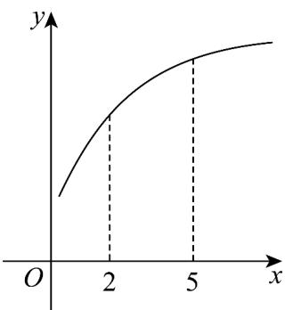
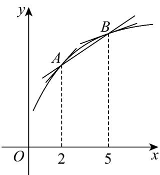
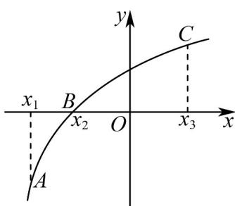

## 知识点 01 函数的平均变化率

函数 $y = f(x)$ 从 $x_{1}$ 到 $x_{2}$ 的平均变化率

(1)定义式：=。

(2)实质：函数值的增量与自变量的增量之比.

(3)作用：刻画函数值在区间 $[x_1, x_2]$ 上变化的快慢。

(4)几何意义：已知 $P_{1}(x_{1}, f(x_{1}))$ ， $P_{2}(x_{2}, f(x_{2}))$ 是函数 $y = f(x)$ 的图象上两点，则平均变化率 $=$ 表示割线 $P_{1}P_{2}$ 的斜率。

【即学即练】

1. 已知函数 $f(x)$ 在 $\mathbf{R}$ 上可导，其部分图象如图所示，则下列不等式正确的是（）

A. $\frac{f(5) - f(2)}{3} < f'(2) < f'(5)$ B. $f'(5) < \frac{f(5) - f(2)}{3} < f'(2)$ C. $f'(5) < f'(2) < \frac{f(5) - f(2)}{3}$ D. $f'(2) < \frac{f(5) - f(2)}{3} < f'(5)$

【答案】B

【分析】根据给定条件，利用导数的几何意义，借助图形判断得解·

【详解】由导数的几何意义，得 $f'(2)$ 为函数 $f(x)$ 图象在 x=2 处切线的斜率， $f'(5)$ 为函数 $f(x)$ 的图象在 x=5 处切线的斜率， $\frac{f(5)-f(2)}{5-2}=k_{AB}$ 为函数 $f(x)$ 图象上点 $A(2,f(2)),B(5,f(5))$ 确定直线的斜率，

观察图象，得 $f'(5)<\frac{f(5)-f(2)}{3}<f'(2)$ .

故选：B

2. 设函数 $y = f(x)$ 在 R 上处处存在导数，其导函数为 $y = f'(x)$ · 已知点 $A(x_{1}, y_{1})$ 、 $B(x_{2}, y_{2})$ 、 $C(x_{3}, y_{3})$ ，在曲线 $y = f(x)$ 上如图，则在下列选项中正确的是（）

A $f^{\prime}\left(x_{1}\right) <   f^{\prime}\left(x_{2}\right) <   f^{\prime}\left(x_{3}\right);$

B．函数 $y = f(x)$ 在 $x = x_{2}$ 处附近的平均变化率均小于 $f'(x_{2})$ ;

C. 点 $x = x_{2}$ 是函数 $y = f(x)$ 的一个极值点;

D．函数 $y = f(x)$ 在区间 $\left[x_{1}, x_{3}\right]$ 上不存在驻点.

【答案】D

【分析】根据导数的几何意义、极值点的定义、驻点的定义逐一判断即可·

【详解】A：根据导数几何意义可知： $f'(x_1) > f'(x_2) > f'(x_3)$ ，因此本选项说法不正确；

B：由函数 $y = f(x)$ 的图象可知： $k_{AB} > f'(x_2)$ ，因此本选项说法不正确；

C：点 $\left(x_{2},0\right)$ 左右两侧的单调性都是单调递增，所以点 $x = x_{2}$ 不是函数 $y = f(x)$ 的极值点，

因此本选项说法不正确；

D：由图象可知函数 $y = f(x)$ 在区间 $[x_1, x_3]$ 上不存在导函数为零的点，所以不存在驻点，因此本选项说法正

确，·

故选：D

知识点 02 瞬时速度

(1)物体在某一时刻的速度称为瞬时速度.

(2)一般地，设物体的运动规律是 $s = s(t)$ ，则物体在 $t_0$ 到 $t_0 + \Delta t$ 这段时间内的平均速度为 $=$ 。如果 $\Delta t$ 无限趋近于

0 时，无限趋近于某个常数 v，我们就说当 $\Delta t$ 趋近于 0 时，的极限是 v，这时 v 就是物体在时刻 $t = t_{0}$ 时的瞬时速度，即瞬时速度 $v = \lim = \lim$ .

(3)瞬时速度与平均速度的关系：从物理角度看，当时间间隔 $|\Delta t|$ 无限趋近于0时，平均速度就无限趋近于 $t = t_0$ 时的瞬时速度.

【即学即练】

1. 一个质量为 $4\mathrm{kg}$ 的物体做直线运动，该物体的位移 $y$ （单位： $\mathrm{m}$ ）与时间 $t$ （单位：s）之间的关系为 $y(t) = \frac{1}{3} t^3 -2t^2 +5t + 1$ ，且 $E_{\mathrm{k}} = \frac{1}{2} mv^{2}(E_{\mathrm{k}}$ 表示物体的动能，单位：J， $m$ 表示物体的质量，单位： $\mathrm{kg}$ ，v表示物体的瞬时速度，单位： $\mathrm{m / s}$ ），则（ ）A.该物体瞬时速度的最小值为 $1\mathrm{m / s}$ B.该物体瞬时速度的最小值为 $1.5\mathrm{m / s}$ C.该物体在第1秒末的动能为10JD.该物体在第1秒末的动能为8J

【答案】AD

【分析】求出函数的导数后结合配方法可求瞬时速度的最小值，故可判断 $^{AB}$ 的正误，结合导数及题设中的动能公式计算后可判断 $^{CD}$ 的正误.

【详解】对于 $^{AB}$ ，由题意得 $y'(t)=t^{2}-4t+5=(t-2)^{2}+1\quad1$ ，

则该物体瞬时速度的最小值为1m/s，A正确，B错误.

对于 CD，由 $y'(1)=2$ ，得 $E_{k}=\frac{1}{2}\times4\times2^{2}=8J$ ，所以该物体在第1秒末时的动能为8J，

故 $^{C}$ 错误， $^{D}$ 正确·

故选：AD.

2. 某物体的位移 $s$ 与时间 $t$ 的函数为 $s = 3t^2 + 2t(t > 0)$ ，其中 $s$ 的单位是米， $t$ 的单位是秒，那么物体在 1 秒末的瞬时速度是（）A. 5 米/秒 B. 6 米/秒 C. 8 米/秒 D. 110 米/秒

【答案】C

【分析】求导，代入 t=1 ，得到答案·

【详解】因为位移 $s$ 与时间 $t$ 的函数为 $s = 3t^2 + 2t(t > 0)$

所以 $s^{\prime} = 6t + 2$ ，当 $t = 1$ 时， $s^{\prime} = 6 + 2 = 8$

故物体在 $^{1}$ 秒末的瞬时速度是 $^{8}$ 米/秒.

故选：C
