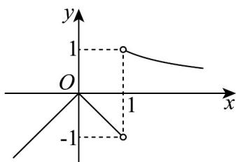

## 知识点 05 函数的单调性与导数的关系

若 $f'(x_0) = 0$ ，则函数在 $x = x_0$ 处切线斜率 $k = \underline{0}$ ；

若 $f'(x_0) > 0$ ，则函数在 $x = x_0$ 处切线斜率 $k \geq 0$ ，且函数在 $x = x_0$ 附近单调递增，且 $f'(x_0)$ 越大，说明函数图象变化的越快；

若 $f'(x_0) < 0$ ，则函数在 $x = x_0$ 处切线斜率 $k \leq 0$ ，且函数在 $x = x_0$ 附近单调递减，且 $|f'(x_0)|$ 越大，说明函数图象变化的越快。

【即学即练】

1. 已知定义在 $\mathbf{R}$ 上的函数 $f(x) = \begin{cases} \ln x, & x > 1, \\ |x^2 - x|, & x \leq 1, \end{cases}$ 若方程 $f(x) - a(x - 1) = 0$ 恰有两个解，则实数 $a$ 的取值范围为（） $\mathrm{A}_{\cdot}(-\infty, -1] \cup [0,1]$ $\mathrm{B}_{\cdot}[0,1]$

C. $(- \infty, -1) \cup [0, 1)$ D. $(- \infty, -1] \cup [0, 1)$

【答案】D

【分析】根据方程 $f(x) - a(x - 1) = 0$ 恰有两个解，得出 $y = a$ 与 $g(x) = \begin{cases} \frac{\ln x}{x - 1}, & x > 1 \\ -|x|, & x < 1 \end{cases}$ 有一个交点，结合图象可得

参数范围.

【详解】因为方程 $f(x) - a(x - 1) = 0$ 恰有两个解，又因为 $f(1) - a(1 - 1) = f(1) = 0$

则 x=1 为方程 $f(x)-a(x-1)=0$ 的一个解，

当 $x \neq 1$ 时，由 $f(x) - a(x - 1) = 0$

则 $a = \frac{f(x)}{x - 1} = \begin{cases} \frac{\ln x}{x - 1}, & x > 1 \\ \frac{|x^2 - x|}{x - 1}, & x < 1 \end{cases} = \begin{cases} \frac{\ln x}{x - 1}, & x > 1 \\ -|x|, & x < 1 \end{cases}$ 有一个解，

所以 $y = a$ 与 $g(x) = \begin{cases} \frac{\ln x}{x - 1}, & x > 1 \\ -|x|, & x < 1 \end{cases}$ 有一个交点，

当 $x > 1$ 时， $g(x) = \frac{\ln x}{x - 1}, g'(x) = \frac{\frac{x - 1}{x} - \ln x}{(x - 1)^2} = \frac{1 - \frac{1}{x} - \ln x}{(x - 1)^2}$ ，

设 $t(x)=1-\frac{1}{x}-\ln x$ ，x>1 ，

则 $t^{\prime}(x) = \frac{1}{x^{2}} -\frac{1}{x} = \frac{1 - x}{x^{2}} < 0$ ，即 $t(x)$ 在 $(1, + \infty)$ 上单调递减，

所以 $t(x) < t(1) = 0$

所以 $g^{\prime}(x) = \frac{1 - \frac{1}{x} - \ln x}{(x - 1)^{2}} < 0$ ，则 $g(x)$ 在 $(1, + \infty)$ 上单调递减，

当 $x \to 1, g(x) \to 1$ ，且 $x > 1$ 时， $g(x) > 0$

做出函数 $g(x)$ 的图象，如下：

结合图象可得，要使 $y = a$ 与 $g(x) = \begin{cases} \frac{\ln x}{x - 1}, & x > 1 \\ -|x|, & x < 1 \end{cases}$ 有一个交点，

则 $a \leq -1$ 或 $0 \leq a < 1$

故选：D.

2. 设 $a > 0$ ，若函数 $f(x) = x \ln x - \frac{3}{2} x^2 + 2x$ 在区间 $(a, +\infty)$ 上单调，则 $a$ 的取值范围是 \_\_\_\_.

【答案】 $\left[1,+\infty\right)$

【分析】利用导数求 $f(x)$ 的单调区间，由 $f(x)$ 在区间 $(a, +\infty)$ 上单调，求 a 的取值范围.

【详解】因为 $f(x)=x\ln x-\frac{3}{2}x^{2}+2x$

所以 $f'(x)=\ln x+1-3x+2=\ln x-3x+3$

设 $g(x)=\ln x-3x+3$ ，则 $g'(x)=\frac{1}{x}-3=\frac{1-3x}{x}$ ，

所以 $x > \frac{1}{3}$ 时， $g'(x) < 0$ ，故 $g(x)$ 在 $\left(\frac{1}{3}, +\infty\right)$ 上单调递减，即 $f'(x)$ 在 $\left(\frac{1}{3}, +\infty\right)$ 上单调递减，

又 $f^{\prime}(1) = 0$ ，所以 $x\in \left(\frac{1}{3},1\right)$ 时 $f^{\prime}(x) > 0$ ； $x\in (1, + \infty)$ 时 $f^{\prime}(x) <   0$

所以 $f(x)$ 在区间 $\left(\frac{1}{3}, 1\right]$ 上单调递增，在区间 $[1, +\infty)$ 上单调递减，

故 $(a,+\infty)\subseteq(1,+\infty)$ ，所以a的取值范围是 $[1,+\infty)$ .

故答案为： $[1, + \infty)$
