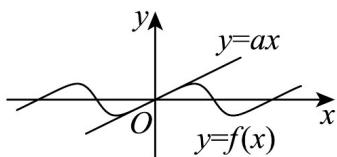

## 知识点 10 利用导数求函数的单调区间的方法

(1)当导函数不等式可解时，解不等式 $f'(x)>0$ 或 $f'(x)<0$ 求出单调区间.

注：①确定函数 $y = f(x)$ 的定义域；②求导数 $y' = f'(x)$ ；③解不等式 $f'(x) > 0$ ，解集在定义域内的部分为增区间；④解不等式 $f'(x) < 0$ ，解集在定义域内的部分为减区间。

(2)当方程 $f'(x) = 0$ 可解时，解出方程的实根，按实根把函数的定义域划分区间，确定各区间 $f'(x)$ 的符号，从而确定单调区间。

注：①确定函数 $y = f(x)$ 的定义域；②求出导数 $f'(x)$ 的零点；③用 $f'(x)$ 的零点将 $f(x)$ 的定义域划分为若干个区间，列表给出 $f'(x)$ 在各区间上的正负，由此得出函数 $y = f(x)$ 在定义域内的单调性。

(3)若导函数的方程、不等式都不可解，根据 $f'(x)$ 结构特征，利用图象与性质确定 $f'(x)$ 的符号，从而确定单调区间。

【即学即练】

1. 已知函数 $f(x) = \frac{\sin x}{2 + \cos x}$

(1)求 $f(x)$ 的单调区间；

(2)若 $f(x)\leq ax$ 在 $x\in [0, + \infty)$ 时恒成立，求 $a$ 的取值范围.

【答案】(1)在区间 $\left(2k\pi -\frac{2\pi}{3},2k\pi +\frac{2\pi}{3}\right)$ （ $k\in \mathbf{Z}$ ）上单调递增，在区间 $\left(2k\pi +\frac{2\pi}{3},2k\pi +\frac{4\pi}{3}\right)$ （ $k\in \mathbf{Z}$ ）上单调

递减

(2) $\left[\frac{1}{3},+\infty\right)$

【分析】（ $^{1}$ ）对函数求导，根据余弦函数的单调区间求解即可；

(2) 将恒成立问题转化为最值问题，借助第一问求得的单调区间，数形结合即可求得最值.

【详解】（1）由 $f(x) = \frac{\sin x}{2 + \cos x}$ ，函数定义域为 $\mathbf{R}$ ，得 $f'(x) = \frac{2\cos x + 1}{(2 + \cos x)^2}$

当 $x \in \left(2k\pi - \frac{2\pi}{3}, 2k\pi + \frac{2\pi}{3}\right)$ 时， $2\cos x + 1 > 0$ ， $f'(x) > 0$ ；

当 $x \in \left(2k\pi + \frac{2\pi}{3}, 2k\pi + \frac{4\pi}{3}\right)$ 时， $2\cos x + 1 < 0$ ， $f'(x) < 0$ 。

故函数 $f(x)$ 在区间 $\left(2k\pi - \frac{2\pi}{3}, 2k\pi + \frac{2\pi}{3}\right) (k \in \mathbf{Z})$ 上单调递增，在区间 $\left(2k\pi + \frac{2\pi}{3}, 2k\pi + \frac{4\pi}{3}\right) (k \in \mathbf{Z})$ 上单调

递减.

(2) 解法 $^{1}$ ：分类讨论

令 $g(x)=ax-\frac{\sin x}{2+\cos x}$ ， $x\in[0,+\infty)$ ，

则 $g^{\prime}(x) = a - \frac{2\cos x + 1}{(2 + \cos x)^{2}} = a - \frac{2}{2 + \cos x} +\frac{3}{(2 + \cos x)^{2}} = 3\left(\frac{1}{2 + \cos x} -\frac{1}{3}\right)^{2} + a - \frac{1}{3},x\in [0, + \infty)$

①当 $a$ $\frac{1}{3}$ 时， $g'(x)$ $0, g(x)$ 在 $[0, +\infty)$ 上单调递增， $\therefore$ 当 $x$ $0$ 时， $g(x)$ $g(0) = 0$ ，即 $f(x) \leq ax$ 成立。

②当 $0 < a < \frac{1}{3}$ 时，令 $h(x) = \sin x - 3ax$ ，则 $h'(x) = \cos x - 3a$ ，

∴当 $x \in [0, \arccos 3a)$ 时， $h'(x) > 0$ ，即 $h(x)$ 在 $x \in [0, \arccos 3a)$ 上单调递增，

因此当 $x \in [0, \arccos 3a)$ 时， $h(x) > h(0)$ ，即 $\sin x > 3ax$ 。

于是，在 $x \in [0, \arccos 3a)$ 时， $f(x) = \frac{\sin x}{2 + \cos x} \quad \frac{\sin x}{3} > ax$ ，不符合题意。

③当 $a \leq 0$ 时，有 $f\left(\frac{\pi}{2}\right) = \frac{1}{2} > 0 \quad a \cdot \frac{\pi}{2}$ ，与题意矛盾。

综上所述，所求 $a$ 的取值范围为 $\left[\frac{1}{3}, +\infty\right)$

解法 $^{2}$ ：数形结合

不等式 $f(x) \leq ax$ 恒成立，说明函数 $y = \frac{\sin x}{2 + \cos x}$ ， $x \in [0, +\infty)$ 的图象在直线 $y = ax$ 的下方。

函数 $y=\frac{\sin x}{2+\cos x}$ 的周期为 $2\pi$ ，结合（1）中 $f(x)$ 的单调区间，可作出函数 $f(x)$ 的图象如图所示。

注意到 $f^{\prime}(0) = \frac{1}{3}$ ， $\therefore y = \frac{\sin x}{2 + \cos x}$ 在 $x = 0$ 处的切线斜率为 $\frac{1}{3}$ ，直线 $y = ax$ 的斜率为 $a$ ：

于是，对任意 $x \in [0, +\infty)$ ，当且仅当 $a = \frac{1}{3}$ 时， $f(x) \leq ax$ 成立。

故 $a$ 的取值范围为 $\left[\frac{1}{3}, +\infty\right)$

2. 已知函数 $f(x) = (1 - ax)\ln (1 + x) - x$ .

(1)若 $a = -2$ ，讨论 $f(x)$ 的单调性；

(2) 若 $a = 1$ ，当 $x > 0$ 时，判断 $f(x)$ 是否存在零点，并说明理由；

(3) 当 $x$ 0 时， $f(x)$ 0，求 $a$ 的取值范围.

【答案】(1)函数 $f(x)$ 在 $(-1,0)$ 上单调递减，在 $(0,+\infty)$ 单调递增；

(2)不存在零点；理由见解析；

(3) $\left(-\infty,-\frac{1}{2}\right]$

【分析】（ $^{1}$ ）利用导数即可讨论函数的单调性；

(2) 利用导数求出函数 $f(x)$ 的单调性，结合单调性得到函数 $f(x)$ 的值域，即可判断零点个数；

(3) 求出 $f'(x)$ ，令 $\varphi(x) = -a \ln(1 + x) + \frac{a + 1}{1 + x} - a - 1$ ，分类讨论 a 的范围，结合导数研究函数 $\varphi(x)$ 的单调性，

从而得到 $f'(x)$ 的正负，求得函数 $f(x)$ 的范围，即可得到 $a$ 的取值范围

【详解】（1）当 $a = -2$ 时， $f(x) = (1 + 2x)\ln (1 + x) - x$ ，其定义域为 $(-1, +\infty)$

则 $f^{\prime}(x) = 2\ln (1 + x) + \frac{1 + 2x}{1 + x} -1 = 2\ln (1 + x) - \frac{1}{1 + x} +1$

令 $g(x)=2\ln(1+x)-\frac{1}{1+x}+1(x>-1)$

则 $g^{\prime}(x) = \frac{2}{1 + x} +\frac{1}{(1 + x)^{2}}$ ，由于 $1 + x > 0$ ，所以 $g^{\prime}(x) > 0$ 在 $(-1, + \infty)$ 上恒成立；

则 $f'(x)$ 在 $(-1, +\infty)$ 上单调递增，由于 $f'(0) = 0$ ，

所以当-1<x<0时， $f'(x)<0$ ，当x>0时， $f'(x)>0$ ；

则函数 $f(x)$ 在 $(-1,0)$ 上单调递减，在 $(0, +\infty)$ 上单调递增；

(2) 当 a=1 时， $f(x)=(1-x)\ln(1+x)-x$

则 $f'(x) = -\ln(1 + x) + \frac{1 - x}{1 + x} - 1 = -\ln(1 + x) + \frac{2}{1 + x} - 2$

$$
\text {令} h (x) = - \ln (1 + x) + \frac {2}{1 + x} - 2 (x > 0),
$$

则 $h'(x)=-\frac{1}{1+x}-\frac{2}{(1+x)^{2}}$ ，因为 x>0，则 $h'(x)=-\frac{1}{1+x}-\frac{2}{(1+x)^{2}}<0$ 在 $(0,+\infty)$ 上恒成立，

所以 $f'(x)$ 在 $(0, +\infty)$ 上单调递减，

由于 $f'(0) = 0$ ，所以当 $x > 0$ 时， $f'(x) < 0$ ，则函数 $f(x)$ 在 $(0, +\infty)$ 上单调递减，

即 $f(x) < f(0) = 0$

所以若 $a = 1$ ，当 $x > 0$ 时， $f(x)$ 不存在零点，

$f^{\prime}(x) = -a\ln (1 + x) + \frac{1 - ax}{1 + x} -1 = -a\ln (1 + x) + \frac{a + 1}{1 + x} -a - 1$ （3）由题可得：

$$
\text { 令 } \varphi (x) = - a \ln (1 + x) + \frac {a + 1}{1 + x} - a - 1 \left( \begin{array}{l l} x & 0 \end{array} \right),
$$

则 $\varphi'(x)=\frac{-a}{1+x}-\frac{a+1}{(1+x)^{2}}=\frac{-a(1+x)-a-1}{(1+x)^{2}}=\frac{-ax-2a-1}{(1+x)^{2}}$

当 $a = 0$ 时，由于 $x = 0$ ，则 $\varphi'(x) < 0$ ，则 $f'(x)$ 在 $[0, +\infty)$ 上单调递减；

所以 $f^{\prime}(x)\leq f^{\prime}(0) = 0$ ，则 $f(x)$ 在 $\left[0, + \infty\right)$ 上单调递减，则 $f(x)\notin f(0) = 0$ ，不满足题意；

当 $a < 0$ 时，令 $\varphi'(x) = \frac{-ax - 2a - 1}{(1 + x)^2}$ ，解得： $x = -2 - \frac{1}{a}$

若 $-2 - \frac{1}{a} \leq 0$ ，即 $a \leq -\frac{1}{2}$ 时，则 $\varphi'(x) = \frac{-ax - 2a - 1}{(1 + x)^2} \quad 0$ 在 $[0, +\infty)$ 上恒成立，

则 $f'(x)$ 在 $[0, +\infty)$ 上单调递增，则 $f'(x) \quad f'(0) = 0$ ，则 $f(x)$ 在 $[0, +\infty)$ 上单调递增，则 $f(x) \quad f(0) = 0$ ，满足

题意；

若 $-2-\frac{1}{a}>0$ ，即 $-\frac{1}{2}<a<0$ 时，令 $\varphi'(x)=\frac{-ax-2a-1}{(1+x)^{2}}>0$ ，解得： $x>-2-\frac{1}{a}$

令 $\varphi'(x)=\frac{-ax-2a-1}{(1+x)^{2}}<0$ ，解得： $0<x<-2-\frac{1}{a}$

所以 $f'(x)$ 在 $\left(0,-2-\frac{1}{a}\right)$ 上单调递减；在 $\left(-2-\frac{1}{a},+\infty\right)$ 上单调递增，

则当 $0 \leq x < -2 - \frac{1}{a}$ 时， $f'(x) \leq f'(0) = 0$ ，则函数 $f(x)$ 在 $\left[0, -2 - \frac{1}{a}\right)$ 上单调递减；

则当 $0 \leq x < -2 - \frac{1}{a}$ 时， $f(x) \notin f(0) = 0$ ，不满足条件；

综上：a 的取值范围为 $\left(-\infty, -\frac{1}{2}\right]$ .
