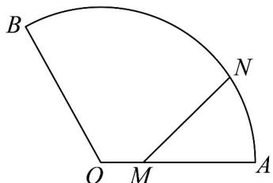

<!-- question-source:start -->
14．某社区内有一扇形草坪如图．，扇形的半径 $OA$ 为60米， $\angle AOB = \frac{2\pi}{3}$ ．甲从圆心 $O$ 出发，沿 $OA$ 以每

秒 $^{1}$ 米的速度向 A 慢走，同时乙从 A 出发，沿 $\overline{AB}$ 以每秒 $\frac{2\pi}{3}$ 米的速度向 B 慢跑．若经过 $t(0 \leq t \leq 60)$ 秒，甲

和乙所在位置分别为 $M$ 和 $N$ ，记 $MN$ 的长度为 $f(t)$ 米．给出下列四个结论：

①当 $t = 30$ 时， $MN \perp OA$ ；

②函数 $y = f(t)$ 在区间(30,45)上单调递增；

③方程 $f(t) = 60$ 在区间 $(45, 60)$ 上恰有一个根；

④若函数 $f(t)$ 在 $t = t_{0}$ 处取得最小值，则 $t_0 \in (0,30)$ .

其中所有正确结论的序号是\_\_\_\_。
<!-- question-source:end -->

![[高中/课堂同步/题库/人教A版高中数学同步讲义(2026)/04_选择性必修第二册/第五章一元函数的导数及其应用/阶段测试/第五章_一元函数的导数及其应用__高效培优单元测试_强化卷_数学人教A/_compact/answers/Q00061486A1.md]]
