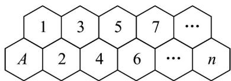

<!-- question-source:start -->
11．（多选）唐代诗人罗隐有咏“蜂”诗云：“不论平地与山尖，无限风光尽被占．采得百花成蜜后，为谁辛苦为谁甜？”蜜蜂是最令人敬佩的建筑专家，蜂巢的结构十分的精密，其中的蜂房均为正六棱柱状．如图是蜂房的一部分，若一只蜜蜂从蜂房 A 出发，想爬到第 $1,2,3,\cdots,n(n\in\mathbb{N}^{*})$ 号蜂房，只允许自左向右（不允许往回走），记该蜜蜂爬到第 n 号蜂房的路线数为数列 $\left\{a_{n}\right\}$ ，则（）

A. $a_{11} = 144$ B. $2a_{2023} = a_{2025} + a_{2022}$ C. $\sum_{i=1}^{60} a_i = \sum_{k=1}^{30} a_{2k+1}$ D. $\sum_{i=1}^{n} a_i = a_{n+2} - 1$
<!-- question-source:end -->

![[高中/课堂同步/题库/人教A版高中数学同步讲义(2026)/04_选择性必修第二册/第四章 数列/专项训练/专题01_数列概念的六大常考题型_高效培优专项训练_数学人教A版高二选/题型二_sec_03/questions/answers/Q00061546A1.md]]
