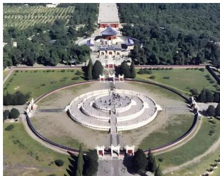

> [!faq]- 《专题02_等差数列八大常考题型_高效培优专项训练_数学人教A版高二选择》官方解析
>
> > [!success]- **【答案】** A
>
> > [!note]- **【分析】**
> > 利用等差数列片段和的性质可知 $S_{3}$ 、 $S_{6} - S_{3}$ 、 $S_{9} - S_{6}$ 成等差数列可求得 $S_{9}$ 的值·
>
> > [!note]- **【解析】**
> > 由题意可得 $S_{3} = 6$ ， $S_{3} = 3$ ，
> > 因为等差数列 $\{a_n\}$ 的前 $n$ 项和为 $S_{n}$ ，
> > 由等差数列片断和的性质可知 $S_{3}$ 、 $S_{6} - S_{3}$ 、 $S_{9} - S_{6}$ 成等差数列，
> > 所以 $2(S_{6} - S_{3}) = S_{3} + S_{9} - S_{6}$ ，所以 $S_{9} = 3S_{6} - 3S_{3} = 3\times 3 - 3\times 6 = -9$ ：
> >
> > 故选：A.
> >
> > 46. 北京天坛的圜丘坛为古代祭天的场所，分上、中、下三层，上层中心有一块圆形石板（称为天心石），环绕天心石砌 $^{9}$ 块扇面形石板构成第一环，向外每环依次增加 $^{9}$ 块，下一层的第一环比上一层的最后一环多 $^{9}$ 块，向外每环依次也增加 $^{9}$ 块，已知每层环数相同，且下层比中层多 $^{729}$ 块，则中下两层共有扇面形石板（）
> >
> > 
> >
> > A.2699块 B.3474块 C.3402块 D.2997块
> >
> > 【答案】D
> >
> > 【分析】第 $n$ 环天石心块数为 $a_{n}$ ，上层共有 $n$ 环，则 $\{a_{n}\}$ 是以 $^{9}$ 为首项， $^{9}$ 为公差的等差数列，设 $S_{n}$ 为 $\{a_{n}\}$ 的前 $n$ 项和，由题意可得 $S_{3n} - S_{2n} = S_{2n} - S_{n} + 729$ ，解方程即可得到 $n$ ，进而求得答案·
> >
> > 【详解】设第 $n$ 环天石心块数为 $a_{n}$ ，上层共有 $n$ 环， $S_{n}$ 为 $\{a_{n}\}$ 的前 $n$ 项和，
> >
> > 则 $\{a_{n}\}$ 是首项为 $^{9}$ ，公差为 $^{9}$ 的等差数列， $a_{n} = 9 + 9(n - 1) = 9n$ ， $S_{n} = \frac{9}{2}(n^{2} + n)$
> >
> > 上层、中层、下层的块数分别为 $S_{n}, S_{2n} - S_{n}, S_{3n} - S_{2n}$
> >
> > 由下层比中层多 $729$ 块，得 $S_{3n} - S_{2n} = S_{2n} - S_n + 729$
> >
> > 即 $\frac{9}{2} (9n^2 +3n) - \frac{9}{2} (4n^2 +2n) = \frac{9}{2} (4n^2 +2n) - \frac{9}{2} (n^2 +n) + 729$ ，解得 $n = 9$
> >
> > 所以中下两层共有扇面形石板 $S_{27} - S_9 = \frac{9}{2}(27^2 + 27) - \frac{9}{2}(9^2 + 9) = 2997$ （块）.
> >
> > 故选 **D**
