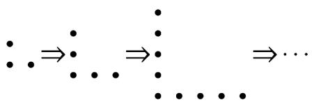

> [!faq]- 《专题04_求数列通项公式八大常考题型_高效培优专项训练_数学人教A版高》官方解析
>
> > [!success]- **【答案】** C
>
> > [!note]- **【分析】**
> > 先利用累加法求得 $T_{n}=n^{2}-n+1$ ，再由 $a_{6}=\frac{T_{6}}{T_{5}}$ 求解即可·
>
> > [!note]- **【解析】**
> > 由题意 $T_{1}=a_{1}=1,T_{n+1}-T_{n}=2n$ ，
> >
> > 所以当n 2时， $T_{n}-T_{n-1}=2(n-1),T_{n-1}-T_{n-2}=2(n-2),\cdots,T_{2}-T_{1}=2\times1$ ，
> >
> > 累加得当n 2时， $T_{n}=1+2\times1+2\times2+\cdots+2(n-1)=1+2\times\frac{n(n-1)}{2}=n^{2}-n+1$ ，
> >
> > 又当n=1时， $T_{1}=1$ 也满足 $T_{n}=n^{2}-n+1$ ，所以 $T_{n}=n^{2}-n+1$ ，
> >
> > 所以 $a_{6}=\frac{T_{6}}{T_{5}}=\frac{6^{2}-6+1}{5^{2}-5+1}=\frac{31}{21}$ .
> >
> > 故选：C
> >
> > 
