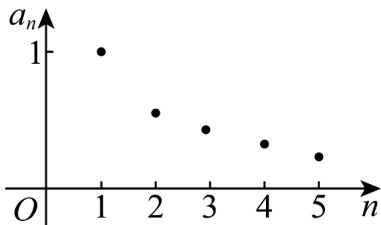

> [!faq]- 《专题01 数列概念的六大常考题型（高效培优专项训练）数学人教A版高二选择性必修第一册》官方解析
>
> > [!success]- **【答案】** (1)1， $\frac{1}{2}$ ， $\frac{1}{3}$ ， $\frac{1}{4}$ ， $\frac{1}{5}$ (2) $a_{n} = \frac{1}{n}$ (3)图见解析
>
> > [!note]- **【分析】**
> > （ $^{1}$ ）直接代入计算即可；
> >
> > (2) 根据前 5 项猜想 $a_{n}=\frac{1}{n}$ ;
> >
> > (3) 画出点集即可·
>
> > [!note]- **【解析】**
> > （1） $a_{1}=1$ ， $a_{2}=\frac{1}{1+1}\times1=\frac{1}{2}$ ，
> >
> > $$
> > a _ {3} = \frac {2}{1 + 2} \times \frac {1}{2} = \frac {1}{3}, a _ {4} = \frac {3}{1 + 3} \times \frac {1}{3} = \frac {1}{4}, a _ {5} = \frac {4}{1 + 4} \times \frac {1}{4} = \frac {1}{5}.
> > $$
> >
> > (2) 猜想： $a_{n}=\frac{1}{n}$ .
> >
> > 下面证明其通项为 $a_{n} = \frac{1}{n}$ ， $a_{n + 1} = \frac{n}{n + 1} a_n$ ，显然 $a_{n}\neq 0$ ，则 $\frac{a_{n + 1}}{a_n} = \frac{n}{n + 1}$
> >
> > 则 $\frac{a_2}{a_1} = \frac{1}{2},\frac{a_3}{a_2} = \frac{2}{3},\frac{a_4}{a_3} = \frac{3}{4},\dots ,\frac{a_n}{a_{n - 1}} = \frac{n - 1}{n}\left(n\quad 2\right)$
> >
> > 累乘得 $\frac{a_n}{a_1} = \frac{1}{n}\left(n - 2\right)$ ，所以 $a_{n} = \frac{1}{n}\left(n - 2\right)$ 对 $n = 1$ 也适合，则 $a_{n} = \frac{1}{n}$
> >
> > (3) 图象如图所示：
> >
> > 
> >
> > 8. 数列满足 $a_{1} = \frac{3}{5}, a_{n+1} = \begin{cases} 2a_{n}, & 0 \leq a_{n} \leq \frac{1}{2} \\ 2a_{n} - 1, & \frac{1}{2} < a_{n} < 1 \end{cases}$ ，则数列的第2023项为 \_\_\_\_.
> > 【答案】 $\frac{2}{5}/0.4$
> >
> > 【分析】根据递推关系可通过计算前面，发现数列是周期为 $^{4}$ 的周期数列，进而由周期性即可求解
> >
> > 【详解】由已知可得 $a_2 = 2 \times \frac{3}{5} - 1 = \frac{1}{5}, a_3 = 2 \times \frac{1}{5} = \frac{2}{5}, a_4 = 2 \times \frac{2}{5} = \frac{4}{5}, a_5 = 2 \times \frac{4}{5} - 1 = \frac{3}{5}$
> >
> > 所以数列 $\{a_{n}\}$ 为周期数列，且 $T = 4$
> >
> > 所以 $a_{2023} = a_{2020 + 3} = a_3 = \frac{2}{5}$
> >
> > 故答案为： $\frac{2}{5}$
