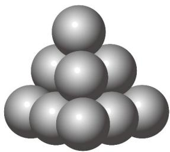

> [!faq]- 《专题04 求数列通项公式八大常考题型（高效培优专项训练）数学人教A版高二选择性必修第二册》官方解析
>
> > [!success]- **【答案】**  A.462 B.465 C.468 D.475
>
> > [!note]- **【分析】**
> > 归纳出递推公式，再累加求通项即可·
>
> > [!note]- **【解析】**
> > 记第 $n$ 层有 $a_{n}$ 个球，则 $a_1 = 1$ ， $a_2 = 3$ ， $a_3 = 6$ ， $a_4 = 10$ ， $a_2 - a_1 = 2$
> >
> > $a_{3} - a_{2} = 3$ ， $a_4 - a_3 = 4$ ，…， $a_{n} - a_{n - 1} = n(n\quad 2)$
> >
> > 则第 30 层的小球个数为 $a_{30} = \left(a_{30} - a_{29}\right) + \left(a_{29} - a_{28}\right) + \cdots + \left(a_{2} - a_{1}\right) + a_{1}$ $=30+29+28+\cdots+2+1=\frac{30\times(30+1)}{2}=465.$
> >
> > 故选 **B**
