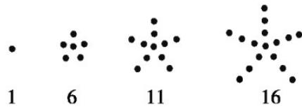

> [!faq]- 《专题04 求数列通项公式八大常考题型（高效培优专项训练）数学人教A版高二选择性必修第二册》官方解析
>
> > [!success]- **【答案】** A．数列-2024，0，4与数列4，0，-2024是同一个数列 B．数列 $\left\{a_{n}\right\}$ 的通项公式为 $a_{n}=n(n-1)$ ，则110是该数列的第11项 C．在数列1， $\sqrt{2}$ ， $\sqrt{3}$ ，2， $\sqrt{5}$ ，…，第8个数是 $2\sqrt{2}$ D．数列3,5,9,17,33,…的一个通项公式为 $a_{n}=2n+1$
>
> > [!note]- **【分析】**
> > A 选项，根据数列的定义作出判断；B 选项， $a_{11}=11\times10=110$ ，B 正确；C 选项，观察得到第8个数是 $\sqrt{8}=2\sqrt{2}$ ；D 选项， $2\times3+1=7\neq9$ ，故 D 错误。
>
> > [!note]- **【解析】**
> > A选项，数列-2024，0，4中， $a_{1}=-2024,a_{2}=0,a_{3}=4$
> >
> > 数列 $^{4}$ ，0，-2024中， $a_{1}=4,a_{2}=0,a_{3}=-2024$ ，不是同一个数列，A错误；
> >
> > B 选项， $a_{11}=11\times10=110$ ，则 110 是该数列的第 11 项，B 正确；
> >
> > C 选项，在数列 $\sqrt{1}$ ， $\sqrt{2}$ ， $\sqrt{3}$ ， $\sqrt{4}$ ， $\sqrt{5}$ ，…，第 8 个数是 $\sqrt{8}=2\sqrt{2}$ ，C 正确；
> >
> > D 选项， $2 \times 3 + 1 = 7 \neq 9$ ，故通项公式不为 $a_{n} = 2n + 1$ ，D 错误.
> >
> > 故选：BC
> >
> > 51. 数列 $2,4,2,4,\dots$ 的通项公式可以是（ ）A. $a_{n} = (-1)^{n} + 3$ B. $a_{n} = 2\left|\sin \frac{(n - 1)\pi}{2}\right| + 2$ C. $a_{n} = 2|\cos n\pi| + 2$ D. $a_{n} = \begin{cases} 2, & n \text{为奇数}\\ 4, & n \text{为偶数} \end{cases}$
> >
> > 【答案】ABD
> >
> > 【分析】将 $n = 1,2,3,4$ 代入选项中的通项公式，看得到的数列是否与已知数列一致即可·
> >
> > 【详解】对于 $A, a_{1} = 2, a_{2} = 4, a_{3} = 2, a_{4} = 4$ ，符合题意，故 A 正确；
> >
> > 对于 $\mathrm{B}, a_1 = 2, a_2 = 4, a_3 = 2, a_4 = 4$ ，符合题意，故 $\mathbf{B}$ 正确；
> >
> > 对于 $C, a_{1} = 4, a_{2} = 4, a_{3} = 4, a_{4} = 4$ ，不符合题意，故 C 错误；
> >
> > 对于 $D, a_{1} = 2, a_{2} = 4, a_{3} = 2, a_{4} = 4$ ，符合题意，故 D 正确.
> >
> > 故选：ABD.
> >
> > 52. 根据下面的图形及相应的点数，可得点数构成的数列的一个通项公式 $a_{n} =$
> >
> > 
> >
> > 【答案】 $5n - 4 / - 4 + 5n$
> >
> > 【分析】观察图形的点数，找出规律进行归纳总结即可·
> >
> > $$
> > \because a _ {1} = 1 = 5 \times 1 - 4 \quad a _ {2} = 6 = 5 \times 2 - 4 \quad a _ {3} = 1 1 = 5 \times 3 - 4 \quad a _ {4} = 1 6 = 5 \times 4 - 4
> > $$
> >
> > 归纳得 $a_{n}=5n-4$ .
> >
> > 故答案为：5n-4.
> >
> > 53. 写出下列数列的一个通项公式，使它的前 $^{4}$ 项分别是下列各数：
> >
> > (1) $\frac{2^2 - 1}{3}$ , $\frac{4^2 - 2}{9}$ , $\frac{6^2 - 3}{27}$ , $\frac{8^2 - 4}{81}$ ;
> >
> > (2)-1, 7, -13, 19;
> >
> > (3)0.7, 0.77, 0.777, 0.7777;
> >
> > (4) $1, \frac{8}{5}, \frac{15}{7}, \frac{24}{9}$ .
> >
> > 【答案】(1) $a_{n}=\frac{4n^{2}-n}{3^{n}}$
> >
> > (2) $a_{n} = (-1)^{n}(6n - 5)$
> >
> > (3) $a_{n} = \frac{7\times(10^{n} - 1)}{9\times10^{n}}$ .
> >
> > (4) $a_{n} = \frac{n^{2} + 2n}{2n + 1}$
> >
> > 【分析】（1）（2）（3）（4）根据前四项数列形式，总结规律即可得到其通项·
> >
> > 【详解】（1）从数列的前 $^{4}$ 项 $\frac{2^{2}-1}{3}$ ， $\frac{(2\times2)^{2}-2}{3^{2}}$ ， $\frac{(2\times3)^{2}-3}{3^{3}}$ ， $\frac{(2\times4)^{2}-4}{3^{4}}$ 中发现规律，
> >
> > $$
> > a _ {n} = \frac {4 n ^ {2} - n}{3 ^ {n}}
> > $$
> >
> > (2) 从数列的前 $^{4}$ 项 -1, 7, -13, 19 中发现规律，其每一项的符号按照 $(-1)^{n}$ 的规律变化，并且每一项的绝对值都比前一项大 $^{6}$ ，
> >
> > 因此该数列的通项公式为 $a_{n} = (-1)^{n}(6n - 5)$
> >
> > (3) 从该数列的前 $^{4}$ 项 $\frac{7}{10}$ ， $\frac{77}{10^{2}}$ ， $\frac{777}{10^{3}}$ ， $\frac{7777}{10^{4}}$ 中发现规律，
> >
> > 由7，77，777，7777，L
> >
> > 可以联想常见数列9，99，999，9999，L，
> >
> > 它的通项公式为 $10^{n} - 1$ ，
> >
> > 因此该数列的通项公式为 $a_{n} = \frac{(10^{n} - 1)\times\frac{7}{9}}{10^{n}} = \frac{7\times(10^{n} - 1)}{9\times10^{n}}$
> >
> > (4) 从该数列的前 $^{4}$ 项 $\frac{4-1}{3}$ ， $\frac{9-1}{5}$ ， $\frac{16-1}{7}$ ， $\frac{25-1}{9}$ 中发现规律，
> >
> > 其通项公式为 $a_{n} = \frac{(n + 1)^{2} - 1}{2n + 1} = \frac{n^{2} + 2n}{2n + 1}$
