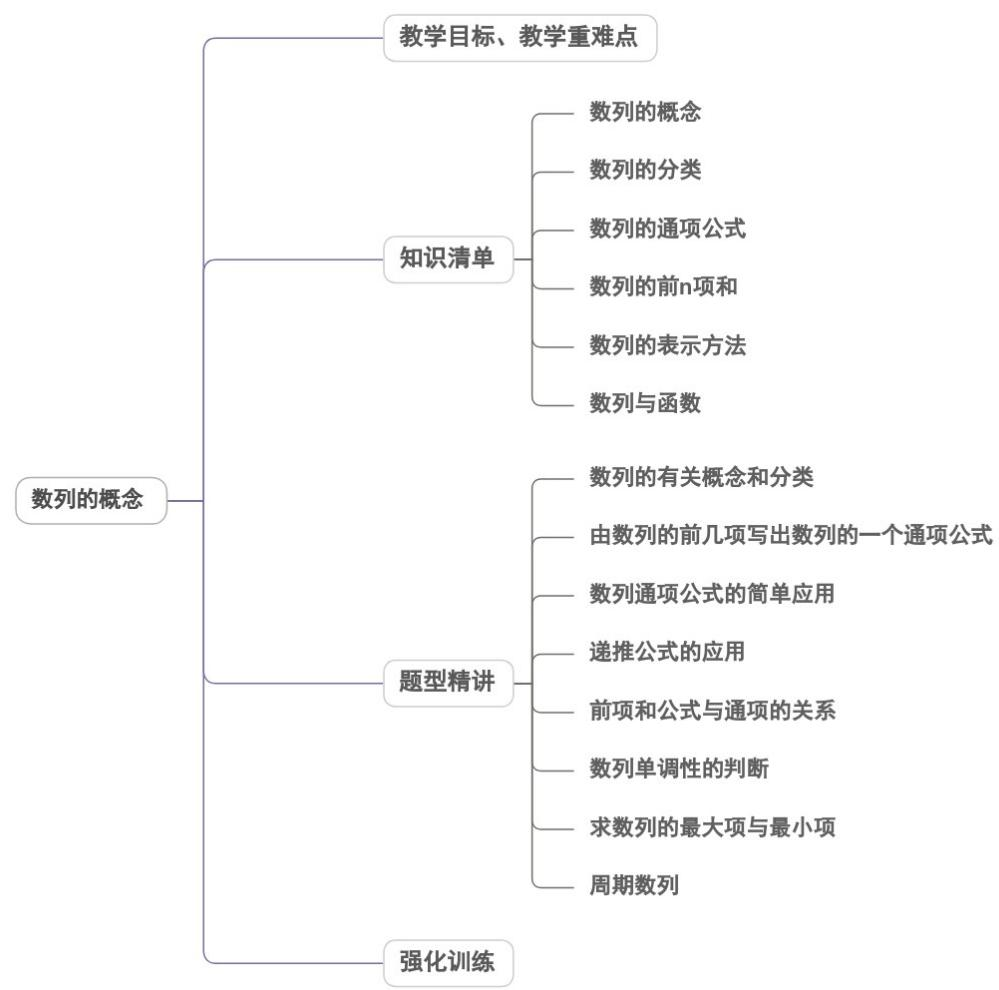

<!-- source-part:1 pages:1-50 -->

## 专题4.1 数列的概念

## 内容概览

## 教学目标、教学重难点

<table><tr><td>教学目标</td><td>1.了解数列的有关概念(项、项的表示)。2.了解数列的表示方法(列表、图象、通项公式)。3.了解数列是特殊的函数。</td></tr><tr><td>教学重难点</td><td>1.重点由数列的前几项写出数列的一个通项公式,递推公式的应用,前n项和公式 $S_n$ 与通项</td></tr></table>

$$
a _ {n}
$$

## 知识清单

## 知识点 01 数列的概念

一般地,我们把按照确定的顺序排列的一列数称为数列.数列中的每一个数叫做这个数列的项.数列的第一个位置上的数叫做这个数列的第1项,常用符号 $a_{1}$ 表示,第二个位置上的数叫做这个数列的第2项,用 $a_{2}$ 表示……第n个位置上的数叫做这个数列的第n项,用 $a_{n}$ 表示.其中第1项也叫做首项.

数列的一般形式是 $a_1, a_2, \ldots, a_n, \ldots$ ，简记为 $\{a_n\}$ .

【即学即练】

1. 下列说法中正确的是（ ）

【答案】
A．如果一个数列不是递增数列，那么它一定是递减数列
B．数列 $\left\{\frac{n+1}{n}\right\}$ 的第k项为 $1+\frac{1}{k}$ C．数列1,0,-1,-2与-2,-1,0,1是相同的数列
D．数列0,2,4,6,…可记为 $\{2n\}$

【答案】B

【分析】根据数列的定义和概念逐项判断即可·

【详解】选项 $^{A}$ ：数列除了递增数列和递减数列，还有常数列（所有项都相等）、摆动数列（项的大小交替

变化）等，

所以一个数列不是递增数列，不一定就是递减数列， $^{A}$ 说法错误；

选项 B：对于数列 $\left\{\frac{n+1}{n}\right\}$ ，它的第 k 项为 $\frac{k+1}{k}=1+\frac{1}{k}$ ，B 说法正确；

选项 $^{C}$ ：数列是按一定顺序排列的一列数，数列 1, 0, -1, -2，和数列 -2, -1, 0, 1 排列顺序不同，

所以这两个数列不是相同数列， $^{C}$ 说法错误；

选项D：数列0，2，4，6，…的通项公式为 $a_{n} = 2(n - 1),(n\in \mathbb{N}^{*})$

而 $\left\{2n\right\}$ 表示的数列为 2, 4, 6, 8, …，首项不同，D说法错误.

故选：B

2. 下列有关数列的说法正确的是（ ）

【答案】
A．数列-2024，0，4与数列4，0，-2024是同一个数列
B．数列 $\left\{a_{n}\right\}$ 的通项公式为 $a_{n}=n(n-1)$ ，则110是该数列的第11项
C．在数列 $1,\sqrt{2},\sqrt{3},2,\sqrt{5},\cdots$ 第8个数是 $2\sqrt{2}$ D．数列3,5,9,17,33,…的一个通项公式为 $a_{n}=2^{n}+1$

【答案】BCD

【分析】根据数列的概念判断 $^{A}$ ，应用通项公式计算判断 $^{B}$ ，应用已知项求出通项公式计算判断 $^{C}$ ，D.

【详解】对于 A，数列中的项与顺序有关，

故数列 -2024,0,4 与数列 4,0,-2024 是两个不同的数列，故 A 错误；

对于 B，令 $a_{n}=n(n-1)=110$ ，解得 n=11 或 n=-10（舍去），

故 $^{110}$ 是该数列的第 $^{11}$ 项，故 $^{B}$ 正确；

对于 C，数列 $1, \sqrt{2}, \sqrt{3}, 2$ ， $\sqrt{5}, \cdots$ 的一个通项公式是 $\sqrt{n}$ ，

故第 8 个数是 $\sqrt{8}=2\sqrt{2}$ ，故 C 正确；

对于 D，数列 3,5,9,17,33,… 的一个通项公式为 $a_{n}=2^{n}+1$ ，故 D 正确.

故选：BCD.

## 知识点 02 数列的分类

1. 根据数列项数的多少分：

有穷数列：项数有限的数列．例如数列1，2，3，4，5，6是有穷数列

无穷数列：项数无限的数列．例如数列1，2，3，4，5，6，...是无穷数列

2.根据数列项的大小分：

递增数列：从第2项起，每一项都大于它的前一项的数列。

递减数列：从第2项起，每一项都小于它的前一项的数列。

常数数列：各项相等的数列。

摆动数列：从第2项起，有些项大于它的前一项，有些项小于它的前一项的数列。

【即学即练】

1. （多选）下面四个数列中，既是无穷数列又是递增数列的是（）

【答案】

$$
1, \frac {1}{2}, \frac {1}{3}, \frac {1}{4}, \dots , \frac {1}{n}, \dots
$$

B. $\sin\frac{1}{7}\pi,\sin\frac{2}{7}\pi,\sin\frac{3}{7}\pi,\cdots,\sin\frac{n}{7}\pi,\cdots$ C. $-1,-\frac{1}{2},-\frac{1}{4},-\frac{1}{8},\cdots,-\frac{1}{2^{n-1}},\cdots$ D. $1,\sqrt{2},\sqrt{3},\cdots,\sqrt{21},\cdots$

【答案】CD
【分析】直接根据数列中数据变化情况来判断即可·
【详解】选项C、D既是无穷数列又是递增数列，而选项A是递减数列，选项B是摆动数列.故选：CD.

2. 下面四个数列中，既是无穷数列又是递增数列的是（）.

【答案】
A. $1, \frac{1}{2}, \frac{1}{3}, \frac{1}{4}, \ldots, \frac{1}{n}, \ldots$ B. $-1, -\frac{1}{2}, -\frac{1}{4}, -\frac{1}{8}, \ldots, -\frac{1}{2^{n-1}}, \ldots$ C. $\sin\frac{\pi}{7}, \sin\frac{2\pi}{7}, \sin\frac{3\pi}{7}, \ldots, \sin\frac{n\pi}{7}, \ldots$ D. $1, \sqrt{2}, \sqrt{3}, \ldots, \sqrt{n}, \ldots$

【答案】BD
【分析】按已知条件逐一分析各个选项即可得解·【详解】对于 A，1， $\frac{1}{2}$ ， $\frac{1}{3}$ ， $\frac{1}{4}$ ，…， $\frac{1}{n}$ ，…为递减数列，故 A 错误；

对于 B，-1， $-\frac{1}{2}$ ， $-\frac{1}{4}$ ， $-\frac{1}{8}$ ，…， $-\frac{1}{2^{n-1}}$ ，…为递增数列，且是无穷数列，故 B 正确；

对于 $C$ ， $\sin \frac{\pi}{7}$ ， $\sin \frac{2\pi}{7}$ ， $\sin \frac{3\pi}{7}$ ，…， $\sin \frac{n\pi}{7}$ ，…中 $\sin \frac{6\pi}{7} > \sin \frac{8\pi}{7}$ ，故不是递增数列，故 $C$ 错误；

对于 $^{D}$ ， $1$ ， $\sqrt{2}$ ， $\sqrt{3}$ ，…， $\sqrt{n}$ ，…既是无穷数列又是递增数列的，故 $^{D}$ 正确·

故选：BD.

## 知识点 03 数列的通项公式

如果数列 $\{a_{n}\}$ 的第 $n$ 项 $a_{n}$ 与 $n$ 之间的关系可以用一个公式 $a_{n} = f(n)$ 来表示，那么这个公式就叫做这个数列的通项公式。

(1) 并不是所有数列都能写出其通项公式；

(2) 一个数列的通项公式有时是不唯一的．如数列：1，0，1，0，1，0，...

它的通项公式可以是 $a_{n} = \frac{1 + (-1)^{n + 1}}{2}$ ，也可以是 $a_{n} = |\cos \frac{n + 1}{2}\pi |$

(3) 数列通项公式的作用：

①求数列中任意一项；②检验某数是否是该数列中的一项。

（4）数列的通项公式具有双重身份，它表示了数列的第 $n$ 项，又是这个数列中所有各项的一般表示.

【即学即练】

1. 下列命题：

①已知数列 $\left\{a_{n}\right\}$ ， $a_{n} = \frac{1}{n(n + 2)}\Big(n\in \mathbf{N}^{*}\Big)$ ，那么 $\frac{1}{120}$ 是这个数列的第10项，且最大项为第1项；

②数列 $\sqrt{2}$ ， $\sqrt{5}$ ， $2\sqrt{2}$ ， $\sqrt{11}$ ，...的一个通项公式是 $a_{n} = \sqrt{3n - 1}$ ；

③已知数列 $\left\{a_{n}\right\}$ ， $a_{n} = kn - 5$ ，且 $a_8 = 11$ ，则 $a_{17} = 29$

④已知 $a_{n + 1} = a_n + 3$ ，则数列 $\{a_n\}$ 是递增数列.

其中正确命题的个数为（ ）A.4 B.3 C.2 D.1

【答案】A

【分析】①令 $a_{n} = \frac{1}{120}$ 从而判断是否是数列的项，结合数列单调性判断；②找规律即可判断；③先求出通项公式，然后代入 $n = 17$ 求解；④根据数列的单调性定义判断·

【详解】对于①，令 $a_{n} = \frac{1}{n(n + 2)} = \frac{1}{120} \Rightarrow n = 10$ ，易知最大项为第 $^{1}$ 项．①正确；

对于②，数列 $\sqrt{2},\sqrt{5},2\sqrt{2},\sqrt{11}\dots$ 变为 $\sqrt{3\times 1 - 1},\sqrt{3\times 2 - 1},\sqrt{3\times 3 - 1},\sqrt{3\times 4 - 1}\dots$

可知 $a_{n} = \sqrt{3n - 1}$ 是一个符合的通项公式，②正确；

对于③， $a_{n} = kn - 5$ ，且 $a_8 = 11 \Rightarrow k = 2 \Rightarrow a_n = 2n - 5 \Rightarrow a_{17} = 29$ 。③正确；

对于④，由 $a_{n + 1} - a_n = 3 > 0$ ，则数列 $\{a_n\}$ 是递增数列，④正确.

故选：A

2. 已知数列 $\left\{a_{n}\right\}$ 的前 $n$ 项之和为 $S_{n}$ 且 $S_{n} = 2n - a_{n}(n \in \mathbf{N}^{*})$ ，若已经算出 $a_{1} = 1$ ， $a_{2} = \frac{3}{2}$ ，则猜想 $a_{n}$ 等于( ) A. $\frac{2n - 1}{n}$ B. $\frac{n + 1}{n}$ C. $\frac{2n - 1}{2^{n - 1}}$ D. $\frac{2^n - 1}{2^{n - 1}}$

【答案】D

【分析】分别计算出 $a_3, a_4$ ，归纳推理出 $a_n$ 即可得解。

【详解】 $\because a_{1}=1,\quad a_{2}=\frac{3}{2},\quad S_{3}=1+\frac{3}{2}+a_{3}=6-a_{3},\quad \therefore a_{3}=\frac{7}{4}$

同理可得 $a_{4} = \frac{15}{8}$

观察 $^{1}$ ， $\frac{3}{2}$ ， $\frac{7}{4}$ ， $\frac{15}{8}$ ，…，猜想 $a_{n}=\frac{2^{n}-1}{2^{n-1}}$

故选：D.

## 知识点 04 数列 $\{a_{n}\}$ 的前 n 项和

数列 $\{a_{n}\}$ 的前 $n$ 项和：指数列 $\{a_{n}\}$ 的前 $n$ 项逐个相加之和，通常用 $S_{n}$ 表示，即 $S_{n} = a_{1} + a_{2} + \ldots + a_{n}$ ； $a_{n}$ 与 $S_{n}$ 的关系

当 $n = 1$ 时 $a_1 = S_1$

当 $n$ 2时， $a_{n} = (a_{1} + a_{2} + \ldots + a_{n-1} + a_{n}) - (a_{1} + a_{2} + \ldots + a_{n-1}) = S_{n} - S_{n-1}$

故 $a_{n} = \left\{ \begin{array}{ll}S_{1}, & n = 1\\ S_{n} - S_{n - 1},n & 2\text{且} n\in N^{*} \end{array} \right.$

【即学即练】

1. 已知数列 $\left\{a_{n}\right\}$ 的前 $n$ 项和为 $S_{n}$ ， $S_{n} = 2^{n}(n \in \mathbf{N}^{*})$ ，则 $a_{n} = \underline{\hspace{2cm}}$ .

【答案】 $\left\{ \begin{array}{ll}2,n = 1\\ 2^{n - 1},n & 2 \end{array} \right.$

【分析】利用前 n 项和与通项公式的关系求解通项公式即可·

【详解】当 $n = 1$ 时， $a_1 = S_1 = 2$

当 n 2 时， $a_{n}=S_{n}-S_{n-1}=2^{n}-2^{n-1}=2^{n-1}$

此时 $a_1 = 2^{1 - 1} = 1$ ，不符，故 $a_{n} = \left\{ \begin{array}{ll}2,n = 1\\ 2^{n - 1},n & 2\cdot \end{array} \right.$

故答案为： $\left\{\begin{aligned}&2,n=1\\ &2^{n-1},n\quad2\end{aligned}\right.$

2. 已知 $S_{n}$ 为数列 $\{a_{n}\}$ 的前 $n$ 项和， $a_{1} = 1, a_{n+1} + 2S_{n} = 2n + 1$ ，则 $S_{2024} = (\quad)$ A. 2021 B. 2022 C. 2023 D. 2024

【答案】D

【分析】利用 $a_{n}=S_{n}-S_{n-1}$ ，得 $a_{n}+a_{n+1}=2$ ，当 n=1 时，由 $a_{1}=1$ 即可推出 $a_{n}$ 即可得解。

【详解】当 $n = 1$ 时， $a_{2} + 2S_{1} = 2 + 1$ ，因为 $S_{1} = a_{1} = 1$ ，所以 $a_{2} = 1$

当 $n$ 2时，由 $a_{n + 1} + 2S_{n} = 2n + 1$ 得 $a_{n} + 2S_{n - 1} = 2n - 1$

两式相减可得 $a_{n + 1} - a_n + 2a_n = 2$ ，即 $a_{n} + a_{n + 1} = 2$

因为 $a_{2}=1$ ，所以 $a_{3}=1, a_{4}=1, \cdots, a_{n}=1$

可得 $S_{n}=a_{1}+a_{2}+\cdots+a_{n}=n$ ，所以 $S_{2024}=2024$

故选：D.

## 知识点 05 数列的表示方法

## 1. 通项公式法（解析式法）：

数列通项公式反映了一个数列项与项数的函数关系．给了数列的通项公式，代入项数就可求出数列的每

一项．反之，根据通项公式，可以判定一个数是否为数列中的项．

## 2.列表法

相对于列表法表示一个函数，数列有这样的表示法：用 $a_1$ 表示第一项，用 $a_2$ 表示第二项，……，用 $a_n$

表示第 $n$ 项，……，依次写出得数列 $\{a_{n}\}$

<table><tr><td>1</td><td>2</td><td>...</td><td>n</td><td>...</td></tr><tr><td> $a_{1}$ </td><td> $a_{2}$ </td><td>...</td><td> $a_{n}$ </td><td>...</td></tr></table>

## 3.图象法：

数列是一种特殊的函数，可以用函数图象的画法画数列的图形。

具体方法：以项数 $n$ 为横坐标，相应的项 $a_{n}$ 为纵坐标，即以 $(n, a_{n})$ 为坐标在平面直角坐标系中做出点．所得

的数列的图形是一群孤立的点，因为横坐标为正整数，所以这些点都在 $y$ 轴的右侧，而点的个数取决于数列

的项数．从图象中可以直观地看到数列的项随项数由小到大变化而变化的趋势．

## 4.递推公式法

递推公式：如果已知数列 $\{a_{n}\}$ 的第1项（或前几项），且任一项 $a_{n}$ 与它的前一项 $a_{n - 1}$ （或前几项）间的关系

可以用一个公式来表示，那么这个公式就叫做这个数列的递推公式。

递推公式也是给出数列的一种方法．如：数列：-3，1，5，9，13，…，

可用递推公式： $a_1 = -3$ $a_{n} = a_{n - 1} + 4(n - 2)$ 表示．数列：3，5，8，13，21，34，55，89，…，

可用递推公式： $a_1 = 3$ ， $a_2 = 5$ ， $a_{n} = a_{n - 1} + a_{n - 2}(n - 3)$ 表示.

## 【即学即练】

1. 已知数列 $\left\{a_{n}\right\}$ 的通项公式为 $a_{n} = (-1)^{n}(2n + 1)$ ，则根据题意，该数列的前4项和 $S_{4} =$ （ ）A.4 B.6 C.8 D.10

【答案】A

【分析】利用数列 $\left\{a_{n}\right\}$ 的通项公式依次求得 $a_{1},a_{2},a_{3},a_{4}$ ，从而得解·

【详解】因为 $a_{n} = (-1)^{n}(2n + 1)$

所以 $a_1 = -3, a_2 = 5, a_3 = -7, a_4 = 9$

则该数列的前 4 项和 $S_{4} = -3 + 5 + (-7) + 9 = 4$ .

故选：A.

2. 数列 $1, \frac{5}{3}, \frac{5}{2}$ , ...的通项公式可能是（ ）A. $a_{n} = \frac{n^{2} + 1}{n + 1}$ B. $a_{n} = \frac{n + 1}{n^{2} + 1}$ C. $a_{n} = \frac{n^{2}}{2n - 1}$ D. $a_{n} = \frac{2n - 1}{n^{2}}$

【答案】A

【分析】代入即可结合选项逐一排除·

【详解】当 $n = 2$ 时，对于B中 $a_{2} = \frac{2 + 1}{2^{2} + 1} = \frac{3}{5}\neq \frac{5}{3}$

当 $n = 3$ 时，对于 $\mathbb{C}$ 中 $a_{3} = \frac{3^{2}}{2\times 3 - 1} = \frac{9}{5}\neq \frac{5}{2}$ ，对于D中 $a_3 = \frac{2\times 3 - 1}{3^2} = \frac{5}{9}\neq \frac{5}{2}$

四个选项中只有 $a_{n}=\frac{n^{2}+1}{n+1}$ 同时满足 $a_{1}=1,\quad a_{2}=\frac{5}{3},\quad a_{3}=\frac{5}{2}$

故选：A

## 知识点 06 数列与函数的关系

由于数列 $\{a_{n}\}$ 中的每一项 $a_{n}$ 与它的序号 $n$ 有下面的对应关系：

<table><tr><td>序号</td><td>1</td><td>2</td><td>3</td><td> $\cdots$ </td><td>n</td><td> $\cdots$ </td></tr><tr><td></td><td>↓</td><td>↓</td><td>↓</td><td></td><td>↓</td><td></td></tr><tr><td>项</td><td> $a_{1}$ </td><td> $a_{2}$ </td><td> $a_{3}$ </td><td> $\cdots$ </td><td> $a_{n}$ </td><td> $\cdots$ </td></tr></table>

所以数列 $\{a_{n}\}$ 是从正整数集 $N^{*}$ （或它的有限子集 $\{1,2,\dots ,n\}$ ）到实数集 $R$ 的函数，其自变量是序号 $n$ ，对应的函数值是数列的第 $n$ 项 $a_{n}$ ，记为 $a_{n} = f(n)$ ：

也就是说，当自变量从1开始，按照从小到大的顺序依次取值时，对应的一列函数值 $f(1)$ ， $f(2)$ ，…， $f(n)$ ，…就是数列 $\{a_n\}$ .

另一方面，对于函数 $y = f(x)$ ，如果 $f(n) (n \in N^{*})$ 有意义，那么 $f(1), f(2), \ldots, f(n), \ldots$ 构成了一个数列 $\{f(n)\}$ .

【即学即练】

1. 已知 $\left\{a_{n}\right\}$ 满足对一切正整数 $n$ 均有 $a_{n+1} < a_{n}$ 且 $a_{n} = -n^{2} + \lambda n$ 恒成立，则实数 $\lambda$ 的范围是（）A. $\lambda > 0$ B. $\lambda < 0$ C. $\lambda < 3$ D. $\lambda > -3$

【答案】C

【分析】根据题意整理可得 $\lambda < 2n + 1$ 对一切正整数 n 恒成立，根据恒成立问题分析求解

【详解】因为 $\left\{a_{n}\right\}$ 满足对一切正整数 n 均有 $a_{n+1}<a_{n}$ 且 $a_{n}=-n^{2}+\lambda n$ 恒成立，

即 $-\left(n + 1\right)^2 +\lambda (n + 1) <   - n^2 +\lambda n$ 恒成立，化为 $\lambda <  2n + 1$

可知 $\lambda < 2n + 1$ 对一切正整数 n 恒成立，所以 $\lambda < 3$

故选：C.

2. 已知数列 $\left\{a_{n}\right\}$ 的通项公式为 $a_{n} = n^{2} + \lambda n$ （其中 $\lambda$ 是常数），若数列 $\left\{a_{n}\right\}$ 为严格增数列，则 $\lambda$ 的取值范围为 \_\_\_\_。

【答案】 $(-3, + \infty)$

【分析】由题意 $a_{n+1}-a_{n}>0$ 对任意 $n\in N^{*}$ 恒成立，从而可得答案.

【详解】由数列 $\left\{a_{n}\right\}$ 为严格增数列，得 $a_{n + 1} - a_n = (n + 1)^2 +\lambda (n + 1) - n^2 -\lambda n = 2n + 1 + \lambda >0$ 恒成立，

因此 $\lambda > -2n - 1$ 对任意 $n \in \mathbb{N}^*$ 恒成立，而 $-2n - 1 \leq -3$ ，当且仅当 $n = 1$ 时取等号，则 $\lambda > -3$

所以 $\lambda$ 的取值范围为 $(-3, +\infty)$ .

故答案为： $(-3,+\infty)$

## 题型精讲

![[高中/课堂同步/题库/人教A版高中数学同步讲义(2026)/04_选择性必修第二册/第四章 数列/专题4.1 数列的概念（高效培优讲义）数学人教A版高二选择性必修第二册/题型01_数列的有关概念和分类/题型01_数列的有关概念和分类.md]]
![[高中/课堂同步/题库/人教A版高中数学同步讲义(2026)/04_选择性必修第二册/第四章 数列/专题4.1 数列的概念（高效培优讲义）数学人教A版高二选择性必修第二册/题型02_由数列的前几项写出数列的一个通项公式/题型02_由数列的前几项写出数列的一个通项公式.md]]
![[高中/课堂同步/题库/人教A版高中数学同步讲义(2026)/04_选择性必修第二册/第四章 数列/专题4.1 数列的概念（高效培优讲义）数学人教A版高二选择性必修第二册/题型03_数列通项公式的简单应用/题型03_数列通项公式的简单应用.md]]
![[高中/课堂同步/题库/人教A版高中数学同步讲义(2026)/04_选择性必修第二册/第四章 数列/专题4.1 数列的概念（高效培优讲义）数学人教A版高二选择性必修第二册/题型04_递推公式的应用/题型04_递推公式的应用.md]]
![[高中/课堂同步/题库/人教A版高中数学同步讲义(2026)/04_选择性必修第二册/第四章 数列/专题4.1 数列的概念（高效培优讲义）数学人教A版高二选择性必修第二册/题型05_前_n_项和公式_S__n__与通项_a__n__的关系/题型05_前_n_项和公式_S__n__与通项_a__n__的关系.md]]
![[高中/课堂同步/题库/人教A版高中数学同步讲义(2026)/04_选择性必修第二册/第四章 数列/专题4.1 数列的概念（高效培优讲义）数学人教A版高二选择性必修第二册/题型06_数列单调性的判断/题型06_数列单调性的判断.md]]
![[高中/课堂同步/题库/人教A版高中数学同步讲义(2026)/04_选择性必修第二册/第四章 数列/专题4.1 数列的概念（高效培优讲义）数学人教A版高二选择性必修第二册/题型07_求数列的最大项与最小项/题型07_求数列的最大项与最小项.md]]
![[高中/课堂同步/题库/人教A版高中数学同步讲义(2026)/04_选择性必修第二册/第四章 数列/专题4.1 数列的概念（高效培优讲义）数学人教A版高二选择性必修第二册/题型08_周期数列/题型08_周期数列.md]]
![[高中/课堂同步/题库/人教A版高中数学同步讲义(2026)/04_选择性必修第二册/第四章 数列/专题4.1 数列的概念（高效培优讲义）数学人教A版高二选择性必修第二册/强化训练/强化训练.md]]
