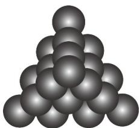

<!-- question-source:start -->
【变式1】如图的形状出现在南宋数学家扬辉所著的《详解九章算法'商功》中后人称为“三角垛”，“三角垛”最

上层有 $^{1}$ 个球，第二层有 $^{3}$ 个球，第三层有 $^{6}$ 个球，…，设第n层有 $a_{n}$ 个球，从上往下n层球的总数为 $S_{n}$

则（ ）

A. $a_5 = 35$ B. $S_{5} = 35$

C. $a_{n + 1} - a_n = n + 1$ D．不存在正整数 $m > 2$ ，使得 $a_{m}$ 为质数
<!-- question-source:end -->

![[高中/课堂同步/题库/人教A版高中数学同步讲义(2026)/04_选择性必修第二册/第四章 数列/专题4.1 数列的概念（高效培优讲义）数学人教A版高二选择性必修第二册/题型04_递推公式的应用/questions/answers/Q00082291A1.md]]
