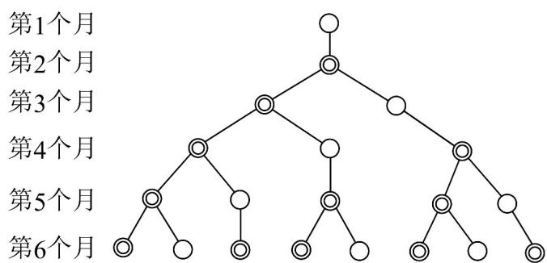

<!-- question-source:start -->
【变式2】意大利著名数学家斐波那契在研究兔子繁殖问题时，发现有这样一个数列：1，1，2，3，5，8，

13, 21, …, 其中从第三个数起，每一个数都等于它前面两个数的和，人们把这样的一列数所组成的数列称

为“斐波那契数列”，记为 $\left\{F_{n}\right\}$ ·利用下图所揭示的 $\left\{F_{n}\right\}$ 的性质，则在等式 $F_{2022}^{2}-\left(F_{1}^{2}+F_{2}^{2}+\cdots+F_{2021}^{2}\right)=F_{2022}\cdot F_{m}$

中， $m =$ \_\_\_\_.

<!-- question-source:end -->

![[高中/课堂同步/题库/人教A版高中数学同步讲义(2026)/04_选择性必修第二册/第四章 数列/专题4.1 数列的概念（高效培优讲义）数学人教A版高二选择性必修第二册/题型04_递推公式的应用/questions/answers/Q00082292A1.md]]
