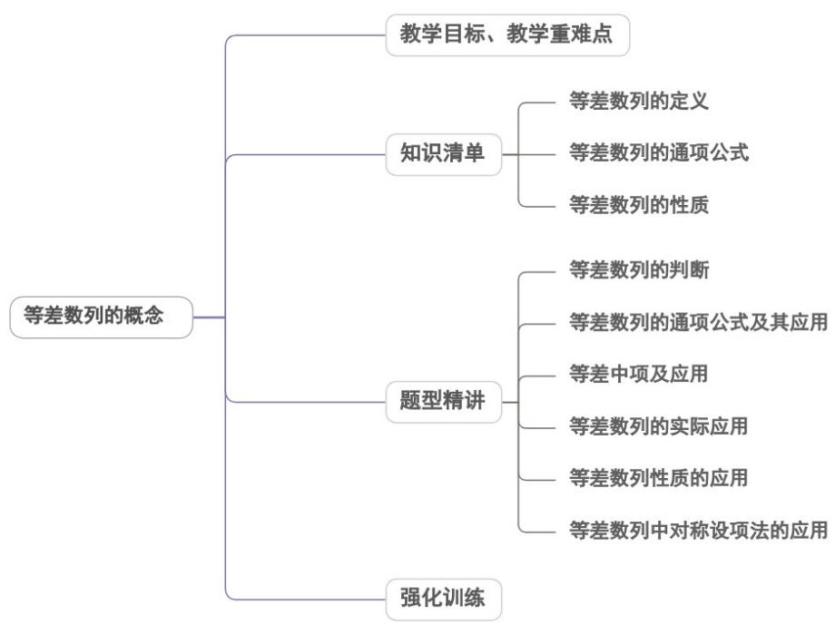

<!-- source-part:1 pages:1-36 -->

## 专题4.2.1 等差数列的概念

## 内容概览

## 教学目标、教学重难点

<table><tr><td>教学目标</td><td>1.理解等差数列的定义·会推导等差数列的通项公式,能运用等差数列的通项公式解决一些简单的问题·掌握等差中项的概念。2.能根据等差数列的定义推出等差数列的常用性质.能运用等差数列的性质解决有关问题。</td></tr><tr><td>教学重难点</td><td>1.重点等差数列的通项公式,等差数列的四种判断方法,等差数列的性质.2.难点灵活利用等差数列性质的应用来解题.</td></tr></table>

## 知识清单

## 知识点 01 等差数列的定义

一般地，如果一个数列从第二项起，每一项与它的前一项的差都等于同一个常数，这个数列就叫做等差

数列，这个常数叫做等差数列的公差，公差通常用字母 $d$ 表示.

对于数列 $\{a_{n}\}$ ，若 $a_{n} - a_{n - 1} = d$ （ $n\in \mathbf{N}^{*}$ ， $n = 2$ ， $d$ 为常数）或 $a_{n + 1} - a_n = d$ （ $n\in \mathbf{N}^*$ ， $d$ 为常数），则此数

列是等差数列，其中常数 $d$ 叫做等差数列的公差。

等差中项

如果 $a$ ， $A$ ， $b$ 成等差数列，那么 $A$ 叫做 $a$ 与 $b$ 的等差中项，即 $A = \frac{a + b}{2}$

【即学即练】

1. 下列数列是递增的等差数列的是（）

【答案】
A. 7,13,19,25,31
B. 1,1,2,3,…,n
C. 9999...
D. 数列 $\left\{a_{n}\right\}$ 满足 $a_{n+1}-a_{n}=3$

【答案】AD

【分析】根据等差数列的概念及单调性逐项判断即可·

【详解】由题意，∵13-7=19-13=25-19=31-25=6>0

$\therefore A$ 中数列是公差为 $6$ 的递增等差数列·故 $A$ 正确·

$\because 1 - 1 = 0 \neq 2 - 1$ ， $\therefore^B$ 中数列不是等差数列·故 $^B$ 错误·

$\because 9-9=9-9=\cdots=0$ ， $\therefore^{C}$ 中数列是公差为 $^{0}$ 的等差数列，但不是递增数列·故 $^{C}$ 错误·

$\because a_{n+1}-a_{n}=3>0,\therefore^{D}$ 中数列 $\left\{a_{n}\right\}$ 是公差为 $^{3}$ 的递增等差数列·故 $^{D}$ 正确·

故选：AD.

2. 已知数列 $\{c_n\}$ 共有9项，且满足 $c_1 = 2$ ， $(c_{n+1} - c_n - 1)(c_{n+1} - c_n - 2) = 0$ ，则下列说法正确的是（）A. 数列 $\{c_n\}$ 是公差为1或公差为2的等差数列B. $c_9$ 的最小值是10，最大值是18C. 若 $c_5 = 8$ ，则满足条件的数组 $(c_2, c_3, c_4)$ 的组数共有6组D. 符合已知条件且满足 $c_5 - c_1 = c_9 - c_5$ 的数列 $\{c_n\}$ 的个数为70个

【答案】BCD

【分析】由题意得 $c_{n+1}-c_{n}=1$ 或 $c_{n+1}-c_{n}=2$ ，对比等差数列的定义可判断 A；分 d=1 和 d=2 两种情况求 $c_{9}$ 的

最小值和最大值即可判断 $B$ ；由 $c_{5} = 8$ 知， $\left(c_{5} - c_{4}\right)$ ， $\left(c_{4} - c_{3}\right)$ ， $\left(c_{3} - c_{2}\right)$ ， $\left(c_{2} - c_{1}\right)$ 这 $^{4}$ 组的数只能为 $^{2}$ 或 $^{1}$ ，

结合组合数可判断 C；由 $c_{5}-c_{1}=c_{9}-c_{5}$ 知， $\left(c_{n+1}-c_{n}\right)$ 的数只能为 2 或 1，结合组合数可判断 D.

【详解】对于 A，由 $\left(c_{n+1}-c_{n}-1\right)\left(c_{n+1}-c_{n}-2\right)=0$ 得： $c_{n+1}-c_{n}=1$ 或 $c_{n+1}-c_{n}=2$ ， $\left\{c_{n}\right\}$ 前后两项差为 1 或 2，不

一定是等差数列，故 $^{A}$ 不正确；

对于 B，当 $\left\{c_{n}\right\}$ 为等差数列时，且 d=1， $c_{9}$ 最小为 10，d=2， $c_{9}$ 最大为 18，故 B 正确；

$$
\text {对于} \mathrm{C}, c _ {5} = \left(c _ {5} - c _ {4}\right) + \left(c _ {4} - c _ {3}\right) + \left(c _ {3} - c _ {2}\right) + \left(c _ {2} - c _ {1}\right) + c _ {1}, 6 = \left(c _ {5} - c _ {4}\right) + \left(c _ {4} - c _ {3}\right) + \left(c _ {3} - c _ {2}\right) + \left(c _ {2} - c _ {1}\right), \text {而} \left(c _ {5} - c _ {4}\right)
$$

$\left(c_{4} - c_{3}\right)$ ， $\left(c_{3} - c_{2}\right)$ ， $\left(c_{2} - c_{1}\right)$ 这 $^4$ 组的数只能为 $^2$ 或 $^1$ ，它们的和为 $^6$ ，故有 $^2$ 个 $^1$ ， $^2$ 个 $^2$ ，故有 $C_4^2 = 6$ 种，

故 $^{C}$ 正确；

对于 D，由 $c_{5}-c_{1}=c_{9}-c_{5}$ ，则 $\left(c_{5}-c_{4}\right)+\left(c_{4}-c_{3}\right)+\left(c_{3}-c_{2}\right)+\left(c_{2}-c_{1}\right)=\left(c_{9}-c_{8}\right)+\left(c_{8}-c_{7}\right)+\left(c_{7}-c_{6}\right)+\left(c_{6}-c_{5}\right)$

每个 $\left(c_{n + 1} - c_n\right)$ 的数只能为 $^2$ 或 $^1$ ，故有 $\mathrm{C}_4^0\mathrm{C}_4^0 +\mathrm{C}_4^1\mathrm{C}_4^1 +\mathrm{C}_4^2\mathrm{C}_4^2 +\mathrm{C}_4^3\mathrm{C}_4^3 +\mathrm{C}_4^4\mathrm{C}_4^4 = 70$ ，故D正确.

故选：BCD.

## 知识点 02 等差数列的通项公式

首项为 $a_1$ ，公差为 $d$ 的等差数列 $\{a_n\}$ 的通项公式为 $a_{n} = a_{1} + (n - 1)d$

(1)等差数列的通项公式是关于三个基本量 $a_1, d$ 和 $n$ 的表达式, 所以由首项 $a_1$ 和公差 $d$ 可以求出数列中的任意一项.

(2)等差数列的通项公式可以推广为 $a_{n} = a_{m} + (n - m)d$ ，由此可知，已知等差数列中的任意两项，就可以求出其他的任意一项.

推导过程：

(1) 归纳法：根据等差数列定义 $a_{n} - a_{n-1} = d$ 可得： $a_{n} = a_{n-1} + d$ ，所以 $a_{2} = a_{1} + d = a_{1} + (2 - 1)d$

$$
a _ {3} = a _ {2} + d = (a _ {1} + d) + d = a _ {1} + 2 d = a _ {1} + (3 - 1) d \quad a _ {4} = a _ {3} + d = (a _ {1} + 2 d) + d = a _ {1} + 3 d = a _ {1} + (4 - 1) d
$$

$$
a _ {n} = a _ {1} + (n - 1) d
$$

当 $n = 1$ 时，上式也成立

所以归纳得出等差数列的通项公式为：

$$
a _ {n} = a _ {1} + (n - 1) d \left(n \in N _ {+}\right)
$$

(2) 叠加法：

根据等差数列定义 $a_{n} - a_{n - 1} = d$ ，有： $a_2 - a_1 = d$ ， $a_3 - a_2 = d$ ， $a_4 - a_3 = d$ ，… $a_{n} - a_{n - 1} = d$

把这 $n - 1$ 个等式的左边与右边分别相加（叠加），并化简得 $a_{n} - a_{1} = (n - 1)d$

所以 $a_{n} = a_{1} + (n - 1)d$

(3) 迭代法：

$$
a _ {n} = a _ {n - 1} + d = \left(a _ {n - 2} + d\right) + d = \dots = \left(a _ {2} + d\right) + d + \dots + d = a _ {1} + (n - 1) d \text {所以} a _ {n} = a _ {1} + (n - 1) d
$$

【即学即练】

1. 已知数列 $\left\{\frac{1}{a_{n}}\right\}$ 是等差数列，且 $a_{1}=1, a_{2}=\frac{1}{3}$ ，则 $a_{10}=(\quad)$ A. $-\frac{1}{5}$ B. $\frac{1}{7}$ C. $\frac{1}{19}$ D. $-\frac{1}{17}$

【答案】C

【分析】利用等差数列的性质列出数列 $\left\{\frac{1}{a_n}\right\}$ 的通项公式，再根据 $a_1, a_2$ 求出公差 $d$ ，从而解出数列 $\left\{\frac{1}{a_n}\right\}$ 的通

项公式，代入 $n = 10$ 求解.

【详解】 $\because$ 数列 $\left\{\frac{1}{a_n}\right\}$ 是等差数列，设公差为 $d$ ，则 $\frac{1}{a_n} = \frac{1}{a_1} + (n - 1)d$

又∵ $a_{1}=1,a_{2}=\frac{1}{3}$

$$
\therefore d = \frac {1}{a _ {2}} - \frac {1}{a _ {1}} = 3 - 1 = 2
$$

∴ 数列 $\left\{\frac{1}{a_{n}}\right\}$ 的通项公式为： $\frac{1}{a_{n}}=\frac{1}{a_{1}}+2(n-1)=2n-1$

$$
\frac {1}{a _ {1 0}} = 1 0 \times 2 - 1 = 1 9
$$

$$
\therefore a _ {1 0} = \frac {1}{1 9}
$$

故选：C.

2. 已知数列 $\sqrt{3}$ , $\sqrt{5}$ , $\sqrt{7}$ , $3$ , $\sqrt{11}$ , ..., 则 $\sqrt{21}$ 是这个数列的第（）项
A. 10 B. 11 C. 12 D. 13

【答案】A

【分析】观察法求出数列的通项公式，令 $\sqrt{2n + 1} = \sqrt{21}$ ，解方程求出结果即可·

【详解】由题意可知，被开方数是首项为 $^{3}$ ，公差为 $^{2}$ 的等差数列，

则该数列的通项公式为 $a_{n} = \sqrt{2n + 1}$ ，令 $\sqrt{2n + 1} = \sqrt{21}$ ，解得 $n = 10$ ，故A正确·

故选：A

## 知识点 03 等差数列的性质

等差数列中，公差为 $d$ ，则

①若 $m, n, p, q \in N^{*}$ ，且 $m + n = p + q$ ，则 $a_{m} + a_{n} = a_{p} + a_{q}$ ，

特别地，当 $m + n = 2p$ 时 $a_{m} + a_{n} = 2a_{p}$

②下标成公差为 $m$ 的等差数列的项 $a_{k}$ ， $a_{k + m}$ ， $a_{k + 2m}$ ，…组成的新数列仍为等差数列，公差为 $md$ 。

③若数列 $\left\{b_n\right\}$ 也为等差数列，则 $\left\{a_n\pm b_n\right\}$ ， $\left\{ka_n\pm b\right\}$ ，（ $k$ ， $b$ 为非零常数）也是等差数列.

④ $a_1 + a_2 + a_3, \quad a_4 + a_5 + a_6, \quad a_7 + a_8 + a_9, \ldots$ 仍是等差数列.

⑤数列 $\left\{\lambda a_{n} + b\right\}$ （ $\lambda, b$ 为非零常数）也是等差数列。

## 【即学即练】

1. 已知等差数列 $\{a_{n}\}$ 的首项 $a_{1} = 2$ ，公差 $d = 6$ ，在 $\{a_{n}\}$ 中每相邻两项之间都插入 $^{2}$ 个数，使它们和原数列的数一起构成一个新的等差数列 $\{b_{n}\}$ ，则 $b_{22}$ 是数列 $\{a_{n}\}$ 的第（）项
A.7 B.8 C.9 D.10

【答案】B

【分析】由等差数列的基本量法求出 $\left\{a_{n}\right\}$ ，再由题意求出 $\left\{b_{n}\right\}$ 后可得

【详解】由题意可得 $a_{n}=2+6(n-1)=6n-4, a_{2}=8$

因为在 $\{a_{n}\}$ 中每相邻两项之间都插入 $^2$ 个数，使它们和原数列的数一起构成一个新的等差数列 $\{b_{n}\}$

所以 $b_{1} = 2, b_{4} = 8$ ，新数列的公差 $d' = 2$

所以 $b_{n} = 2 + 2(n - 1) = 2n$

所以 $b_{22} = 44 = 6n - 4 \Rightarrow n = 8$ .

故选：B.

2. 已知等差数列 $\left\{a_{n}\right\}, a_{1} = \frac{1}{3}, a_{2} + a_{4} = 4$ ，则下列结论正确的是（）A. 等差数列 $\left\{a_{n}\right\}$ 的公差为 $\frac{5}{6}$ B. 等差数列 $\left\{a_{n}\right\}$ 的通项公式为 $a_{n} = \frac{2}{3} n + \frac{1}{3}$ C. 等差数列 $\left\{a_{n}\right\}$ 是一个单调递增的数列D. 若 $a_{n} = 35$ ，则 $n = 52$

【答案】AC

【分析】选项 A，利用等差数列性质求出 $a_{3}$ ，进而求出公差 d；选项 B，根据通项公式求出 $a_{n}$ ；选项 C，根据

公差的正负判断数列单调性；选项 $^{D}$ ，利用通项公式求解特定项的项数。

【详解】选项 $^{A}$ ， $2a_{3}=a_{2}+a_{4}=4$ ，则 $a_{3}=2$ ，所以 $d=\frac{2-\frac{1}{3}}{2}=\frac{5}{6}$ ，所以 $^{A}$ 正确；

选项 B， $a_{1}=\frac{1}{3},d=\frac{5}{6}$ ，则通项公式为 $a_{n}=\frac{1}{3}+\left(n-1\right)\times\frac{5}{6}=\frac{5}{6}n-\frac{1}{2}$ ，所以 B 错误；

选项 C，由选项 A 知 $a_{n+1}-a_{n}=d=\frac{5}{6}>0$ ，所以 C 正确；

选项D，由选项B知 $a_{n} = \frac{5}{6} n - \frac{1}{2}$ ，则当 $a_{n} = 35$ 时，解得 $n = \frac{213}{5}$ ，而 $n\in \mathbf{N}^{*}$ ，所以D错误·

故选：AC.

## 题型精讲

![[高中/课堂同步/题库/人教A版高中数学同步讲义(2026)/04_选择性必修第二册/第四章 数列/专题4.2.1 等差数列的概念（高效培优讲义）数学人教A版高二选择性必修第二册/题型01_等差数列的判断/题型01_等差数列的判断.md]]
![[高中/课堂同步/题库/人教A版高中数学同步讲义(2026)/04_选择性必修第二册/第四章 数列/专题4.2.1 等差数列的概念（高效培优讲义）数学人教A版高二选择性必修第二册/题型02_等差数列的通项公式及其应用/题型02_等差数列的通项公式及其应用.md]]
![[高中/课堂同步/题库/人教A版高中数学同步讲义(2026)/04_选择性必修第二册/第四章 数列/专题4.2.1 等差数列的概念（高效培优讲义）数学人教A版高二选择性必修第二册/题型03_等差中项及应用/题型03_等差中项及应用.md]]
![[高中/课堂同步/题库/人教A版高中数学同步讲义(2026)/04_选择性必修第二册/第四章 数列/专题4.2.1 等差数列的概念（高效培优讲义）数学人教A版高二选择性必修第二册/题型04_等差数列的实际应用/题型04_等差数列的实际应用.md]]
![[高中/课堂同步/题库/人教A版高中数学同步讲义(2026)/04_选择性必修第二册/第四章 数列/专题4.2.1 等差数列的概念（高效培优讲义）数学人教A版高二选择性必修第二册/题型05_等差数列性质的应用/题型05_等差数列性质的应用.md]]
![[高中/课堂同步/题库/人教A版高中数学同步讲义(2026)/04_选择性必修第二册/第四章 数列/专题4.2.1 等差数列的概念（高效培优讲义）数学人教A版高二选择性必修第二册/题型06_等差数列中对称设项法的应用/题型06_等差数列中对称设项法的应用.md]]
![[高中/课堂同步/题库/人教A版高中数学同步讲义(2026)/04_选择性必修第二册/第四章 数列/专题4.2.1 等差数列的概念（高效培优讲义）数学人教A版高二选择性必修第二册/强化训练/强化训练.md]]
