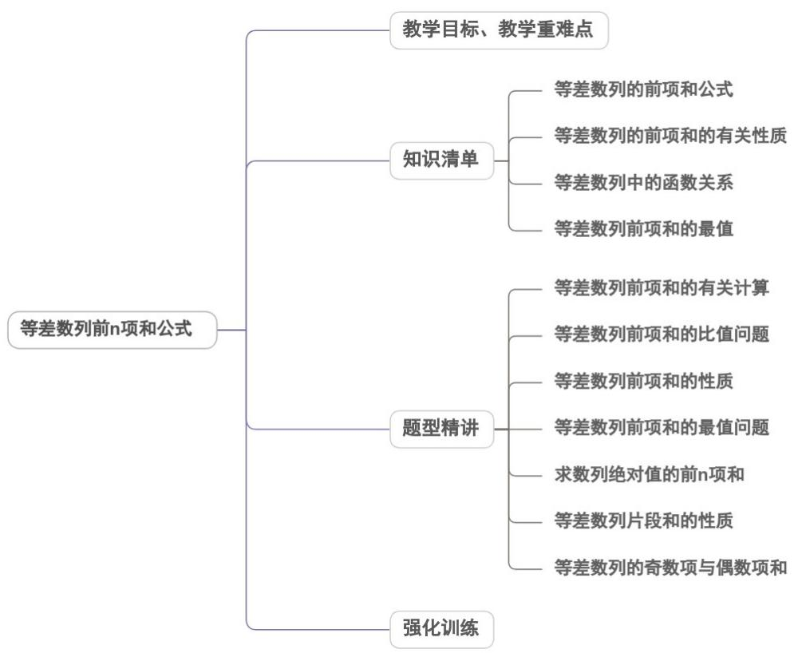

<!-- source-part:1 pages:1-48 -->

## 专题4.2.2 等差数列前n项和公式

## 内容概览

## 教学目标、教学重难点

<table><tr><td>教学目标</td><td>1.掌握等差数列前n项和公式及求取思路,熟练掌握等差数列的五个量之间的关系并能由三求二,能用通项与和求通项。2.会利用等差数列性质简化求和运算,会利用等差数列前n项和的函数特征求最值。3.能处理与等差数列相关的综合问题。</td></tr><tr><td>教学重难点</td><td>1.重点等差数列前n项和的性质,等差数列前n项和的最值问题,等差数列的奇数项与偶数项和.2.难点</td></tr></table>

<table><tr><td></td><td>求数列 $\left\{ |a_n| \right\}$ 的前n项和、等差数列前n项和的比值问题.</td></tr></table>

## 知识清单

## 知识点 01 等差数列的前 n 项和公式

等差数列的前 n 项和公式：1. $S_{n}=\frac{n(a_{1}+a_{n})}{2}$ ， $S_{n}=na_{1}+\frac{n(n-1)d}{2}$

证明：将 $a_{n} = a_{1} + (n - 1)d$ 代入 $S_{n} = \frac{n(a_{1} + a_{n})}{2}$ 可得： $S_{n} = na_{1} + \frac{n(n - 1)d}{2}$

① 倒序相加是数列求和的重要方法之一.

②上面两个公式均为等差数列的求和公式，共涉及 $a_1$ 、 $n$ 、 $d$ 、 $a_n$ 、 $S_n$ 五个量，已知其中任意三个量，通过

解方程组，便可求出其余两个量。

## 【即学即练】

1. 已知一个多边形的周长为 $158$ ，所有各边的长度成等差数列，最大的边长为 $44$ ，公差为 $3$ ，则这个多边形

的边数是（ ）A.3 B.4 C.5 D.6

【答案】B

【分析】设这个多边形的最小边长为 $a_1$ ，根据等差数列的通项公式和前 $n$ 项和公式，列出方程组，求得 $a_1, n$

的值，即可得到答案·

【详解】设这个多边形的最小边长为 $a_1$ ，

因为多边形的周长为158，且最大的边长为44，公差为3，

可得 $\left\{ \begin{array}{l}a_{1} + (n - 1)\times 3 = 44\\ \frac{n(a_{1} + 44)}{2} = 158 \end{array} \right.$ ，解得 $a_1 = 35,n = 4$ ，即这个多边形的边数是

故选：B.

2. 已知等差数列 $\left\{a_{n}\right\}$ 中， $a_{3} + a_{5} = a_{4} + 7, a_{10} = 19$ ，则数列 $\left\{a_{n} \cos n\pi\right\}$ 的前 10 项和为 \_\_\_\_.

【答案】 $^{10}$

【分析】先根据条件求出首项与公差，再根据等差数列通项公式得 $a_{n}$ ，最后利用分组求和法得结果·

【详解】设等差数列 $\left\{a_{n}\right\}$ 的公差为d.

$$
\because a _ {3} + a _ {5} = a _ {4} + 7 \quad a _ {1 0} = 1 9
$$

$\therefore \left\{ \begin{array}{l}a_{1} + 2\mathrm{d} + a_{1} + 4d = a_{1} + 3d + 7\\ a_{1} + 9d = 19 \end{array} \right.$ ，解得 $\left\{ \begin{array}{l}a_1 = 1\\ d = 2 \end{array} \right.,$

$\therefore a_{n} = 1 + 2(n - 1) = 2n - 1$ ，则 $a_{n}\cos n\pi = (2n - 1)\cdot (-1)^{n}$

所以数列 $\left\{a_{n}\cos n\pi\right\}$ 的前 10 项的和为 $-a_{1}+a_{2}-a_{3}+a_{4}-\cdots-a_{9}+a_{10}$

$$
= \left(- a _ {1} + a _ {2}\right) + \left(- a _ {3} + a _ {4}\right) + \dots + \left(- a _ {9} + a _ {1 0}\right) = 2 + 2 + \dots + 2 = 2 \times \frac {1 0}{2} = 1 0.
$$

故答案为：10

## 知识点 02 等差数列的前 n 项和的有关性质

(1)若数列 $\{a_{n}\}$ 是公差为 $d$ 的等差数列,则数列 $\left\{\frac{S_n}{n}\right\}$ 也是等差数列,且公差为 $\frac{d}{2}$

(2)设等差数列 $\{a_{n}\}$ 的公差为 $d$ ， $S_{n}$ 为其前 $n$ 项和，则 $S_{m}$ ， $S_{2m} - S_{m}$ ， $S_{3m} - S_{2m}$ ， $S_{4m} - S_{3m},\ldots$ 组成公差为

$m^2 d$ 的等差数列

(3)在等差数列 $\{a_{n}\}$ ， $\{b_{n}\}$ 中，它们的前 $n$ 项和分别记为 $S_{n}, T_{n}$ 则 $\frac{a_{n}}{b_{n}} = \frac{S_{2n-1}}{T_{2n-1}}$

(4)若等差数列 $\{a_{n}\}$ 的项数为 $2n$ ，则 $S_{2n} = n(a_n + a_{n + 1})$

$$
S _ {\text {偶}} - S _ {\text {奇}} = n d, \frac {S _ {\text {偶}}}{S _ {\text {奇}}} = \frac {a _ {n + 1}}{a _ {n}} 。
$$

(5)若等差数列 $\{a_{n}\}$ 的项数为 $2n - 1$ ，则 $S_{\text{偶}} = (n - 1)a_{n}$ ， $S_{\text{奇}} = na_{n}$ ， $S_{\text{奇}} - S_{\text{偶}} = a_{n}$ ， $\frac{S_{\text{奇}}}{S_{\text{偶}}} = \frac{n}{n - 1}$ 【即学即练】

1. 若 $a_1, a_2, L, a_{2n+1}$ 成等差数列，奇数项的和为 75，偶数项的和为 60，则该数列的项数为（）

【答案】
A. 4 B. 5 C. 9 D. 11

【答案】C

【分析】利用奇偶数项的和及等差数列的性质有 $\left\{\begin{aligned}(n+1)a_{n+1}&=75\\na_{n+1}&=60\end{aligned}\right.$ ，即可求项数。

【详解】由题设 $\left\{\begin{aligned}a_{1}+a_{3}+\cdots+a_{2n+1}&=75\\a_{2}+a_{4}+\cdots+a_{2n}&=60\end{aligned}\right.$ ，则 $\left\{\begin{aligned}(n+1)a_{n+1}&=75\\na_{n+1}&=60\end{aligned}\right.$ ，显然 $a_{n+1}\neq0$ ，

所以 $\frac{n+1}{n}=\frac{75}{60}=\frac{5}{4}$ ，可得 n=4，则共有 $2n+1=9$ 项。

故选：C

2. 已知等差数列 $\left\{a_{n}\right\}$ 的前 $n$ 项和为 $S_{n}$ ，若 $S_{4} = 9, S_{12} = 6$ ，则 $S_{8} = (\quad)$ A. $\frac{3}{2}$ B. $\frac{15}{2}$ C. 10

D. 11

【答案】D

【分析】根据等差数列前 n 项和的性质可得 $S_{4}, S_{8} - S_{4}, S_{12} - S_{8}$ 成等差数列，进而列方程求解即可·

【详解】由题知 $S_{4}, S_{8} - S_{4}, S_{12} - S_{8}$ 成等差数列，

即 $9, S_{8} - 9, 6 - S_{8}$ 成等差数列，

即 $2(S_{8}-9)=9+6-S_{8}$ ，解得 $S_{8}=11$ 。

故选：D.

## 知识点 03 等差数列中的函数关系

等差数列 $\{a_{n}\}$ 的通项公式是关于 $n$ 的一次函数（或常数函数）

等差数列 $\{a_{n}\}$ 中， $a_{n} = a_{1} + (n - 1)d = dn + (a_{1} - d)$ ，令 $a_{1} - d = b$ ，则： $a_{n} = dn + b$ （ $d$ ， $b$ 是常数且 $d$ 为公

差）

（1）当 $d = 0$ 时， $a_{n} = b$ 为常数函数， $\{a_{n}\}$ 为常数列；它的图象是在直线 $y = b$ 上均匀排列的一群孤立的点。

(2) 当 $d \neq 0$ 时， $a_{n} = dn + b$ 是 $n$ 的一次函数；它的图象是在直线 $y = dx + b$ 上均匀排列的一群孤立的点。

①当 $d > 0$ 时，一次函数单调增， $\{a_n\}$ 为递增数列；②当 $d < 0$ 时，一次函数单调减， $\{a_n\}$ 为递减数列.

等差数列 $\{a_{n}\}$ 的前 $n$ 项和公式是关于 $n$ 的一个常数项为零的二次函数（或一次函数）

由 $S_{n} = na_{1} + \frac{n(n - 1)}{2} d = \frac{d}{2} n^{2} + (a_{1} - \frac{d}{2})n$ ，令 $A = \frac{d}{2}$ ， $B = a_{1} - \frac{d}{2}$ ，则： $S_{n} = An^{2} + Bn$ （ $A$ ， $B$ 是常数）

（1）当 $d = 0$ 即 $A = 0$ 时， $S_{n} = Bn = na_{1}$ ， $S_{n}$ 是关于 $n$ 的一个一次函数；它的图象是在直线 $y = a_{1}x$ 上的一群

孤立的点.

(2) 当 $d \neq 0$ 即 $A \neq 0$ 时， $S_{n}$ 是关于 $n$ 的一个常数项为零的二次函数；它的图象是在抛物线 $y = Ax^{2} + Bx$ 上的

一群孤立的点．

①当 d > 0 时 $S_{n}$ 有最小值②当 d < 0 时， $S_{n}$ 有最大值

1、公差不为0的等差数列 $\{a_{n}\}$ 的通项公式是关于 $n$ 的一次函数.

$a_{n} = pn + q$ （ $p$ ， $q$ 是常数）是数列 $\{a_n\}$ 成等差数列的充要条件.

3、公差不为0的等差数列 $\{a_{n}\}$ 的前 $n$ 项和公式是关于 $n$ 的一个常数项为零的二次函数.

$S_{n} = An^{2} + Bn$ （其中 $A$ ， $B$ 为常数）是数列 $\{a_n\}$ 成等差数列的充要条件.

【即学即练】

1. 已知数列 $\left\{a_{n}\right\}$ 是等差数列，前 $n$ 项和为 $S_{n}$ ，则下列结论正确的是（）

【答案】

A. 若 $a_{n} = 3n + r$ ，且 $n = 6$ 时 $S_{n}$ 最小，则 $-21 < r < -18$

B．若 $S_{4}$ 2， $S_{5} \leq 15$ ，则 $S_{7}$ 的最大值为56

C．若 $a_{1}^{2}+a_{4}^{2}=10$ ，则 $S_{5}$ 的最大值为 $\frac{25\sqrt{2}}{3}$

D．若 $S_{n}=n^{2}+7stn+t+1$ ，且 $S_{7}$ 最小，则 $\frac{13}{7}\leq s\leq\frac{15}{7}$

【答案】BCD

【分析】利用等差数列的通项公式及前 $n$ 项和公式，逐项计算分析即可·【详解】对于 $^{A}$ ，因为 n=6 时 $S_{n}$ 最小，所以 $\left\{\begin{aligned}a_{6}&\leq0\\ a_{7}&0\end{aligned}\right.$ ，即 $\left\{\begin{aligned}18+r&\leq0\\ 21+r&0\end{aligned}\right.$ ，所以 $-21\leq r\leq-18$ ，故 $^{A}$ 错误；

对于 $^{B}$ ，设 $\left\{a_{n}\right\}$ 的公差为 d，则由 $S_{4}=4a_{1}+6d$ 得 $2a_{1}+3d$ 1，由 $S_{5}=5a_{1}+10d\leq15$ 得 $a_{1}+2d\leq3$ ，

所以 $S_{7}=7a_{1}+21d=-7(2a_{1}+3d)+21(a_{1}+2d)\leq-7+63=56$ ，故 $^{B}$ 正确；

对于 C，因为 $a_{1}^{2} + a_{4}^{2} = 10$ ，所以 $(a_{3} - 2d)^{2} + (a_{3} + d)^{2} = 10$ ，即 $5d^{2} - 2a_{3}d + 2a_{3}^{2} - 10 = 0$ ，

把该式看作关于 $d$ 的一元二次方程，则 $\Delta = 4a_3^2 - 20(2a_3^2 - 10) \quad 0$

解得 $-\frac{5\sqrt{2}}{3} \leq a_{3} \leq \frac{5\sqrt{2}}{3}$ ，所以 $S_{5} = 5a_{3} \leq \frac{25\sqrt{2}}{3}$ ，故 C 正确；

对于 D，由题意得 t = -1，故 $S_{n} = n^{2} - 7sn$ ，因为 $S_{7}$ 最小，所以 $6.5 \leq \frac{7s}{2} \leq 7.5$ ，即 $\frac{13}{7} \leq s \leq \frac{15}{7}$ ，故 D 正确。
故选：BCD．

2. 已知等差数列 $\left\{a_{n}\right\}$ 的前 $n$ 项和为 $S_{n}$ ， $a_{1} = -12$ ，公差 $d = 2$ ，则下列说法正确的是（）

【答案】
A. $\left\{a_{n}\right\}$ 是递增数列
B. 1 是数列 $\left\{a_{n}\right\}$ 中的项
C. 数列 $\left\{S_{n}\right\}$ 中的最小项为 $S_{8}$ D. 数列 $\left\{\frac{S_{n}}{n}\right\}$ 是等差数列

【答案】AD

【分析】根据题意，由等差数列的通项公式以及性质即可判断 $^{AB}$ ，由等差数列前n项和公式以及性质即可判

断 CD.

【详解】对于 A，因为 $a_{1} = -12$ ，公差 d = 2，则 $a_{n} = -12 + 2(n - 1) = 2n - 14$

所以 $\left\{a_{n}\right\}$ 是递增数列，故 A 正确；

对于 B，令 $a_{n}=2n-14=1$ ，解得 $n=\frac{15}{2}$ ，故 1 不是数列 $\left\{a_{n}\right\}$ 中的项，

故 $^{B}$ 错误；

对于 C，令 $a_{n}=2n-14=0$ ，解得 n=7，即 $a_{6}<0, a_{7}=0, a_{8}>0$ ，

所以数列 $\{S_n\}$ 中的最小项为 $S_{6}$ 或 $S_{7}$ ，故C错误；

对于D，因为 $S_{n} = -12n + \frac{n(n - 1)}{2}\times 2 = n^{2} - 13n$ ，则 $\frac{S_n}{n} = n - 13$

所以数列 $\left\{\frac{S_{n}}{n}\right\}$ 是等差数列，故 D 正确；

故选：AD

## 知识点 04 等差数列前 n 项和的最值

(1) 在等差数列 $\left\{a_{n}\right\}$ 中，

当 $a_1 > 0$ ， $d < 0$ 时， $S_{n}$ 有最大值，使 $S_{n}$ 取得最值的 $n$ 可由不等式组 $\left\{ \begin{array}{ll}a_n\cdot ..0\\ a_{n + 1}, & 0 \end{array} \right.$ 确定；当 $a_1 < 0$ ， $d > 0$ 时， $S_{n}$ 有

最小值，使 $S_{n}$ 取到最值的 $n$ 可由不等式组 $\left\{ \begin{array}{ll}a_{n}, & 0\\ a_{n + 1}, & 0 \end{array} \right.$ 确定.

(2) $S_{n} = \frac{d}{2} n^{2} + \left(a_{1} - \frac{d}{2}\right)n$ ，若 $d \neq 0$ ，则从二次函数的角度看：当 $d > 0$ 时， $S_{n}$ 有最小值；当 $d < 0$ 时， $S_{n}$

有最大值．当 n 取最接近对称轴的正整数时， $S_{n}$ 取到最值．

【即学即练】

1. 记 $S_{n}$ 为等差数列 $\{a_{n}\}$ 的前 $n$ 项和，已知 $a_{1} = -7$ ， $S_{3} = -9$

(1)求 $\{a_{n}\}$ 的通项公式；

(2)求 $S_{n}$ ，并求 $S_{n}$ 的最小值.

【答案】(1) $a_{n}=4n-11$

(2) $S_{n}=2n^{2}-9n$ ， $S_{n}$ 的最小值为-10

【分析】（1）根据等差数列性质可得 $a_{2}=-3$ ，进而可得公差和通项公式；

(2) 根据等差数列求和公式求 $S_{n}$ ，再根据 $a_{n}$ 的符号性分析最值.

【详解】（1）因为 $S_{n}$ 为等差数列 $\{a_n\}$ 的前 $n$ 项和，且 $a_1 = -7$ ， $S_3 = -9$

则 $S_{3} = 3a_{2} = -9$ ，即 $a_2 = -3$ ，可得公差 $d = a_{2} - a_{1} = 4$

所以数列 $\{a_{n}\}$ 的通项公式为 $a_{n} = -7 + 4(n - 1) = 4n - 11$

(2) 因为 $a_{n} = 4n - 11$ ，则 $S_{n} = \frac{n(-7 + 4n - 11)}{2} = 2n^{2} - 9n$

令 $a_{n}=4n-11>0$ ，解得 $n>\frac{11}{4}$

可知当 n 3 时， $a_{n} > 0$ ；当 $n \leq 2$ 时， $a_{n} < 0$ ；

所以 $S_{n}$ 的最小值为 $S_{2} = -7 - 3 = -10$ .

2. 已知 $\left\{a_{n}\right\}$ 为等差数列，其前 $n$ 项和为 $S_{n}$ ， $a_{1} = 12$ ， $S_{5} = S_{8}$ ，则下列结论正确的有（）

【答案】
A. $a_{7} = 0$ B. $S_{5} = 40$ C. 当且仅当 $n = 6$ 时， $S_{n}$ 最大 D. 满足 $S_{n} > 0$ 的最大整数 $n$ 为 14

【答案】AB

【分析】借助 $a_{n}$ 与 $S_{n}$ 的关系及等差数列性质计算可得 $\mathsf{A}$ ；计算出数列 $\left\{a_{n}\right\}$ 的公差后利用等差数列求和公式计

算即可得 $^{B}$ ；利用等差数列性质及等差数列求和公式计算可得 $^{C}$ 、 $^{D}$ .

【详解】对 A： $S_{8}-S_{5}=a_{8}+a_{7}+a_{6}=3a_{7}=0$ ，故 $a_{7}=0$ ，故 A 正确；

对 B： $\frac{a_{7}-a_{1}}{6}=\frac{-12}{6}=-2$ ，故 $\left\{a_{n}\right\}$ 的公差为 -2，

故 $a_{n} = 12 - 2(n - 1) = -2n + 14$

则 $S_{5} = \frac{(a_{1} + a_{5})\cdot 5}{2} = \frac{(12 + 14 - 10)\cdot 5}{2} = 40$ ，故B正确；

对 C：由 $a_{7}=0$ ，故 $S_{6}=S_{7}$ ，当 n<7 时， $a_{n}>0$ ，当 n>7 时， $a_{n}<0$ ，

故当 n=6 或 n=7 时， $S_{n}$ 最大，故 C 错误；

对 D：当 n<7 时， $a_{n}>0$ ，当 n>7 时， $a_{n}<0$ ，

又 $a_{1} + a_{13} = 2a_{7} = 0$ ，故 $S_{13} = \frac{(a_1 + a_{13})\times 13}{2} = 0$

则当 n 14 时， $S_{n}<0$ ，当 $n\leq12$ 时， $S_{n}>0$ ，

故满足 $S_{n} > 0$ 的最大整数 $n$ 为12，故 $\mathbb{D}$ 错误

故选：AB.

## 题型精讲

![[高中/课堂同步/题库/人教A版高中数学同步讲义(2026)/04_选择性必修第二册/第四章 数列/专题4.2.2 等差数列前n项和公式（高效培优讲义）数学人教A版高二选择性必修第二册/题型01_等差数列前_n_项和的有关计算/题型01_等差数列前_n_项和的有关计算.md]]
![[高中/课堂同步/题库/人教A版高中数学同步讲义(2026)/04_选择性必修第二册/第四章 数列/专题4.2.2 等差数列前n项和公式（高效培优讲义）数学人教A版高二选择性必修第二册/题型02_等差数列前_n_项和的比值问题/题型02_等差数列前_n_项和的比值问题.md]]
![[高中/课堂同步/题库/人教A版高中数学同步讲义(2026)/04_选择性必修第二册/第四章 数列/专题4.2.2 等差数列前n项和公式（高效培优讲义）数学人教A版高二选择性必修第二册/题型03_等差数列前_n_项和的性质/题型03_等差数列前_n_项和的性质.md]]
![[高中/课堂同步/题库/人教A版高中数学同步讲义(2026)/04_选择性必修第二册/第四章 数列/专题4.2.2 等差数列前n项和公式（高效培优讲义）数学人教A版高二选择性必修第二册/题型04_等差数列前_n_项和的最值问题/题型04_等差数列前_n_项和的最值问题.md]]
![[高中/课堂同步/题库/人教A版高中数学同步讲义(2026)/04_选择性必修第二册/第四章 数列/专题4.2.2 等差数列前n项和公式（高效培优讲义）数学人教A版高二选择性必修第二册/题型05_求数列___a_n___的前_n_项和/题型05_求数列___a_n___的前_n_项和.md]]
![[高中/课堂同步/题库/人教A版高中数学同步讲义(2026)/04_选择性必修第二册/第四章 数列/专题4.2.2 等差数列前n项和公式（高效培优讲义）数学人教A版高二选择性必修第二册/题型06_等差数列片段和的性质/题型06_等差数列片段和的性质.md]]
![[高中/课堂同步/题库/人教A版高中数学同步讲义(2026)/04_选择性必修第二册/第四章 数列/专题4.2.2 等差数列前n项和公式（高效培优讲义）数学人教A版高二选择性必修第二册/题型07_等差数列的奇数项与偶数项和/题型07_等差数列的奇数项与偶数项和.md]]
![[高中/课堂同步/题库/人教A版高中数学同步讲义(2026)/04_选择性必修第二册/第四章 数列/专题4.2.2 等差数列前n项和公式（高效培优讲义）数学人教A版高二选择性必修第二册/强化训练/强化训练.md]]
