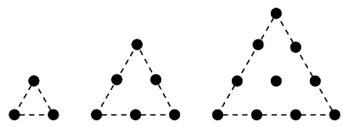

<!-- question-source:start -->
7. 在古希腊，毕达哥拉斯学派把 $136101521283645, \ldots$ ，这些数叫做三角形数，这是因为这些数目的点可

以排成正三角形（如图所示）. 设第 $n$ 个三角形数为 $a_{n}$ ，则下列结论错误的是（ ）
A. $a_{n} - a_{n-1} = n(n > 1)$ B. $a_{200} = 21000$ C. 1024 是三角形数
D. $\frac{1}{a_1} + \frac{1}{a_2} + \frac{1}{a_3} + \dots + \frac{1}{a_n} = \frac{2n}{n+1}$
<!-- question-source:end -->

![[高中/课堂同步/题库/人教A版高中数学同步讲义(2026)/04_选择性必修第二册/第四章 数列/专题4.2.2 等差数列前n项和公式（高效培优讲义）数学人教A版高二选择性必修第二册/强化训练/questions/answers/Q00082391A1.md]]
