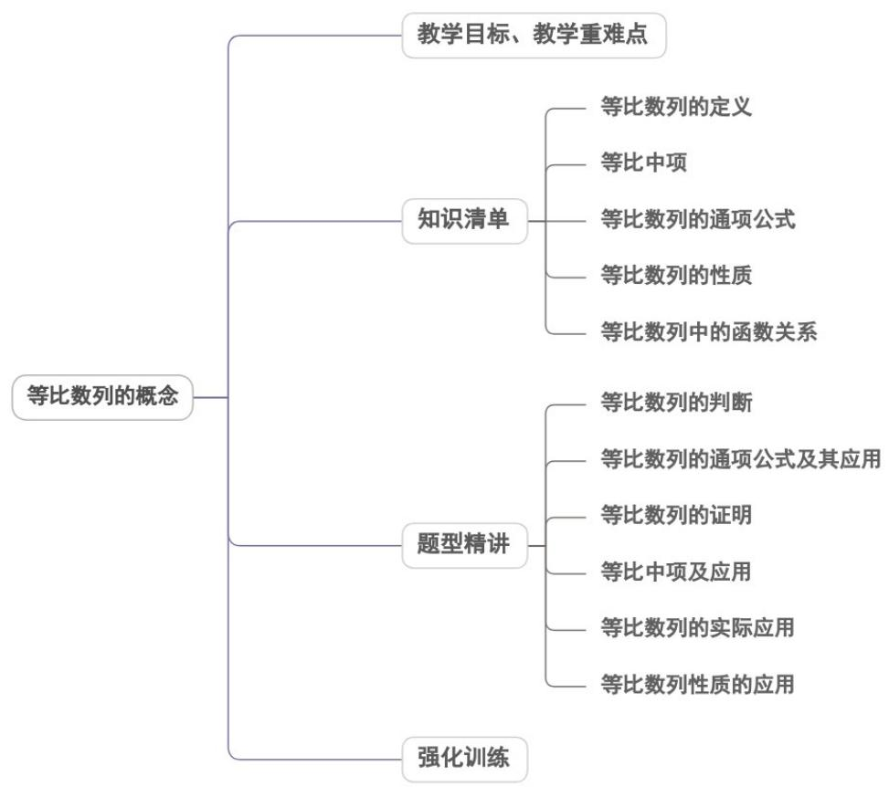
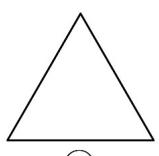
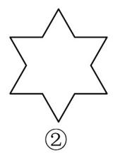
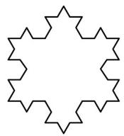
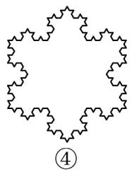

<!-- source-part:1 pages:1-47 -->

## 专题4.3.1 等比数列的概念

## 内容概览

## 教学目标、教学重难点

<table><tr><td>教学目标</td><td>1、理解等比数列的定义·会推导等比数列的通项公式,能运用等比数列的通项公式解决一些简单的问题·掌握等比中项的概念。2、能根据等比数列的定义推出等比数列的常用性质.能运用等比数列的性质解决有关问题.</td></tr><tr><td>教学重难点</td><td>1.重点能应用等比数列的定义判断等比数列,会应用等比数列的通项公式进行基本量的求解.2.难点</td></tr></table>

能应用等比数列的性质解决与等比数列相关的问题.

## 知识清单

## 知识点 01 等比数列的定义

一般地，如果一个数列从第二项起，每一项与它的前一项的比等于同一个常数，那么这个数列就叫做等

比数列．这个常数叫做等比数列的公比；公比通常用字母 $q$ 表示（ $q \neq 0$ ），即： $\frac{a_{n+1}}{a_n} = q (q \neq 0)$

①由于等比数列每一项都可能作分母，故每一项均不为0，因此q可不能是0；

②“从第二项起，每一项与它的前一项的比等于同一个常数 $q$ ”，这里的项具有任意性和有序性，常数是同一

个；

③隐含条件：任一项 $a_{n} \neq 0$ 且 $q \neq 0$ ；“ $a_{n} \neq 0$ ”是数列 $\{a_{n}\}$ 成等比数列的必要非充分条件；

④常数列都是等差数列，但不一定是等比数列．不为0的常数列是公比为1的等比数列；

⑤证明一个数列为等比数列，其依据 $a_{n}$ .利用这种形式来判定，就便于操作了

$$
\frac {a _ {n + 1}}{a _ {n}} = q (n \in N ^ {*}, q \neq 0)
$$

## 【即学即练】

1. 下列数列是等比数列的是（）

【答案】
A. 1, 1, 1, 1, 1
B. 1, 2, 4, 8, 16
C. $\frac{1}{3}$ , $\frac{1}{9}$ , $\frac{1}{27}$ , $\frac{1}{81}$ , $\frac{1}{243}$ D. -3, -2, -1, 0, 1

【答案】ABC

【分析】根据等比数列的定义对四个选项一一判断，得到答案·

【详解】 $^{A}$ 选项，数列为公比为 $^{1}$ 的等比数列， $^{A}$ 正确；

B 选项，数列为公比为 $^{2}$ 的等比数列，B 正确；

$C_{选项}$ ，数列为公比为 $\frac{1}{3}$ 的等比数列， $C_{正确}$ ；

D 选项， $\frac{-2}{-3} \neq \frac{-1}{-2}$ ，不是等比数列，D 错误

故选：ABC

2．已知数列 $\left\{a_{n}\right\}$ 满足 $a_{1}=1$ ， $a_{2}=\frac{1}{32}$ ， $\frac{a_{n+2}}{a_{n+1}}=\frac{4a_{n+1}}{a_{n}}$ ，则 $a_{8}=$ \_\_\_\_。

【答案】128

【分析】由题意，根据等比数列的定义可知数列 $\left\{\frac{a_{n+1}}{a_n}\right\}$ 是首项为 $\frac{a_2}{a_1} = \frac{1}{32}$ ，公比为 $^4$ 的等比数列，由等比数列

的通项公式可得 $\frac{a_{n+1}}{a_{n}}=\frac{1}{2}\times4^{n-3}$ ，利用累乘法求得 $a_{n}=2^{n^{2}-8n+7}$ ，令 n=8，计算即可求解。

【详解】由题意知， $\frac{a_{n+2}}{a_{n+1}}=\frac{4a_{n+1}}{a_{n}}$ ，即 $\frac{a_{n+2}}{a_{n+1}}=4\cdot\frac{a_{n+1}}{a_{n}}$ ，又 $\frac{a_{2}}{a_{1}}=\frac{1}{32}\neq0$

所以数列 $\left\{\frac{a_{n + 1}}{a_n}\right\}$ 是首项为 $\frac{1}{32}$ ，公比为 $^4$ 的等比数列，

所以 $\frac{a_{n+1}}{a_{n}}=\frac{1}{32}\times4^{n-1}=2^{-5}\times2^{2n-2}=2^{2n-7}$

当 $n$ 2时， $a_{n} = \frac{a_{n}}{a_{n - 1}}\cdot \frac{a_{n - 1}}{a_{n - 2}}\cdot \dots \cdot \frac{a_{2}}{a_{1}}\cdot a_{1} = 2^{2n - 9}\cdot 2^{2n - 11}\cdot \dots \cdot 2^{-5}\cdot 1 = 2^{\frac{(n - 1)(2n - 9 - 5)}{2}} = 2^{n^2 -8n + 7}$

所以 $a_{8}=2^{7}=128$ .

故答案为：128

## 知识点 02 等比中项

如果三个数 $a$ 、 $G$ 、 $b$ 成等比数列，那么称数 $G$ 为 $a$ 与 $b$ 的等比中项．其中 $G = \pm \sqrt{ab}$ ：

①只有当 $a$ 与 $b$ 同号即 $ab > 0$ 时， $a$ 与 $b$ 才有等比中项，且 $a$ 与 $b$ 有两个互为相反数的等比中项。当 $a$ 与 $b$ 异

号或有一个为零即 $ab \leq 0$ 时， $a$ 与 $b$ 没有等比中项。

②任意两个实数 $a$ 与 $b$ 都有等差中项，且当 $a$ 与 $b$ 确定时，等差中项 2 唯一．但任意两个实数 $a$ 与 $b$ 不

$$
c = \frac {a + b}{2}
$$

一定有等比中项，且当 $a$ 与 $b$ 有等比中项时，等比中项不唯一。

③当 $ab > 0$ 时， $a$ 、 $G$ 、 $b$ 成等比数列 $\Leftrightarrow \frac{G}{a} = \frac{b}{G} \Leftrightarrow G^2 = ab \Leftrightarrow G = \pm \sqrt{ab}$

④ $G^{2}=ab$ 是 a、G、b 成等比数列的必要不充分条件。

## 【即学即练】

1. 已知三个实数 $a, b, c$ 成等比数列，且 $a + b + c = m$ （ $m$ 为正常数），则 $b$ 的取值范围是 \_\_\_\_。

【答案】 $\left[-m,0\right)\cup\left(0,\frac{m}{3}\right]$

【分析】解法一设 $a = \frac{b}{x}$ ， $c = bx$ ，得到 $b$ 的表达式，再结合基本不等式求解；解法二由等比中项的性质结合

一元二次方程根与系数的关系由判别式求解·

【详解】解法一设 $a = \frac{b}{x}$ ， $c = bx$ ，则由 $a + b + c = m$ ， $\frac{b}{x} +b + bx = b\left(\frac{1}{x} +x + 1\right)$ 可得 $b = \frac{m}{1 + x + \frac{1}{x}}$ 当 $x > 0$ 时， $x + \frac{1}{x} 2$ ；当 $x <   0$ 时， $x + \frac{1}{x}\leq -2$ ，于是 $1 + x + \frac{1}{x} 3$ 或 $1 + x + \frac{1}{x}\leq -1$ 又 $\because m > 0$ ，∴ $0 <   b\leq \frac{m}{3}$ 或 $-m\leq b <   0$ ，故 $b\in \left[-m,0\right)\cup \left(0,\frac{m}{3}\right]$

解法二：由 $a, b, c$ 成等比数列，知 $b^{2} = ac$ ，又 $a + b + c = m$ ． $\therefore a + c = m - b$ 且 $ac = b^{2}$

从而 a、c 可视为关于 x 的方程 $x^{2}-(m-b)x+b^{2}=0$ 的两个实根.

令 $\Delta = \left[-(m - b)\right]^2 - 4b^2$ 0，解得 $-m \leq b \leq \frac{m}{3} (m > 0)$

又 $b \neq 0$ ，故 $b \in [-m, 0) \cup \left(0, \frac{m}{3}\right]$

故答案为： $\left[-m,0\right)\cup\left(0,\frac{m}{3}\right)$

2. 设各项均为正数的等比数列 $\left\{a_{n}\right\}$ 满足 $a_{4}a_{10}=2a_{8}$ ，则 $\log_{2}(a_{1}a_{2}\cdots a_{10}a_{11})$ 等于（）

【答案】
A. 211 B. 210 C. 11 D. 9

【答案】C

【分析】设出等比数列的公比，利用等式求得 $a_{6}$ ，根据等比中项，可得答案·

【详解】设等比数列 $\left\{a_{n}\right\}$ 的公比为 q，由 $a_{4}a_{10}=2a_{8}$ ，得 $a_{4}a_{10}=2a_{4}q^{4}$ ，即 $\frac{a_{10}}{q^{4}}=a_{6}=2$ ，故 $\log_{2}\left(a_{1}a_{2}\cdots a_{10}a_{11}\right)=\log_{2}\left(a_{1}a_{11}a_{2}a_{10}\cdots a_{5}a_{7}a_{6}\right)=\log_{2}a_{6}^{11}=\log_{2}2^{11}=11$ 。

故选：C.

## 知识点 03 等比数列的通项公式

等比数列的通项公式

首相为 $a_1$ ，公比为 $q$ 的等比数列 $\{a_n\}$ 的通项公式为： $a_{n} = a_{1}\cdot q^{n - 1}(n\in N^{*},a_{1}\cdot q\neq 0)$

①通项公式由首项 $a_1$ 和公比 $q$ 完全确定，一旦一个等比数列的首项和公比确定，该等比数列就唯一确定了.

②通项公式中共涉及 $a_1$ 、 $n$ 、 $q$ 、 $a_n$ 四个量，已知其中任意三个量，通过解方程，便可求出第四个量.

等比数列的通项公式的推广

已知等比数列 $\{a_{n}\}$ 中，第 $m$ 项为 $a_{m}$ ，公比为 $q$ ，则： $a_{n} = a_{m} \cdot q^{n - m}$

证明： $\because a_{n}=a_{1}\cdot q^{n-1}$ ， $a_{m}=a_{1}\cdot q^{m-1}$

$$
\begin{array}{c} \frac {a _ {n}}{a _ {m}} = \frac {a _ {1} \cdot q ^ {n - 1}}{a _ {1} \cdot q ^ {m - 1}} = q ^ {n - m} \\ \therefore a _ {n} = a _ {m} \cdot q ^ {n - m} \end{array}
$$

由上可知，等比数列的通项公式可以用数列中的任一项与公比来表示，通项公式

$a_{n} = a_{1}\cdot q^{n - 1}(n\in N^{*},a_{1}\cdot q\neq 0)$ 可以看成是 $m = 1$ 时的特殊情况.

## 【即学即练】

1. 如图是瑞典数学家科赫在 $^{1904}$ 年构造的能够描述雪花形状的图案图形的作法是：从一个正三角形开始，

把每条边分成三等份，然后以各边的中间一段为底边分别向外作正三角形，再去掉底边．反复进行这一过程．

就得到一条“雪花”状的曲线．设原正三角形（图①）的边长为 $^{1}$ ，把图①、图②、图③、图④中图形的周长依

次记为 $C_1, C_2, C_3, C_4$ ，则 $C_4 = (\quad)$

③

A. $\frac{128}{9}$ B. $\frac{64}{9}$ C. $\frac{64}{27}$ D. $\frac{128}{27}$

【答案】B

【分析】设各个图形的周长依次排成一列构成数列 $\{C_n\}$ ，观察图形知，从第二个图形开始，每一个图形的边

数是相邻前一个图形的 $^{4}$ 倍，边长是相邻前一个图形的 $\frac{1}{3}$ ，判断 $\{C_{n}\}$ 为等比数列，求出其通项 $C_{n}=3\times(\frac{4}{3})^{n-1}$

代入即得 $C_4$

【详解】观察图形知，各个图形的周长依次排成一列构成数列 $\{C_n\}$

从第二个图形开始，每一个图形的边数是相邻前一个图形的 $^{4}$ 倍，边长是相邻前一个图形的 $^{\frac{1}{3}}$

则从第二个图形开始，每一个图形的周长是相邻前一个图形周长的 $\frac{4}{3}$ ，即有 $C_{n + 1} = \frac{4}{3} C_n$

故数列 $\{C_n\}$ 是首项 $C_1 = 3$ ，公比为的等比数列，则 $C_n = 3 \times (\frac{4}{3})^{n-1}$ ，故 $C_4 = 3 \times (\frac{4}{3})^3 = \frac{64}{9}$

故选：B.

2. 已知数列 $\left\{a_{n}\right\}$ 满足 $a_{1} = 4$ ，且 $a_{n+1} = 2a_{n} - 3$ ，则 $a_{211} = (\quad)$ A. $2^{210} - 3$ B. $2^{211} + 3$ C. $2^{210} + 3$ D. $2^{211} + 1$

【答案】C

【分析】由 $a_{n + 1} = 2a_{n} - 3$ ，得到 $a_{n + 1} - 3 = 2(a_n - 3)$ ，再利用等比数列的定义求解

【详解】因为 $a_{n + 1} = 2a_{n} - 3$ ，所以 $a_{n + 1} - 3 = 2(a_n - 3)$

因为 $a_1 - 3 = 1$ ，所以数列 $\{a_n - 3\}$ 是首项为1，公比为2的等比数列，

所以 $a_{n}-3=2^{n-1}$ ，所以 $a_{n}=2^{n-1}+3$ ，

故 $a_{211} = 2^{210} + 3$

故选：C

## 知识点 04 等比数列的性质

设等比数列 $\{a_{n}\}$ 的公比为 $q$

①若 $m,n,p,q\in N_{+}$ ，且 $m + n = p + q$ ，则 $a_{m}\cdot a_{n} = a_{p}\cdot a_{q}$ ，特别地，当 $m + n = 2p$ 时 $a_{m}\cdot a_{n} = a_{p}^{2}$

②下标成等差数列且公差为 $m$ 的项 $a_{k}$ ， $a_{k + m}$ ， $a_{k + 2m}$ ，...组成的新数列仍为等比数列，公比为 $q^{m}$

③若 $\{a_{n}\}$ ， $\{b_{n}\}$ 是项数相同的等比数列，则 $\{a_{2n}\}$ 、 $\{a_{2n-1}\}$ 、 $\{ka_{n}\}$ （ $k$ 是常数且 $k \neq 0$ ）、 $\{\frac{1}{a_n}\}$ 、 $\{a_n^m\}$ （

$m\in N_{+}$ ， $m$ 是常数）、 $\{a_n\cdot b_n\} ,\frac{\{a_n\}}{b_n}$ 也是等比数列；

④连续 $k$ 项和（不为零）仍是等比数列．即 $S_{k}$ ， $S_{2k} - S_{k}$ ， $S_{3k} - S_{2k}$ ，...成等比数列．

【即学即练】

1. 已知在正项等比数列 $\left\{a_{n}\right\}$ 中， $a_{1}a_{3} = 4$ ， $a_{5} = 16$ ，则（）

【答案】

A. $\{a_{n}\}$ 的公比为2 B. $\{a_{n}\}$ 的通项公式为 $a_{n} = 2^{n}$ C. $a_{3} + a_{5} = 20$ D. 数列 $\left\{\log_2\frac{1}{a_n}\right\}$ 为递增数列

【答案】AC

【分析】应用等比数列的基本量运算求出公比及通项判断 A, B, C，再结合对数运算计算判断单调性判断 D.

【详解】设等比数列 $\left\{a_{n}\right\}$ 的公比为 q，依题意， $a_{1}a_{3}=a_{2}^{2}=4,\quad a_{2}>0$ ，所以 $a_{2}=2$

又 $a_{5}=a_{2}\cdot q^{3}=16$ ，所以 $q^{3}=8$ ，即 q=2，

所以 $a_{n}=2^{n-1}$ ， $a_{3}+a_{5}=2^{2}+2^{4}=20$ ，A，C 正确，B 错误；

对于 D， $\log_{2}\frac{1}{a_{n}}=1-n$ ，则数列 $\left\{\log_{2}\frac{1}{a_{n}}\right\}$ 为递减数列，D 错误。

故选：AC.

2．在等比数列 $\left\{a_{n}\right\}$ 中，公比为q，其前n项积为 $T_{n}$ ，并且满足 $a_{1}>1$ ， $a_{99}\cdot a_{100}-1>0$ ， $\frac{a_{99}-1}{a_{100}-1}<0$

则以下结论正确的是（ ）A. $0 < q < 1$ B. $a_{99} \cdot a_{101} - 1 < 0$ C. $T_{100}$ 的值是 $T_{n}$ 中最大的D.使 $T_{n} > 1$ 成立的最大自然数 $n$ 等于198

【答案】ABD

【分析】根据等比数列的性质公式，结合已知条件，逐个计算判定即可·

【详解】因为 $a_{99} \cdot a_{100} - 1 > 0$ ，所以 $a_1^2 q^{197} > 1$ ，所以 $q > 0$ ·因为 $\frac{a_{99} - 1}{a_{100} - 1} < 0$ ，所以 $(a_{99} - 1)(a_{100} - 1) < 0$

又 $a_1 > 1$ ，所以 $a_{99} > 1$ ， $a_{100} < 1$ 分析选项知， $q = \frac{a_{100}}{a_{99}} < 1$ 故A中结论正确；

$a_{99} \cdot a_{101} = a_{100}^{2} < 1$ ，故 B 中结论正确；

$T_{100}=T_{99}a_{100}<T_{99}$ ，故 $^{C}$ 中结论错误；

$$
T _ {1 9 8} = a _ {1} a _ {2} \dots a _ {1 9 8} = \left(a _ {1} a _ {1 9 8}\right) \left(a _ {2} a _ {1 9 7}\right) \dots \left(a _ {9 9} a _ {1 0 0}\right) = \left(a _ {9 9} a _ {1 0 0}\right) ^ {9 9} > 1
$$

$T_{199}=a_{1}a_{2}\cdots a_{198}a_{199}=(a_{1}a_{199})(a_{2}a_{198})\cdots(a_{99}a_{101})a_{100}=a_{100}^{199}<1$ ，故D中结论正确·

故选：ABD.

## 知识点 05 等比数列中的函数关系

等比数列 $\{a_{n}\}$ 中， $a_{n} = a_{1}\cdot q^{n - 1} = \frac{a_{1}}{q}\cdot q^{n}$ ，若设 $c = \frac{a_1}{q}$ ，则： $a_{n} = c\cdot q^{n}$

(1) 当 $q = 1$ 时， $a_{n} = c$ ，等比数列 $\{a_{n}\}$ 是非零常数列。它的图象是在直线 $y = c$ 上均匀排列的一群孤立的点。

(2) 当 $q > 0$ 且 $q \neq 1$ 时，等比数列 $\{a_n\}$ 的通项公式 $a_n = c \cdot q^n$ 是关于 $n$ 的指数型函数；它的图象是分布在曲线

$y=\frac{a_{1}}{q}\cdot q^{x}$ (q>0且 $q\neq1$ ) 上的一些孤立的点.

①当 $q > 1$ 且 $a_1 > 0$ 时，等比数列 $\{a_n\}$ 是递增数列；②当 $q > 1$ 且 $a_1 < 0$ 时，等比数列 $\{a_n\}$ 是递减数列；

③当 $0 < q < 1$ 且 $a_1 > 0$ 时，等比数列 $\{a_n\}$ 是递减数列；④当 $0 < q < 1$ 且 $a_1 < 0$ 时，等比数列 $\{a_n\}$ 是递增数列.

(3) 当 $q < 0$ 时，等比数列 $\{a_{n}\}$ 是摆动数列。

【即学即练】

1. 已知 $\left(2, \frac{3}{2}\right)$ , $\left(5, \frac{3}{16}\right)$ 是等比数列 $\{a_n\}$ 图象上的两点, 则 $a_n =$ \_\_\_\_. 【答案】 $3 \times \left(\frac{1}{2}\right)^{n-1}$

【分析】根据等比数列的通项公式进行求解即可·

【详解】由题意知 $a_2 = \frac{3}{2}$ ， $a_5 = \frac{3}{16}$ $q^3 = \frac{a_5}{a_2} = \frac{1}{8}$ $q = \frac{1}{2}$

$$
a _ {n} = a _ {2} \cdot q ^ {n - 2} = \frac {3}{2} \times \left(\frac {1}{2}\right) ^ {n - 2} = 3 \times \left(\frac {1}{2}\right) ^ {n - 1}
$$

故答案为： $3 \times \left( \frac{1}{2} \right)^{n-1}$

2. 设数列 $\{a_{n}\}$ 的公比为 $q$ ，则“ $a_{1} > 0$ 且 $0 < q < 1$ ”是“ $\{a_{n}\}$ 是递减数列”的（）

【答案】
A. 充分不必要条件
B. 必要不充分条件
C. 充要条件
D. 既不充分也不必要条件

【答案】A

【分析】根据题意，结合等比数列的通项公式，分别验证充分性以及必要性，即可得到结果·

【详解】由等比数列的通项公式可得， $a_{n} = a_{1}\cdot q^{n - 1} = \frac{a_{1}}{q}\cdot q^{n}$

当 $a_1 > 0$ 且 $0 < q < 1$ 时，则 $\frac{a_1}{q} > 0$ ，且 $y = q^n$ 单调递减，则 $a_n = \frac{a_1}{q} \cdot q^n$ 是递减数列，故充分性满足；

当 $a_{n} = \frac{a_{1}}{q}\cdot q^{n}$ 是递减数列，可得 $\left\{ \begin{array}{ll}a_1 > 0 & a_1 < 0\\ 0 < q < 1\text{或} & q > 1 \end{array} \right.$ ，故必要性不满足；

所以“ $a_{1}>0$ 且 0<q<1”是“ $\left\{a_{n}\right\}$ 是递减数列”的充分不必要条件.

故选：A

## 题型精讲

![[高中/课堂同步/题库/人教A版高中数学同步讲义(2026)/04_选择性必修第二册/第四章 数列/专题4.3.1 等比数列的概念（高效培优讲义）数学人教A版高二选择性必修第二册/题型01_等比数列的判断/题型01_等比数列的判断.md]]
![[高中/课堂同步/题库/人教A版高中数学同步讲义(2026)/04_选择性必修第二册/第四章 数列/专题4.3.1 等比数列的概念（高效培优讲义）数学人教A版高二选择性必修第二册/题型02_等比数列的通项公式及其应用/题型02_等比数列的通项公式及其应用.md]]
![[高中/课堂同步/题库/人教A版高中数学同步讲义(2026)/04_选择性必修第二册/第四章 数列/专题4.3.1 等比数列的概念（高效培优讲义）数学人教A版高二选择性必修第二册/题型03_等比数列的证明/题型03_等比数列的证明.md]]
![[高中/课堂同步/题库/人教A版高中数学同步讲义(2026)/04_选择性必修第二册/第四章 数列/专题4.3.1 等比数列的概念（高效培优讲义）数学人教A版高二选择性必修第二册/题型04_等比中项及应用/题型04_等比中项及应用.md]]
![[高中/课堂同步/题库/人教A版高中数学同步讲义(2026)/04_选择性必修第二册/第四章 数列/专题4.3.1 等比数列的概念（高效培优讲义）数学人教A版高二选择性必修第二册/题型05_等比数列的实际应用/题型05_等比数列的实际应用.md]]
![[高中/课堂同步/题库/人教A版高中数学同步讲义(2026)/04_选择性必修第二册/第四章 数列/专题4.3.1 等比数列的概念（高效培优讲义）数学人教A版高二选择性必修第二册/题型06_等比数列性质的应用/题型06_等比数列性质的应用.md]]
![[高中/课堂同步/题库/人教A版高中数学同步讲义(2026)/04_选择性必修第二册/第四章 数列/专题4.3.1 等比数列的概念（高效培优讲义）数学人教A版高二选择性必修第二册/强化训练/强化训练.md]]
