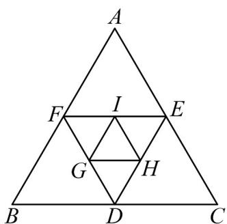

<!-- question-source:start -->
【典例1】如图，等边三角形 $ABC$ 的边长为 $^4$ ，取 $\mathrm{V}ABC$ 各边的中点 $D$ ， $E$ ， $F$ ，作第 $^2$ 个等边三角形 $DEF$

然后再取 $\triangle DEF$ 各边的中点 $G$ ， $H$ ， $I$ ，作第 $^3$ 个等边三角形 $GHI$ ，依此方法一直继续下去，记 $\mathrm{V}ABC$ 为第

$^{1}$ 个三角形， $\triangle DEF$ 为第 $^{2}$ 个三角形， $\triangle GHI$ 为第 $^{3}$ 个三角形，L，依此类推，则第 $^{10}$ 个三角形与第 $^{5}$ 个三

角形的面积之和为（）

A. $\frac{4^5 + 1}{4^9}$ B. $\frac{4^5 + 1}{4^8}$ C. $\frac{(4^5 + 1)\sqrt{3}}{4^9}$ D. $\frac{(4^5 + 1)\sqrt{3}}{4^8}$
<!-- question-source:end -->

![[高中/课堂同步/题库/人教A版高中数学同步讲义(2026)/04_选择性必修第二册/第四章 数列/专题4.3.1 等比数列的概念（高效培优讲义）数学人教A版高二选择性必修第二册/题型05_等比数列的实际应用/questions/answers/Q00082412A1.md]]
