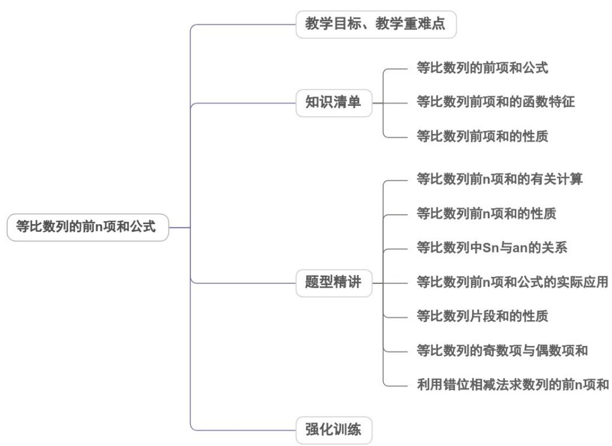

<!-- source-part:1 pages:1-50 -->

## 专题4.3.2 等比数列的前 $\mathbf{n}$ 项和公式

## 内容概览

## 教学目标、教学重难点

<table><tr><td>教学目标</td><td>1、掌握等比数列前n项和公式及求取思路,熟练掌握等比数列的五个量之间的关系并能由三求二,能用通项与和求通项。2、会利用等比数列性质简化求和运算,会利用等比数列前n项和的函数特征求最值。3、能处理与等比数列相关的综合问题。</td></tr><tr><td>教学重难点</td><td>1.重点能掌握等比数列的通项与前n项和的相关计算公式,能熟练处理与等比数列的相关量之间的关系.2.难点用函数的思想解决等比数列的相关问题,会利用等比数列的性质灵活解决与之相关的问题</td></tr></table>

## 知识清单

## 知识点 01 等比数列的前 n 项和公式

等比数列的前 $n$ 项和公式

$$
S _ {n} = \left\{ \begin{array}{l l} n a _ {1} & (q = 1) \\ \frac {a _ {1} \left(1 - q ^ {n}\right)}{1 - q} = \frac {a _ {1} - a _ {n} q}{1 - q} & (q \neq 1) \end{array} \right.
$$

## (1) 利用等比性质

由等比数列的定义，有 $\frac{a_{2}}{a_{1}}=\frac{a_{3}}{a_{2}}=\cdots=\frac{a_{n}}{a_{n-1}}=q$

根据等比性质，有 $\frac{a_{2}+a_{3}+\cdots+a_{n}}{a_{1}+a_{2}+\cdots+a_{n-1}}=\frac{S_{n}-a_{1}}{S_{n}-a_{n}}=q\Rightarrow(1-q)S_{n}=a_{1}-a_{n}q$

所以当 $q \neq 1$ 时， $S_{n} = \frac{a_{1} - a_{n}q}{1 - q}$ 或 $S_{n} = \frac{a_{1}(1 - q^{n})}{1 - q}$ .

## (2) 错位相减法

等比数列 $\{a_{n}\}$ 的前 n 项和 $S_{n}=a_{1}+a_{2}+a_{3}+\cdots+a_{n}$

①当 $q = 1$ 时， $a_{n} = a_{1}$ ， $S_{n} = a_{1} + a_{2} + a_{3} + \cdots + a_{n} = na_{1}$ ；

② 当 $q \neq 1$ 时，由 $a_{n} = a_{1} q^{n-1}$ 得： $S_{n} = a_{1} + a_{1} q + a_{1} q^{2} + \cdots + a_{1} q^{n-2} + a_{1} q^{n-1}$

$$
q S _ {n} = a _ {1} q + a _ {1} q ^ {2} + a _ {1} q ^ {3} + \dots + a _ {1} q ^ {n - 1} + a _ {1} q ^ {n} \therefore (1 - q) S _ {n} = a _ {1} - a _ {1} q ^ {n} = a _ {1} - a _ {n} q = a _ {1} \left(1 - q ^ {n}\right)
$$

所以 $S_{n}=\frac{a_{1}-a_{n}q}{1-q}$ 或 $S_{n}=\frac{a_{1}(1-q^{n})}{1-q}$ . 即 $S_{n}=\left\{\begin{aligned}&na_{1}\\ &a_{1}(1-q^{n})\\ &1-q\end{aligned}\right.=\frac{a_{1}-a_{n}q}{1-q}$ $(q=1)$

①错位相减法是一种非常常见和重要的数列求和方法，适用于一个等比数列和一个等比数列对应项的积组成

的数列求和问题，要求理解并掌握此法。

②在求等比数列前 n 项和时，要注意区分 $q=1$ 和 $q\neq1$

③当 $q \neq 1$ 时，等比数列的两个求和公式，共涉及 $a_1$ 、 $n$ 、 $q$ 、 $a_n$ 、 $S_n$ 五个量，已知其中任意三个量，通过解

方程组，便可求出其余两个量。

【即学即练】

1. 已知数列 $\{a_{n}\}$ 的前 $n$ 项和为 $S_{n}$ , $a_{2} = 2$ , $S_{n} = \frac{n(a_{n} - a_{1})}{2}$ .

(1)求 $\{a_{n}\}$ 的通项公式；

(2)若 $a_{2}$ , $a_{3}$ , $a_{b_{1}}$ , $a_{b_{2}}$ , ..., $a_{b_{n}}$ , ...成等比数列，求 $\{b_n\}$ 的前 $n$ 项和 $T_{n}$ .

【答案】(1) $a_{n}=2n-2$

(2) $T_{n} = 2^{n + 2} + n - 4$

【分析】（1）通过已知的 $S_{n}$ 表达式，利用 $a_{n + 1} = S_{n + 1} - S_n$ 的关系推导出数列 $\{a_n\}$ 的通项公式；

(2) 根据等比数列的性质求出 $a_{b_n}$ 的表达式，进而得到 $b_n$ 的表达式，最后求出数列 $\{b_n\}$ 的前 $n$ 项和 $T_n$

【详解】（1） $S_{n}=\frac{n\left(a_{n}-a_{1}\right)}{2}$ 中令 n=1，

得 $S_{1}=\frac{a_{1}-a_{1}}{2}=0$ ，所以 $a_{1}=S_{1}=0$ ，

因为 $a_{n + 1} = S_{n + 1} - S_n = \frac{(n + 1)a_{n + 1}}{2} -\frac{na_n}{2}$

整理得 $(n-1)a_{n+1}=na_{n}$ ，

当 $n$ 2时， $\frac{a_{n + 1}}{n} = \frac{a_n}{n - 1}$

所以 $n$ 2时， $\left\{\frac{a_n}{n - 1}\right\}$ 是常数列，且 $\frac{a_2}{1} = 2$

所以 $a_{n}=2(n-1)$

又 $a_{1}=0$ 也满足上式，

所以 $a_{n} = 2n - 2$

(2) 因为 $a_{2}, a_{3}, a_{b_{1}}, a_{b_{2}}, \cdots, a_{b_{n}}, \cdots$ 成等比数列，且 $a_{2} = 2$ ， $a_{3} = 4$

所以该数列的第 $n$ 项为 $2^{n}$ ，

因为 $a_{b_{n}}$ 是数列 $\left\{2^{n}\right\}$ 的第 $n+2$ 项，

所以 $a_{b_n} = 2b_n - 2 = 2^{n + 2}$

所以 $b_{n} = 2^{n + 1} + 1$

所以 $T_{n}=\frac{4\left(1-2^{n}\right)}{1-2}+n=2^{n+2}+n-4$

2. 正项等比数列 $\left\{a_{n}\right\}$ 中， $S_{n}$ 是其前 $n$ 项和，若 $a_{2} = a_{3} + 2a_{4}$ ， $S_{2} = 16$ ，则 $S_{6} =$ （）A.20 B.21 C.24 D.28

【答案】B

【分析】根据给定条件，求出等比数列的公比，再利用并项法求和·

【详解】设正项等比数列 $\{a_{n}\}$ 的公比为 $q(q > 0)$ ，由 $a_{2} = a_{3} + 2a_{4}$ ，得 $1 = q + 2q^{2}$ ，则 $q = \frac{1}{2}$ ，

而 $S_{2}=16$ ，所以 $S_{6}=(a_{1}+a_{2})+(a_{3}+a_{4})+(a_{5}+a_{6})=16+16\times(\frac{1}{2})^{2}+16\times(\frac{1}{2})^{4}=21$

故选：B

## 知识点02 等比数列前 $n$ 项和的函数特征

1、 $S_{n}$ 与 $q$ 的关系

(1) 当公比 $q \neq 1$ 时，等比数列的前 n 项和公式是 $S_{n} = \frac{a_{1}(1 - q^{n})}{1 - q}$

它可以变形为 $S_{n} = \frac{a_{1}}{1 - q} -\frac{a_{1}}{1 - q} q^{n}$ ，设 $A = \frac{a_1}{1 - q}$ ，则上式可以写成 $S_{n} = A - Aq^{n}$ 的形式，

由此可见，数列 $\{S_n\}$ 的图象是函数 $y = A - Aq^x$ 图象上的一群孤立的点；

(2) 当公比 $q = 1$ 时，等比数列的前 $n$ 项和公式是 $S_{n} = na_{1}$ ，则数列 $\{S_{n}\}$ 的图象是函数 $y = a_{1}x$ 图象上的一群孤立的点。

2、 $S_{n}$ 与 $a_{n}$ 的关系

当公比 $q \neq 1$ 时，等比数列的前 $n$ 项和公式是 $S_{n} = \frac{a_{1} - a_{n}q}{1 - q}$ ，它可以变形为 $S_{n} = \frac{a_{1}}{1 - q} - \frac{q}{1 - q} a_{n}$

设 $A = -\frac{q}{1 - q}$ ， $B = \frac{a_1}{1 - q}$ ，则上式可写成 $S_{n} = Aa_{n} + B$ 的形式，则 $S_{n}$ 是 $a_{n}$ 的一次函数.

【即学即练】

1. 已知数列 $\{c_n\}$ 的通项公式为 $c_n = -3 \cdot (-\frac{1}{2})^n$ ，设数列 $\{c_n\}$ 的前 $n$ 项和为 $T_n$ ，求 $T_n - \frac{1}{T_n}, (n \in \mathbb{N}_+)$ 的最大值和最

小值为（）

A. $\frac{5}{6}$ , $-\frac{7}{12}$ B. $\frac{3}{2}, 0$ C. $\frac{3}{2}, \frac{3}{4}$ D. $0, -\frac{7}{12}$

【答案】A

【分析】由等比数列求和公式得到 $T_{n}=1-\left(-\frac{1}{2}\right)^{n}$ ，再结合 $f(x)=x-\frac{1}{x}$ 的单调性即可求解.

【详解】由 $c_{n} = -3 \cdot (-\frac{1}{2})^{n}$

由等比数列求和公式可得 $T_{n} = 1 - \left(-\frac{1}{2}\right)^{n}$

当 n 为奇数时， $T_{n}=1-\left(-\frac{1}{2}\right)^{n}>1$ ，

又 $\left(-\frac{1}{2}\right)^n = -\frac{1}{2^n} < \left(-\frac{1}{2}\right)^{n + 2} = -\frac{1}{2^{n + 2}}$

所以 n=1 时，得最大值 $T_{1}=\frac{3}{2}$

当 n 为偶数时， $0 < T_{n} = 1 - \left(-\frac{1}{2}\right)^{n} < 1$ ，

又 $\left(-\frac{1}{2}\right)^n = \frac{1}{2^n} >\left(-\frac{1}{2}\right)^{n + 2} = \frac{1}{2^{n + 2}}$

所以 n=2 时，得最小值 $T_{2}=\frac{3}{4}$

由函数 $f(x) = x - \frac{1}{x}$ ，在 $(0, +\infty)$ 单调递增，

所以当 $T_{n}=T_{1}=\frac{3}{2}$ 时， $T_{n}-\frac{1}{T_{n}}\frac{5}{6}$

所以当 $T_{n}=T_{2}=\frac{3}{4}$ 时， $T_{n}-\frac{1}{T_{n}}$ 取得最小值 $-\frac{7}{12}$

故选：A

2. 已知数列 $\left\{a_{n}\right\}$ 的首项 $a_{1} = \frac{1}{3}$ ，且满足 $a_{n+1} = \frac{4a_{n}}{6a_{n} + 1}$

(1)求证： $\left\{\frac{1}{a_n} -2\right\}$ 为等比数列；

(2)设 $b_{n}=\frac{1}{a_{n}}$ ，记 $\left\{b_{n}\right\}$ 的前n项和 $T_{n}$ ，求满足 $T_{n}>20$ 的最小正整数n。

【答案】(1)证明见解析

(2)10

【分析】（ $^{1}$ ）对已知数列的递推公式两边取倒数，根据等比数列的定义，即可得证；

(2) 由 (1) 可得 $b_{n} = \left(\frac{1}{4}\right)^{n - 1} + 2$ ，利用分组求和法及等比数列的前 $n$ 项和公式可得 $T_{n} = 2n - \frac{4}{3}\left(\frac{1}{4}\right)^{n} + \frac{4}{3}$ ，可

得 $\{T_n\}$ 为递增数列，由 $T_9 < 20, T_{10} > 20$ 即可求解

【详解】（1） $\frac{\frac{1}{a_{n+1}}-2}{\frac{1}{a_{n}}-2}=\frac{\frac{6a_{n}+1}{4a_{n}}-2}{\frac{1}{a_{n}}-2}=\frac{\frac{1}{4a_{n}}-\frac{1}{2}}{\frac{1}{a_{n}}-2}=\frac{\frac{1}{4}\left(\frac{1}{a_{n}}-2\right)}{\frac{1}{a_{n}}-2}=\frac{1}{4}$

$\therefore \left\{\frac{1}{a_n} - 2\right\}$ 是以 $^1$ 为首项， $\frac{1}{4}$ 为公比的等比数列；

(2) 由 (1) 得 $\frac{1}{a_n} - 2 = \left(\frac{1}{4}\right)^{n-1}$ , 即 $\frac{1}{a_n} = \left(\frac{1}{4}\right)^{n-1} + 2$

所以 $b_{n} = \left(\frac{1}{4}\right)^{n - 1} + 2$

所以 $T_{n}=1+2+\frac{1}{4}+2+\left(\frac{1}{4}\right)^{2}+2+\cdots+\left(\frac{1}{4}\right)^{n-1}+2=2n-\frac{4}{3}\times\left(\frac{1}{4}\right)^{n}+\frac{4}{3}$

因为 $T_{n + 1} - T_n = 2 + \left(\frac{1}{4}\right)^n >0$

所以 $\{T_n\}$ 为递增数列，又 $T_{9} < 20, T_{10} > 20$

所以满足 $T_{n} > 20$ 的最小正整数为10.

## 知识点 03 等比数列前 n 项和的性质

1、等比数列 $\{a_{n}\}$ 中，若项数为 $2n$ ，则 $\frac{S_{\text{偶}}}{S_{\text{奇}}} = q$ ；若项数为 $2n + 1$ ，则 $\frac{S_{\text{奇}} - a_1}{S_{\text{偶}}} = q$

2、若等比数列 $\{a_{n}\}$ 的前 $n$ 项和为 $S_{n}$ ，则 $S_{n}$ ， $S_{2n} - S_{n}$ ， $S_{3n} - S_{2n}$ ...成等比数列（其中 $S_{n}$ ， $S_{2n} - S_{n}$ ， $S_{3n} - S_{2n}$ ...均不为0）.

3、若一个非常数列 $\{a_{n}\}$ 的前 $n$ 项和 $S_{n} = Aq^{n} - A(A\neq 0,q\neq 0,n\in N^{*})$ ，则数列 $\{a_n\}$ 为等比数列.

1. 已知一个项数为偶数的等比数列 $\{a_n\}$ 所有项之和为所有奇数项之和的 3 倍，前 2 项之积为 8，则 $a_1 =$ （ ）A.2 B.-2 C.-1 D.2或-2

【答案】D

【分析】设数列共有 $2n$ 项，设所有奇数项之和为 $T_{n}$ ，由题意表求出 $S_{2n}$ 和 $T_{n}$ ，利用 $\frac{S_{2n}}{T_n} = 3$ 求出公比 $q$ ，再结

合 $a_{1}\cdot a_{2}=8$ 求出 $a_{1}$ 即可·

【详解】设首项为 $a_1$ ，公比为 $q$ ，数列共有 $2n$ 项，则 $\{a_{2n - 1}\}$ 满足首项为 $a_1$ ，公比为 $q^2$ ，项数为 $n$ 项，设所有

奇数项之和为 $T_{n}$ ，

因为所有项之和是奇数项之和的 $^{3}$ 倍，所以 $q \neq 1$

所以 $T_{n}=a_{1}+a_{3}+\cdots+a_{2n-1}=\frac{a_{1}\left(1-\left(q^{2}\right)^{n}\right)}{1-q^{2}}$ ， $S_{2n}=\frac{a_{1}\left(1-q^{2n}\right)}{1-q}$ ，

故满足 $\frac{S_{2n}}{T_n} = \frac{\frac{a_1(1 - q^{2n})}{1 - q}}{\frac{a_1(1 - (q^2)^n)}{1 - q^2}} = 3$ ，解得 $q = 2$

又 $a_1 \cdot a_2 = a_1^2 \cdot q = 8$

所以 $a_{1}=\pm2$ .

故选：D

2. 关于等差数列和等比数列，下列说法正确的是（ ）

【答案】
A．若数列 $\left\{a_{n}\right\}$ 为等差数列，且 $a_{2}=3,a_{6}=5$ ，则 $S_{7}=28$ B．若数列 $\left\{a_{n}\right\}$ 的前n项和为 $S_{n}$ ，且 $S_{n}=n^{2}+1$ ，则 $\left\{a_{n}\right\}$ 是等差数列.
C．若数列 $\left\{a_{n}\right\}$ 为等比数列， $S_{n}$ 为前n项和， $S_{2}=2,\quad S_{4}=6$ ，则 $S_{6}=14$ D．若数列 $\left\{a_{n}\right\}$ 为等比数列，且 $a_{1}>1,a_{5}a_{6}-1>0,\frac{a_{5}-1}{a_{6}-1}<0$ ，则q>1

【答案】AC

【分析】根据等差数列的性质及求和公式计算判断 $^{A}$ ；先求出 $a_{1}=2$ ，再当n=2时求出 $a_{n}=2n-1$ ，判断当 $n=1$ 时有 $a_{n}=1\neq a_{1}$ ，判断 $^{B}$ ；根据等比数列的性质计算求值判断 $^{C}$ ；由题意得 $q>0,\quad a_{n}>0$ 可判断D.

【详解】对于 A，由 $S_{7}=\frac{7\left(a_{1}+a_{7}\right)}{2}=\frac{7}{2}\left(a_{2}+a_{6}\right)=\frac{7}{2}\times(3+5)=28$ ，正确；

对于 B，数列 $\left\{a_{n}\right\}$ 的前 n 项和 $S_{n}=n^{2}+1$ ，当 n=1 时， $a_{1}=S_{1}=1^{2}+1=2$

当 $n$ 2时， $a_{n} = S_{n} - S_{n-1} = (n^{2} + 1) - [(n - 1)^{2} + 1] = 2n - 1$

当 $n = 1$ 时， $a_{n} = 1 \neq a_{1}$ ，错误；

对于 $C$ ，因为数列 $\{a_n\}$ 是等比数列，所以 $S_{2}$ ， $S_{4} - S_{2}$ ， $S_{6} - S_{4}$ 成等比数列，

因为 $S_{2}=2$ ， $S_{4}=6$ ，所以 $S_{4}-S_{2}=4$ ，所以 $S_{6}-S_{4}=2\times4=8$ ，

所以 $S_{6} = 6 + 8 = 14$ ，正确；

对于 D，由 $a_{1}>1$ ， $a_{5}a_{6}=a_{1}^{2}q^{9}>1$ ，则 q>0，所以 $a_{n}>0$ ，

若 q 1 时，由 $a_{1} > 1$ ，可得 $a_{5} > 1, a_{6} > 1$ ，

所以 $\frac{a_5 - 1}{a_6 - 1} >0$ ，与已知条件矛盾，所以 $0 < q < 1$ ，错误

故选：AC

## 题型精讲

![[高中/课堂同步/题库/人教A版高中数学同步讲义(2026)/04_选择性必修第二册/第四章 数列/专题4.3.2 等比数列的前n项和公式（高效培优讲义）数学人教A版高二选择性必修第二册/题型01_等比数列前_n_项和的有关计算/题型01_等比数列前_n_项和的有关计算.md]]
![[高中/课堂同步/题库/人教A版高中数学同步讲义(2026)/04_选择性必修第二册/第四章 数列/专题4.3.2 等比数列的前n项和公式（高效培优讲义）数学人教A版高二选择性必修第二册/题型02_等比数列前_n_项和的性质/题型02_等比数列前_n_项和的性质.md]]
![[高中/课堂同步/题库/人教A版高中数学同步讲义(2026)/04_选择性必修第二册/第四章 数列/专题4.3.2 等比数列的前n项和公式（高效培优讲义）数学人教A版高二选择性必修第二册/题型03_等比数列中_S__n__与_a__n__的关系/题型03_等比数列中_S__n__与_a__n__的关系.md]]
![[高中/课堂同步/题库/人教A版高中数学同步讲义(2026)/04_选择性必修第二册/第四章 数列/专题4.3.2 等比数列的前n项和公式（高效培优讲义）数学人教A版高二选择性必修第二册/题型04_等比数列前_mathbf_n__项和公式的实际应用/题型04_等比数列前_mathbf_n__项和公式的实际应用.md]]
![[高中/课堂同步/题库/人教A版高中数学同步讲义(2026)/04_选择性必修第二册/第四章 数列/专题4.3.2 等比数列的前n项和公式（高效培优讲义）数学人教A版高二选择性必修第二册/题型05_等比数列片段和的性质/题型05_等比数列片段和的性质.md]]
![[高中/课堂同步/题库/人教A版高中数学同步讲义(2026)/04_选择性必修第二册/第四章 数列/专题4.3.2 等比数列的前n项和公式（高效培优讲义）数学人教A版高二选择性必修第二册/题型06_等比数列的奇数项与偶数项和/题型06_等比数列的奇数项与偶数项和.md]]
![[高中/课堂同步/题库/人教A版高中数学同步讲义(2026)/04_选择性必修第二册/第四章 数列/专题4.3.2 等比数列的前n项和公式（高效培优讲义）数学人教A版高二选择性必修第二册/题型07_利用错位相减法求数列的前_n_项和/题型07_利用错位相减法求数列的前_n_项和.md]]
![[高中/课堂同步/题库/人教A版高中数学同步讲义(2026)/04_选择性必修第二册/第四章 数列/专题4.3.2 等比数列的前n项和公式（高效培优讲义）数学人教A版高二选择性必修第二册/强化训练/强化训练.md]]
