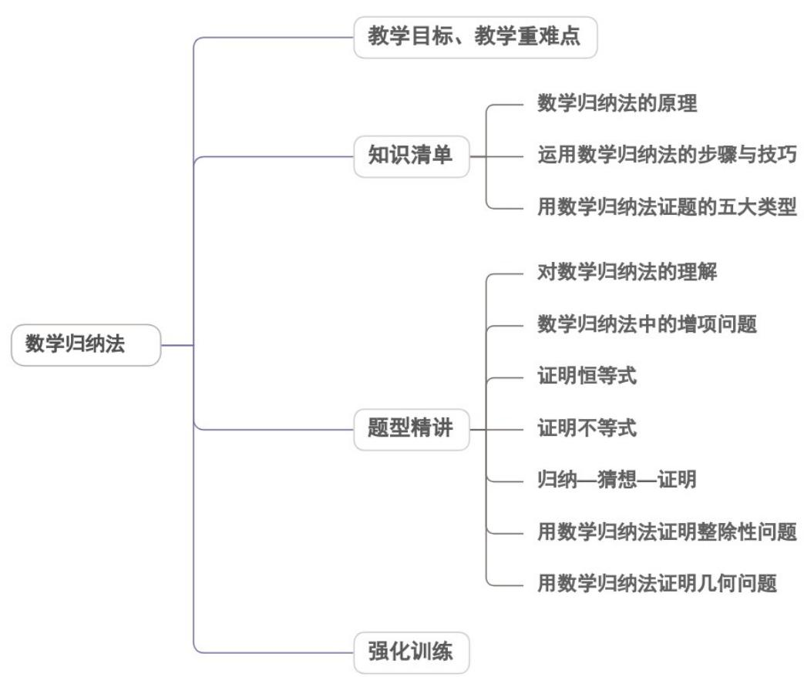

<!-- source-part:1 pages:1-50 -->

专题4.4 数学归纳法

## 内容概览

## 教学目标、教学重难点

<table><tr><td>教学目标</td><td>1.理解与掌握数学归纳法增项问题.2.会用数学归纳法的步骤与技巧以及应用出处.3.会用数学归纳法证明整除性问题.</td></tr><tr><td>教学重难点</td><td>1.重点数学归纳法中的增项问题、证明恒等式,证明不等式.</td></tr></table>

## 知识清单

## 知识点 01 数学归纳法的原理

1、数学归纳法定义：

对于某些与自然数 $n$ 有关的命题常常采用下面的方法来证明它的正确性：先证明当 $n$ 取第一个值 $n_0$ 时命题成

立；然后假设当 $n = k$ （ $k \in N^{*}$ ， $k \cap n_{0}$ ）时命题成立，证明当 $n = k + 1$ 时命题也成立。这种证明方法就叫做数

学归纳法。

## 2、数学归纳法的原理：

数学归纳法是专门证明与正整数集有关的命题的一种方法，它是一种完全归纳法。

它的证明共分两步：

①证明了第一步，就获得了递推的基础。

但仅靠这一步还不能说明结论的普遍性．在第一步中，考察结论成立的最小正整数就足够了，没有必要再考

察几个正整数，即使命题对这几个正整数都成立，也不能保证命题对其他正整数也成立；

②证明了第二步，就获得了递推的依据。

但没有第一步就失去了递推的基础．只有把第一步和第二步结合在一起，才能获得普遍性的结论．

其中第一步是命题成立的基础，称为“归纳基础”（或称特殊性），第二步是递推的证据，解决的是延续性问

题（又称传递性问题）.

【即学即练】

1. 若 $f(n) = 1 + 2 + 2^2 + 2^3 + \ldots + 2^{5n-1}$ 用数学归纳法证明 $1 + 2 + 2^2 + 2^3 + \ldots + 2^{5n-1}$ 是31的倍数 $(n \in \mathbf{N}_+)$ ，在验证

n=1 成立时，原式为\_\_\_\_。

【答案】 $f(1)=1+2+2^{2}+2^{3}+2^{4}$

【分析】将 n=1 代入 $f(n)$ 计算可得结果.

【详解】当 $n = 1$ 时， $f(n) = 1 + 2 + 2^2 + 2^3 + \ldots + 2^{5 \times 1 - 1} = 1 + 2 + 2^2 + 2^3 + 2^4$ .

故答案为： $f(1)=1+2+2^{2}+2^{3}+2^{4}$

2．以下是一个证明的全部过程：假设当 $n=k(k\in\mathbf{N}_{+})$ 时等式成立，即 $2+4+\cdots+2k=k^{2}+k$ ，则当 $n=k+1$ 时。

$2+4+\cdots+2k+2(k+1)=k^{2}+k+2(k+1)=(k+1)^{2}+(k+1)$ ，即当 $n=k+1$ 时，等式也成立．因此等式对于任何

$n \in N_{+}$ 都成立．则用数学归纳法证明“ $2 + 4 + \cdots + 2n = n^{2} + n(n \in N_{+})$ ”的过程中的错误为\_\_\_\_.

【答案】缺少当 n=1 时命题成立的证明

【分析】根据数学归纳法的使用步骤即可求解·

【详解】根据数学归纳法的一般步骤，知其缺少 n=1 时命题成立的说明·

故答案为：缺少当 $n = 1$ 时命题成立的证明

## 知识点 02 运用数学归纳法的步骤与技巧

1、用数学归纳法证明一个与正整数有关的命题的步骤：

(1) 证明：当 $n$ 取第一个值 $n_0$ 结论正确；

(2) 假设当 $n = k$ ( $k \in N^{*}$ , $k = n_{0}$ ) 时结论正确，证明当 $n = k + 1$ 时结论也正确。由（1），（2）可知，命

题对于从 $n_0$ 开始的所有正整数 $n$ 都正确。

2、用数学归纳法证题的注意事项

(1) 弄错起始 $n_0$ 。 $n_0$ 不一定恒为 1，也可能 $n_0 = 2$ 或 3（即起点问题）.

(2) 对项数估算错误．特别是当寻找 $n = k$ 与 $n = k + 1$ 的关系时，项数的变化易出现错误（即跨度问题）.

(3) 没有利用归纳假设．归纳假设是必须要用的，假设是起桥梁作用的，桥梁断了就过不去了，整个证明过

程也就不正确了（即伪证问题）.

(4) 关键步骤含糊不清。“假设 $n = k$ 时结论成立，利用此假设证明 $n = k + 1$ 时结论也成立”是数学归纳法的关

键一步，也是证明问题最重要的环节，推导的过程中要把步骤写完整，另外要注意证明过程的严谨性、规范

性（即规范问题）.

3、用数学归纳法证题的关键：

运用数学归纳法由 $n = k$ 到 $n = k + 1$ 的证明是证明的难点，突破难点的关键是掌握由 $n = k$ 到 $n = k + 1$ 的推证方

法．在运用归纳假设时，应分析由 n=k 到 $n=k+1$ 的差异与联系，利用拆、添、并、放、缩等手段，或从归

纳假设出发，或从 $n = k + 1$ 时分离出 $n = k$ 时的式子，再进行局部调整；也可以考虑二者的结合点，以便顺利

过渡.

## 【即学即练】

1. 一般地，在证明一个与正整数 $n$ 有关的命题时，可按下列步骤进行：

(1) 证明\_\_\_\_时命题成立；

(2) 假设 $\left(k \in \mathbf{N}_{+}, k, n_{0}\right)$ 时命题成立，证明 \_\_\_\_ 时命题也成立。

只要完成这两个步骤，就可以知道：对任何从\_\_\_\_开始的正整数 $n$ ，命题成立．这种证明方法叫作数学归

纳法.

【答案】 $n=n_{0}\left(n_{0}\in\mathbf{N}_{+}\right)$ $n=k$ $n=k+1$ $n_{0}$

2. 已知命题 $1 + 2 + 2^{2} + \dots + 2^{n-1} = 2^{n} - 1$ 及其证明：

(1) 当 n=1 时，左边 =1 ，右边 = $2^{1}-1=1$ ，所以等式成立。

(2) 假设 $n = k \left( k \in \mathbf{N}_{+} \right)$ 时等式成立，即 $1 + 2 + 2^{2} + \cdots + 2^{k-1} = 2^{k} - 1$ 成立，则当 $n = k + 1$ 时，

$1+2+2^{2}+\cdots+2^{k-1}+2^{k}=\frac{1-2^{k+1}}{1-2}=2^{k+1}-1$ ，所以 $n=k+1$ 时等式也成立。

由（1）（2）知，对任意的正整数 $n$ 命题都成立．判断以上评述（ ）A．命题、证明都正确 B．命题正确、证明不正确C．命题不正确、证明正确 D．命题、证明都不正确

【答案】B

【分析】由数学归纳法、等比数列求和公式即可求解·

【详解】证明不正确，错在证明当 $n = k + 1$ 时，没有用到假设 $n = k$ 时的结论.

由等比数列求和公式知 $1+2+2^{2}+\cdots+2^{n-1}=\frac{1-2^{n}}{1-2}=2^{n}-1$ ，命题正确·

故选：B.

## 知识点 03 用数学归纳法证题的类型

1、用数学归纳法证明与正整数 $n$ 有关的恒等式；

对于证明恒等的问题，在由证等式也成立时，应及时把结论和推导过程对比，也就是我们通常所说的两边凑

的方法，以减小计算的复杂程度，从而发现所要证明的式子，使问题的证明有目的性。

2、用数学归纳法证明与正整数 $n$ 有关的整除性问题；

用数学归纳法证明整除问题时，由到时，首先要从要证的式子中拼凑出假设成立的式子，然后证明剩余的式

子也能被某式（数）整除，这是数学归纳法证明问题的一大技巧。

3、用数学归纳法证明与正整数 $n$ 有关的几何问题；

数学归纳法在高考试题中常与数列、平面几何、解析几何等知识相结合来考查，对于此类问题解决的关键往

往在于抓住对问题的所划分标准，例如在平面几何中要抓住线段、平面、空间的个数与交点、交线间的关系

等.

4、用数学归纳法证明与正整数 $n$ 有关的不等式.

用数学归纳法证明一些与 $n$ 有关的不等式时，推导“ $n = k + 1$ ”时成立，有时要进行一些简单的放缩，有时还要

用到一些其他的证明不等式的方法，如比较法、综合法、分析法、反证法等等。

5、用数学归纳法证明与数列有关的命题.

由有限个特殊事例进行归纳、猜想，从而得出一般性的结论，然后加以证明是科学研究的重要思想方法。在

研究与正整数有关的数学命题中，此思想方法尤其重要。

【即学即练】

1．用数学归纳法证明命题“ $\forall n \in \mathbf{N}^{*}$ ， $(n+1)(n+2) \cdots (n+n)=2^{n} \times 1 \times 3 \times \cdots \times (2n-1)$ 时，假设 $n=k$ 时成立，证

明 $n = k + 1$ 时也成立，可在左边乘以一个代数式

【答案】 $4k + 2$

【分析】由数学归纳法的定义，依次写出 $n = k$ ， $n = k + 1$ 时等号左边的情形，对比即可得解·

【详解】假设 n=k 时成立，即 $(k+1)(k+2)\cdots(k+k)=2^{k}\times1\times3\times\cdots\times(2k-1)$

当 $n = k + 1$ 时，等号左边为 $\left(k + 1 + 1\right)\left(k + 1 + 2\right)\dots \left(k + 1 + k\right)\left(k + 1 + k + 1\right)$

$$
\frac {(2 k + 1) (2 k + 2)}{k + 1} = 4 k + 2
$$

故答案为： $4k+2$

2．用数学归纳法证明：“两两相交且不共点的 n 条直线把平面分为 $f(n)$ 部分，则 $f(n)=1+2$ ·”证明第二步

$$
f (n) = 1 + \frac {n (n + 1)}{2}
$$

归纳递推时，用到 $f(k+1)=f(k)+$ \_\_\_\_。

【答案】 $k+1$

【分析】从目标 $f(n) = 1 + \frac{n(n + 1)}{2}$ 分析， $f(k + 1) - f(k)$ 的结果，便可知第二步归纳递推时需要要证明的结论

【详解】 $f(k)=1+\frac{k(k+1)}{2}$

$$
f (k + 1) = 1 + \frac {(k + 1) (k + 2)}{2} ,
$$

$$
\therefore f (k + 1) - f (k)
$$

$$
= \left[ 1 + \frac {(k + 1) (k + 2)}{2} \right] - \left[ 1 + \frac {k (k + 1)}{2} \right]
$$

$$
= k + 1
$$

$$
\therefore f (k + 1) = f (k) + (k + 1)
$$

故答案为： $k+1$ .

## 题型精讲

![[高中/课堂同步/题库/人教A版高中数学同步讲义(2026)/04_选择性必修第二册/第四章 数列/专题4.4 数学归纳法（高效培优讲义）数学人教A版高二选择性必修第二册/题型01_对数学归纳法的理解/题型01_对数学归纳法的理解.md]]
![[高中/课堂同步/题库/人教A版高中数学同步讲义(2026)/04_选择性必修第二册/第四章 数列/专题4.4 数学归纳法（高效培优讲义）数学人教A版高二选择性必修第二册/题型02_数学归纳法中的增项问题/题型02_数学归纳法中的增项问题.md]]
![[高中/课堂同步/题库/人教A版高中数学同步讲义(2026)/04_选择性必修第二册/第四章 数列/专题4.4 数学归纳法（高效培优讲义）数学人教A版高二选择性必修第二册/题型03_证明恒等式/题型03_证明恒等式.md]]
![[高中/课堂同步/题库/人教A版高中数学同步讲义(2026)/04_选择性必修第二册/第四章 数列/专题4.4 数学归纳法（高效培优讲义）数学人教A版高二选择性必修第二册/题型04_证明不等式/题型04_证明不等式.md]]
![[高中/课堂同步/题库/人教A版高中数学同步讲义(2026)/04_选择性必修第二册/第四章 数列/专题4.4 数学归纳法（高效培优讲义）数学人教A版高二选择性必修第二册/题型05_归纳_猜想_证明/题型05_归纳_猜想_证明.md]]
![[高中/课堂同步/题库/人教A版高中数学同步讲义(2026)/04_选择性必修第二册/第四章 数列/专题4.4 数学归纳法（高效培优讲义）数学人教A版高二选择性必修第二册/题型06_用数学归纳法证明整除性问题/题型06_用数学归纳法证明整除性问题.md]]
![[高中/课堂同步/题库/人教A版高中数学同步讲义(2026)/04_选择性必修第二册/第四章 数列/专题4.4 数学归纳法（高效培优讲义）数学人教A版高二选择性必修第二册/题型07_用数学归纳法证明几何问题/题型07_用数学归纳法证明几何问题.md]]
![[高中/课堂同步/题库/人教A版高中数学同步讲义(2026)/04_选择性必修第二册/第四章 数列/专题4.4 数学归纳法（高效培优讲义）数学人教A版高二选择性必修第二册/强化训练/强化训练.md]]
