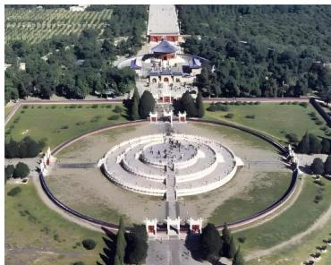

> [!faq]- 《第四章 数列（高效培优单元测试·强化卷）数学人教A版高二选择性必修第二册》官方解析
>
> > [!success]- **【答案】** B
>
> > [!note]- **【解析】**
> > 设等比数列 $\left\{a_{n}\right\}$ 的公比为q，因为 $a_{1}\neq a_{2}$ ，故 $q\neq1$
> >
> > 由 $6a_{4} = 4a_{3} + 2a_{5}$ ，所以 $3a_{3}\cdot q = 2a_{3} + a_{3}\cdot q^{2}$ ，又 $a_3\neq 0$
> >
> > $\therefore q^{2}-3q+2=0$ ，解得 $q=2$ 或 q=1 （舍），
> >
> > $$
> > \therefore \frac {S _ {2}}{S _ {6}} = \frac {\frac {a _ {1} (1 - q ^ {2})}{1 - q}}{\frac {a _ {1} (1 - q ^ {6})}{1 - q}} = \frac {1 - q ^ {2}}{1 - q ^ {6}} = \frac {1 - 2 ^ {2}}{1 - 2 ^ {6}} = \frac {1}{2 1}.
> > $$
> >
> > 故选：B.
> >
> > 7. 北京天坛的圜丘坛为古代祭天的场所，分上、中、下三层，上层中心有一块圆形石板（称为天心石），
> >
> > 环绕天心石砌 $^{9}$ 块扇面形石板构成第一环，向外每环依次增加 $^{9}$ 块，下一层的第一环比上一层的最后一环
> >
> > 多 $^{9}$ 块，向外每环依次也增加 $^{9}$ 块，已知每层环数相同，且下层比中层多 $^{729}$ 块，则中下两层共有扇面形
> >
> > 石板（）
> >
> > 
> >
> > A.2699块 B.3474块 C.3402块 D.2997块
> >
> > 【答案】D
> >
> > 【详解】设第 $n$ 环天石心块数为 $a_{n}$ ，上层共有 $n$ 环， $S_{n}$ 为 $\{a_{n}\}$ 的前 $n$ 项和，
> >
> > 则 $\{a_{n}\}$ 是首项为 $9$ ，公差为 $9$ 的等差数列， $a_{n} = 9 + 9(n - 1) = 9n$ ， $S_{n} = \frac{9}{2}(n^{2} + n)$
> >
> > 上层、中层、下层的块数分别为 $S_{n}, S_{2n} - S_{n}, S_{3n} - S_{2n}$
> >
> > 由下层比中层多 $729$ 块，得 $S_{3n} - S_{2n} = S_{2n} - S_n + 729$
> >
> > 即 $\frac{9}{2} (9n^2 +3n) - \frac{9}{2} (4n^2 +2n) = \frac{9}{2} (4n^2 +2n) - \frac{9}{2} (n^2 +n) + 729$ ，解得 $n = 9$
> >
> > 所以中下两层共有扇面形石板 $S_{27}-S_{9}=\frac{9}{2}(27^{2}+27)-\frac{9}{2}(9^{2}+9)=2997$ （块）.
> >
> > 故选 **D**
