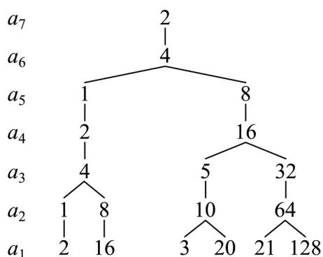

> [!faq]- 《第四章 数列（高效培优单元测试·提升卷）数学人教A版高二选择性必修第二册》官方解析
>
> > [!success]- **【答案】** BCD
>
> > [!note]- **【解析】**
> > A选项：由已知 $S_{n}=n^{2}+1$ ，当n=1时， $a_{1}=S_{1}=2$ ，
> >
> > 当 $n$ 2时， $a_{n} = S_{n} - S_{n - 1} = n^{2} + 1 - \left[\left(n - 1\right)^{2} + 1\right] = 2n - 1$
> >
> > 综上所述 $a_{n}=\left\{\begin{aligned}&2,n=1\\ &2n-1,n&2\end{aligned}\right.$ ，A选项错误；
> >
> > B 选项：由已知 $a_{n+1} + a_n = 2$ ，则 $a_{n+2} + a_{n+1} = a_{n+1} + a_n = 2$ ，即 $a_{n+2} = a_n$ ，
> > 又 $a_1 = 1$ ， $a_2 + a_1 = 2$ ，即 $a_2 = 1$ ，
> >
> > 所以当 n 为奇数时， $a_{n}=1$ ，当 n 为偶数时， $a_{n}=1$ ，
> >
> > 综上所述 $a_{n} = 1$ ，B选项正确；
> >
> > C 选项：由 $\frac{a_{n+1}}{a_{n}}=\frac{n}{n+1}$ ，即 $\frac{a_{n}}{a_{n-1}}=\frac{n-1}{n}$ ， $\frac{a_{n-1}}{a_{n-2}}=\frac{n-2}{n-1}$ ， $\frac{a_{2}}{a_{1}}=\frac{1}{2}$ ，
> >
> > 等式左右分别相乘可得 $\frac{a_n}{a_1} = \frac{1}{n}$
> >
> > $$
> > a _ {n} = \frac {1}{n}
> > $$
> >
> > $$
> > a _ {1} = 1
> > $$
> >
> > D 选项：由已知 $a_{n + 2} - a_{n + 1} = 2a_{n + 1} - 2a_n = 2(a_{n + 1} - a_n)$
> >
> > 可知数列 $\{a_{n + 1} - a_n\}$ 是以 $a_2 - a_1 = 1$ 为首项，2为公比的等比数列，
> >
> > 即 $a_{n + 1} - a_n = 2^{n - 1}$ ，即 $a_{n} - a_{n - 1} = 2^{n - 2}$ ， $a_{n - 1} - a_{n - 2} = 2^{n - 3}$ ，L， $a_2 - a_1 = 2^0$
> >
> > 等式左右分别相加可得 $a_{n} - a_{1} = 2^{n - 2} + 2^{n - 3} + \dots +2^{0} = \frac{2^{0}\left(1 - 2^{n - 1}\right)}{1 - 2} = 2^{n - 1} - 1$
> >
> > 又 $a_{1}=1$ ，则 $a_{n}=2^{n-1}$ ，D选项正确；
> >
> > 故选：BCD.
> >
> > 11. 任取一个正整数，若是奇数，就将该数乘 $^{3}$ 再加上 $^{1}$ ;若是偶数，就将该数除以 $^{2}$ ·反复进行上述两种运
> >
> > 算，经过有限次步骤后，必进入循环圈 $1 \rightarrow 4 \rightarrow 2 \rightarrow 1$ 。这就是数学史上著名的“冰雹猜想”（又称“角谷猜
> >
> > 想”)·如取正整数 $m = 6$ ，根据上述运算法则得出 $6 \rightarrow 3 \rightarrow 10 \rightarrow 5 \rightarrow 16 \rightarrow 8 \rightarrow 4 \rightarrow 2 \rightarrow 1$ ，共需经过8个步
> >
> > 骤变成 $^{1}$ （简称为 $^{8}$ 步“雹程”）·现给出“冰雹猜想”的递推关系如下：
> >
> > 已知数列 $\left\{a_{n}\right\}$ 满足： $a_{1}=m$ （m为正整数）， $a_{n+1}=\left\{\begin{aligned}&\frac{a_{n}}{2}, 当 a_{n} 为偶数时,\\&3a_{n}+1, 当 a_{n} 为奇数时.记数列\left\{a_{n}\right\} 的前 n 项和为 S_{n}\end{aligned}\right.$ ，则
> >
> > 下列说法正确的是（）
> >
> > A. 当 $m = 2$ 时， $a_{2025} = 2$
> >
> > B．当 m=34 时，使得 $a_{n}=1$ 要 13 步“雹程”
> >
> > C. 当 $m = 512$ 时， $S_{11} = 1027$
> >
> > D．若 $a_7 = 2$ ，则 $m$ 的取值有6个
> >
> > 【答案】BCD
> >
> > 【详解】m=2 时， $a_{1}=2,a_{2}=1,a_{3}=4,a_{4}=2,a_{5}=1,\cdots$
> >
> > 所以此时数列 $\left\{a_{n}\right\}$ 的周期为 3，又 $2025 \div 3 = 375$ ，所以 $a_{2025} = a_{3} = 4$ ，故 A 错误；
> >
> > $m = 34$ 时， $a_1 = 34, a_2 = 17, a_3 = 52, a_4 = 26, a_5 = 13, a_6 = 40, a_7 = 20, a_8 = 10, a_9 = 5$
> >
> > $a_{10} = 16, a_{11} = 8, a_{12} = 4, a_{13} = 2, a_{14} = 1$ ，所以使得 $a_n = 1$ 经过了 $^{13}$ 步“雹程”故 $^B$ 正确；
> >
> > $m=512$ ，则 $a_{1}=512=2^{9}$ ，所以 $a_{2}=2^{8},\cdots,a_{10}=1,a_{11}=4$
> >
> > 则 $S_{11}=2^{9}+2^{8}+\cdots+1+4=\frac{1-2^{10}}{1-2}+4=1027$ ，故 C 正确；
> >
> > 对于 D，
> >
> > 
> >
> > 所以 m 的取值有 6 个，故 D 正确；
> >
> > 故选 **BCD**.
