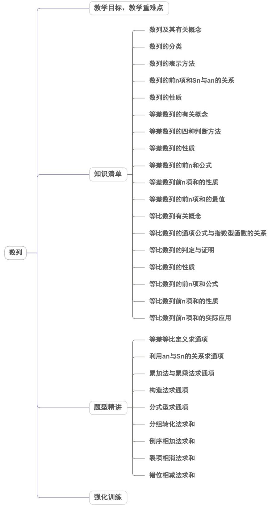

<!-- source-part:1 pages:1-50 -->

## 第四章 数列

内容概览

<table><tr><td>教学目标</td><td>1.能从具体实例中归纳、概括出数列的表示方法(表格、图象、递推关系和通项公式).2.能根据数列的通项公式,写出任意项.能理解递推公式中体现的是项与项之间的迭代关系,并能根据递推公式选择恰当的方法求出数列通项公式.3.能理解数列的前n项和公式的定义,并会根据数列的前n项和公式求出数列的通项公式4.会类比函数的“定义—表示方法—性质”的研究路径来研究数列,会用函数思想解决数列问题.5.会从具体的情景中抽象出数列模型,进而应用数学知识解决实际问题.6.通过日常生活和数学中的实例,了解数列的概念和表示方法(列表、图象、通项公式),了解数列是一种特殊函数.7.通过生活中的实例,理解等差数列的概念和通项公式的意义.探索并掌握等差数列的前n项和公式,理解等差数列的通项公式与前n项和公式的关系.能在具体的问题情境中,发现数列的等差关系,并解决相应的问题.体会等差数列与一元一次函数的关系.8.通过生活中的实例,理解等比数列的概念和通项公式的意义.探索并掌握等比数列的前n项和公式,理解等比数列的通项公式与前n项和公式的关系.能在具体的问题情境中,发现数列的等比关系,并解决相应的问题.体会等比数列与指数函数的关系.9.了解数学归纳法的原理及其过程。</td></tr><tr><td>教学重难点</td><td>1.重点利用递推关系求通项公式;数列求和.数列的情境问题,数学归纳法,数列与其它模块知识交汇问题.2.难点数学归纳法,数列与其它模块知识交汇问题.</td></tr></table>

## 知识清单

## 知识点 01 数列及其有关概念

1．一般地，我们把按照确定的顺序排列的一列数称为数列，数列中的每一个数叫做这个数列的项．数列的第一个位置上的数叫做这个数列的第1项，常用符号 $a_{1}$ 表示，第二个位置上的数叫做这个数列的第2项，用 $a_{2}$ 表示……，第n个位置上的数叫做这个数列的第n项，用 $a_{n}$ 表示．其中第1项也叫做首项．

注：数列的第 $n$ 项与项数 $n$ ：数列 $\{a_{n}\}$ 的第 $n$ 项为 $a_{n}$ ， $a_{n}$ 在数列 $\{a_{n}\}$ 中的项数为 $n$

2. 数列的一般形式是 $a_1, a_2, a_3, \ldots, a_n, \ldots$ ，简记为 $\{a_n\}$ .

3. 对数列概念的理解

(1) 数列是按一定“顺序”排列的一列数，一个数列不仅与构成它的“数”有关，而且还与这些“数”的排列顺序有

关，这有别于集合中元素的无序性．因此，若组成两个数列的数相同而排列次序不同，那么它们就是不同的

两个数列.

(2) 数列中的数可以重复出现，而集合中的元素不能重复出现，这也是数列与数集的区别。

(3) 数列是一种特殊的函数

数列是一种特殊的函数，其定义域是正整数集 $N^{*}$ 和正整数集 $N^{*}$ 的有限子集.所以数列的函数的图像不是连

续的曲线，而是一串孤立的点.

【即学即练】

1. 数列 1, 2, 3, 4 和数列 1, 3, 2, 4 \_\_\_\_ (是/不是) 同一数列·

【答案】不是

【分析】根据数列的定义判断·

【详解】因为第二，第三项不同，

所以数列是两个不同的数列，

故答案为：不是

2. 设 $a_1$ 、 $a_2$ 、L、 $a_8$ 是 1、2、3、4、5、6、7、8 的一个排列， $S = \{x \mid x = |a_1 - a_2| + |a_3 - a_4| + |a_5 - a_6| + |a_7 - a_8|\}$

则集合 $S$ 中所有元素的和为\_\_\_\_。

【答案】70

【分析】设 $a_1 < a_2$ ， $a_3 < a_4$ ， $a_5 < a_6$ ， $a_7 < a_8$ ，分析可得出 $x$ 的最大值为16，最小值为4，列表分析 $x$ 能取

到区间 $[4,16]$ 内的所有偶数，即可得出集合S中所有元素之和·

【详解】对于集合S中的元素x，不妨设 $a_{1}<a_{2}$ ， $a_{3}<a_{4}$ ， $a_{5}<a_{6}$ ， $a_{7}<a_{8}$ ，

$$
\text {则} x = \left| a _ {1} - a _ {2} \right| + \left| a _ {3} - a _ {4} \right| + \left| a _ {5} - a _ {6} \right| + \left| a _ {7} - a _ {8} \right| = a _ {2} - a _ {1} + a _ {4} - a _ {3} + a _ {6} - a _ {5} + a _ {8} - a _ {7}
$$

$$
= \left(a _ {1} + a _ {2} + a _ {3} + a _ {4} + a _ {5} + a _ {6} + a _ {7} + a _ {8}\right) - 2 \left(a _ {1} + a _ {3} + a _ {5} + a _ {7}\right)
$$

$= (1 + 2 + \dots + 8) - 2(a_{1} + a_{3} + a_{5} + a_{7}) = 36 - 2(a_{1} + a_{3} + a_{5} + a_{7})$ 为偶数，

根据题意可知， $\left|a_{1}-a_{2}\right|$ 1， $\left|a_{3}-a_{4}\right|$ 1， $\left|a_{5}-a_{6}\right|$ 1， $\left|a_{7}-a_{8}\right|$

则 $x = \left|a_{1} - a_{2}\right| + \left|a_{3} - a_{4}\right| + \left|a_{5} - a_{6}\right| + \left|a_{7} - a_{8}\right|$ 4

不妨取 $a_{i}=i(i=1,2,3,4,5,6,7,8)$ ，此时，x 取最小值 4，

当 $a_1 + a_3 + a_5 + a_7$ 取最小值时， $x$ 最大，且 $a_1 + a_3 + a_5 + a_7$ 的最小值为 $1 + 2 + 3 + 4 = 10$ 则 $x$ 的最大值为 $36 - 2 \times 10 = 16$ ，接下来验证 $x$ 可取 $[4,16]$ 内的所有偶数，对 $a_i (1 \leq i \leq 8, i \in \mathbb{N}^*)$ 取特殊值进行验证，列表如下：

<table><tr><td> $a_1$ </td><td> $a_2$ </td><td> $a_3$ </td><td> $a_4$ </td><td> $a_5$ </td><td> $a_6$ </td><td> $a_7$ </td><td> $a_8$ </td><td>x</td></tr><tr><td>1</td><td>2</td><td>3</td><td>4</td><td>5</td><td>6</td><td>7</td><td>8</td><td>4</td></tr><tr><td>1</td><td>2</td><td>3</td><td>5</td><td>4</td><td>6</td><td>7</td><td>8</td><td>6</td></tr><tr><td>1</td><td>3</td><td>2</td><td>4</td><td>5</td><td>7</td><td>6</td><td>8</td><td>8</td></tr><tr><td>1</td><td>2</td><td>3</td><td>6</td><td>4</td><td>7</td><td>5</td><td>8</td><td>10</td></tr><tr><td>1</td><td>3</td><td>2</td><td>6</td><td>4</td><td>7</td><td>5</td><td>8</td><td>12</td></tr><tr><td>1</td><td>4</td><td>2</td><td>6</td><td>3</td><td>7</td><td>5</td><td>8</td><td>14</td></tr><tr><td>1</td><td>5</td><td>2</td><td>6</td><td>3</td><td>7</td><td>4</td><td>8</td><td>16</td></tr></table>

因此，集合S的所有元素之和为 $4+6+8+10+12+14+16=70$ .
故答案为：70·

知识点 02 数列的分类

<table><tr><td>分类标准</td><td>类型</td><td>含义</td></tr><tr><td rowspan="2">按项数</td><td>有穷数列</td><td>项数有限的数列</td></tr><tr><td>无穷数列</td><td>项数无限的数列</td></tr><tr><td rowspan="3">按项的变化趋势</td><td>递增数列</td><td>从第2项起,每一项都大于它的前一项的数列,即恒有 $a_{n+1} > a_n (n \in \mathbb{N}^*)$ </td></tr><tr><td>递减数列</td><td>从第2项起,每一项都小于它的前一项的数列,即恒有 $a_{n+1} < a_n (n \in \mathbb{N}^*)$ </td></tr><tr><td>常数列</td><td>各项都相等的数列,即恒有 $a_{n+1} = a_n (n \in \mathbb{N}^*)$ </td></tr><tr><td>按其他标准</td><td>周期数列</td><td>一般地,对于数列 $\{a_n\}$ ,若存在一个固定的正整数T,使得 $a_{n+T}=a_n$ 恒成立,则称 $\{a_n\}$ 是周期为T的周期数列</td></tr><tr><td rowspan="2">按其他标准</td><td>有界(无界)数列</td><td>任一项的绝对值都小于某一正数的数列称为有界数列,即 $\exists M\in R$ , $|a_n|\leq M$ ,否则称为无界数列</td></tr><tr><td>摆动数列</td><td>从第2项起,有些项大于它的前一项,有些项小于它的前一项的数列</td></tr></table>

## 【即学即练】

1. 已知数列 $\left\{a_{n}\right\}$ 中， $a_{1} = 1$ ， $a_{n} + a_{n+1} = 3$ ，则 $\left\{a_{n}\right\}$ 的前 12 项和为（） A. 12 B. 15 C. 18 D. 20

【答案】C

【分析】根据已知条件 $a_{n} + a_{n + 1} = 3$ ，将数列 $\{a_n\}$ 的前12项和进行分组，然后计算每组的和，最后求出总和· 【详解】数列 $\{a_n\}$ 的前12项和 $S_{12} = a_1 + a_2 + a_3 + a_4 + a_5 + a_6 + a_7 + a_8 + a_9 + a_{10} + a_{11} + a_{12}$ 根据 $a_{n} + a_{n + 1} = 3$ ，可将上式分组为 $S_{12} = (a_1 + a_2) + (a_3 + a_4) + (a_5 + a_6) + (a_7 + a_8) + (a_9 + a_{10}) + (a_{11} + a_{12})$ 由 $a_{n} + a_{n + 1} = 3$ 可知，每组的和都为3.

一共有6组，每组和为3，所以 $S_{12}=3\times6=18$ .

故选：C.

2．给出以下数列：①1、-1、1、-1、L；②2、4、6、8、L、1000；③8、8、8、8、L；④0.8、 $0.8^{2}$ 、 $0.8^{3}$ 、 $0.8^{4}$ 、L、 $0.8^{10}$ 其中，有穷数列为\_\_\_\_；无穷数列为\_\_\_\_；递增数列为\_\_\_\_；递减数列

为\_\_\_\_；常数列为\_\_\_\_·（填序号）

【答案】 ②④ ①③ ② ④ ③

【分析】利用数列的概念、单调性判断即可·

【详解】有穷数列为②④；无穷数列为①③；递增数列为②；递减数列为④；常数列为③·

故答案为：②④；①③；②；④；③·

## 知识点 03 数列的表示方法

1. 列表法

列出表格来表示数列 $\{a_{n}\}$ 的第 $n$ 项与序号 $n$ 之间的关系．见下表：

<table><tr><td>序号n</td><td>1</td><td>2</td><td>3</td><td>...</td><td>n</td><td>...</td></tr><tr><td>项an</td><td> $a_1$ </td><td> $a_2$ </td><td> $a_3$ </td><td>...</td><td> $a_n$ </td><td>...</td></tr></table>

## 2. 图象法

在平面直角坐标系中，数列的图象是一系列横坐标为正整数的孤立的点 $(n, a_{n})$ .

3. 通项公式法

如果数列 $\{a_{n}\}$ 的第 $n$ 项 $a_{n}$ 与它的序号 $n$ 之间的对应关系可以用一个式子来表示，那么这个式子叫做这个数列

的通项公式．即 $a_{n} = f(n)$ ，不是每一个数列都有通项公式,也不是每一个数列都有一个个通项公式.数列的通

项公式实际上是一个以正整数集 $\mathbf{N}^*$ 或它的有限子集 $\{1,2,3,\dots ,n\}$ 为定义域的函数的表达式.

注：通项公式就是数列的函数解析式，以前我们学过的函数的自变量通常是连续变化的，而数列是自变量为离散的数的函数。

4. 递推公式法

如果已知数列的第1项(或前几项)，且从第2项(或某一项)开始的任一项 $a_{n}$ 与它的前一项 $a_{n-1}$ (或前几项)间的关系可以用一个公式来表示，那么这个公式就叫做这个数列的递推公式。

## 【即学即练】

1. 数列 $\left\{a_{n}\right\}$ 满足 $a_1 = 2$ ， $a_{n+1} = \frac{a_n}{a_n + 2}$ ，则 $a_4 = \_$ .

【答案】 $\frac{1}{11}$

【分析】根据递推公式，代入 $n = 1,2,3$ 即可求得 $a_4$

【详解】由题意 $a_2 = \frac{a_1}{a_1 + 2} = \frac{1}{2}, a_3 = \frac{a_2}{a_2 + 2} = \frac{1}{5}, a_4 = \frac{a_3}{a_3 + 2} = \frac{1}{11}$

故答案为： $\frac{1}{11}$

2. 若数列 $\{a_{n}\}$ 满足 $a_1 = \frac{1}{2}$ , $a_{n+1} = \frac{a_n - 3}{a_n - 2}$ , 则 $a_{12} = (\quad)$ A. $\frac{1}{2}$ B. $\frac{5}{3}$ C. 4

D. $\frac{2}{3}$

【答案】C

【分析】利用递推公式求数列的前几项，观察可得数列的周期性，可得 $a_{12}$

【详解】因为 $a_1 = \frac{1}{2}, a_2 = \frac{a_1 - 3}{a_1 - 2} = \frac{\frac{1}{2} - 3}{\frac{1}{2} - 2} = \frac{5}{3}, a_3 = \frac{a_2 - 3}{a_2 - 2} = \frac{\frac{5}{3} - 3}{\frac{5}{3} - 2} = 4$

$a_{4} = \frac{a_{3} - 3}{a_{3} - 2} = \frac{4 - 3}{4 - 2} = \frac{1}{2}$

所以数列 $\left\{a_{n}\right\}$ 是以 $^{3}$ 为周期的周期数列.

所以 $a_{12}=a_{3}=4$

故选：C

## 知识点 04 数列的前 n 项和 Sn 与 an 的关系

1. 把数列 $\{a_{n}\}$ 从第1项起到第 $n$ 项止的各项之和，称为数列 $\{a_{n}\}$ 的前 $n$ 项和，记作 $S_{n}$ ，即 $S_{n} = a_{1} + a_{2} + \ldots + a_{n}$ .

2. 数列 $\left\{a_{n}\right\}$ 的前 n 项和 $S_{n}$ 和通项 $a_{n}$ 的关系：则 $a_{n}=\left\{\begin{aligned}&S_{1}&(n=1)\\&S_{n}-S_{n-1}(n&2)\end{aligned}\right.$

特别地，若 $a_1$ 满足 $a_n = S_n - S_{n-1}(n \geq 2)$ ，则不需要分段。

【即学即练】

1. 已知数列 $\left\{a_{n}\right\}$ 的前 $n$ 项和满足 $S_{n} = 2^{n} - 1$ ，下列说法正确的是（）A. $a_{1} = 1$ B. $a_{n} = n$ C. $a_{n} = 2^{n-1}$ D. $a_{n} = 2^{n} - 1$

【答案】AC

【分析】根据 $a_{n}=S_{n}-S_{n-1},\left(n\quad2\right)$ 求解 $a_{n}$ ，再结合 $a_{1}=1$ 求解通项公式，根据选项即可判断

【详解】因为 $S_{n} = 2^{n} - 1$ ， $n = 2$ 时， $a_{n} = S_{n} - S_{n - 1} = 2^{n} - 1 - \left(2^{n - 1} - 1\right) = 2^{n - 1}$

又 $a_1 = S_1 = 2^1 - 1 = 1$ ，也适合 $a_n = 2^{n-1}$ ，所以 $a_n = 2^{n-1}$

故 AC 正确；BD 错误。

故选：AC

2. 已知数列 $\{a_{n}\}$ 满足 $S_{n} = 2025^{n} + 2026n$ ，则 $a_{2} = \underline{\hspace{2cm}}$ .

【答案】4100626

【分析】由题意，利用 $a_2 = S_2 - S_1$ 直接求解即可·

【详解】因为 $S_{n} = 2025^{n} + 2026n$

所以 $S_{1}=2025+2026$ ， $S_{2}=2025^{2}+2026\times2$

$$
a _ {2} = S _ {2} - S _ {1} = 2 0 2 5 ^ {2} - 2 0 2 5 + 2 0 2 6 = 4 1 0 0 6 2 6
$$

故答案为：4100626.

## 知识点 05 数列的性质

(1) 数列的单调性----递增数列、递减数列或是常数列；

在数列 $\{a_{n}\}$ 中，若 $a_{n}$ 最大，则若 $a_{n}$ 最小，则

(2) 数列的周期性.

根据给出的关系式求出数列的若干项，通过观察归纳出数列的周期，进而求有关项的值或者前 $n$ 项的和。

【即学即练】

1. 已知数列 $\left\{a_{n}\right\}$ 满足 $a_{2}=\frac{1}{2}$ ， $a_{n+1}\left(a_{n}^{2}+1\right)=a_{n}\left(n\in\mathbb{N}^{*}\right)$ ， $S_{n}=a_{1}+a_{2}+a_{3}+\cdots+a_{n}$ 则（）

【答案】

A. $a_{1}=1$ B. $a_{n+1}<a_{n}$ C. $S_{n}=\frac{1}{a_{n+1}}-1$ D. $a_{n}\leq\frac{1}{n}$

【答案】ABC

【分析】对 $^{A}$ ，直接代入n=1即可判断；对 $^{B}$ ，化简得 $a_{n+1}=\frac{a_{n}}{a_{n}^{2}+1}$ ，再结合对勾函数的单调性即可判断数列

单调性；对 $^{C}$ ，利用裂项求和法即可判断；对 $^{D}$ ，利用不等式性质进行放缩即可。

【详解】对 $\mathsf{A}$ ， $a_{n + 1}(a_n^2 +1) = a_n(n\in \mathbb{N}^*)$ ，令 $n = 1$ 得 $a_2(a_1^2 +1) = a_1$ ，即 $\frac{1}{2} (a_1^2 +1) = a_1$ ，解得 $a_1 = 1$ ，故 $\mathsf{A}$ 正确；

对 ${}^{\mathsf{B}}$ ， $\because a_{n + 1}\left(a_n^2 +1\right) = a_n\left(n\in \mathbf{N}^*\right)$ ， $\therefore a_{n + 1} = \frac{a_n}{a_n^2 + 1}$ ，由 $a_1 = 1 > 0$ ，可得 $a_{n} > 0,\therefore a_{n}^{2} + 1 > 1$ ，则 $a_{n + 1} = \frac{1}{a_n + \frac{1}{a_n}}$ ，根

据对勾函数性质知 $y = x + \frac{1}{x}$ 在 $[1, +\infty)$ 上单调递增，

且 $y = x + \frac{1}{x}$ $2\sqrt{x \cdot \frac{1}{x}} = 2$ ，当且仅当 x = 1 时等号成立，

则 $y = \frac{1}{x + \frac{1}{x}}$ 在 $[1, +\infty)$ 上单调递减，则 $a_{n+1} = \frac{1}{a_n + \frac{1}{a_n}}$ 为递减数列，从而 $a_{n+1} < a_n$ ，故 $^B$ 正确；

对 $\mathbb{C}$ ，由 $a_{n + 1} = \frac{a_n}{a_n^2 + 1}$ 得 $\frac{1}{a_{n + 1}} = \frac{a_n^2 + 1}{a_n} = a_n + \frac{1}{a_n},\therefore \frac{1}{a_{n + 1}} -\frac{1}{a_n} = a_n$

$$
\therefore S _ {n} = a _ {1} + a _ {2} + a _ {3} + \dots + a _ {n} = \left(\frac {1}{a _ {2}} - \frac {1}{a _ {1}}\right) + \left(\frac {1}{a _ {3}} - \frac {1}{a _ {2}}\right) + \left(\frac {1}{a _ {4}} - \frac {1}{a _ {3}}\right) + \dots + \left(\frac {1}{a _ {n + 1}} - \frac {1}{a _ {n}}\right)
$$

$= \frac{1}{a_{n + 1}} -\frac{1}{a_1} = \frac{1}{a_{n + 1}} -1$ 故C正确；

对 D，因为 $a_{n+1} < a_{n}$ ，且 $a_{1} = 1$ ，∴ $\frac{1}{a_{n+1}} - 1 = a_{1} + a_{2} + a_{3} + \cdots + a_{n} \leq n$

$\because \frac{1}{a_{n + 1}}\leq n + 1,\therefore a_{n + 1}\quad \frac{1}{n + 1}$ ，结合 $a_1 = 1$ ，则 $a_{n}\quad \frac{1}{n}$ ，故D不正确，

故选：ABC

2. 下列数列 $\left\{a_{n}\right\}$ 的通项公式中，是递增数列的是（ ）A. $a_{n} = -3n - 1$ B. $a_{n} = 5n - 3$

C. $a_{n} = 7 + 2^{n}$ D. $a_{n} = n^{2}$

【答案】BCD

【分析】根据数列单调性定义，验证 $a_{n+1}-a_{n}$ 的正负即可。

【详解】对于 A，∵ $a_{n+1}-a_{n}=-3(n+1)-1+3n+1=-3<0$ ，∴ 数列 $\left\{a_{n}\right\}$ 为递减数列，故 A 错误；

对于 B，∵ $a_{n+1}-a_{n}=5(n+1)-3-5n+3=5>0$ ，∴ 数列 $\left\{a_{n}\right\}$ 为递增数列，故 B 正确；

对于 C，∵ $a_{n+1}-a_{n}=7+2^{n+1}-7-2^{n}=2^{n}>0$ ，∴ 数列 $\left\{a_{n}\right\}$ 为递增数列，故 C 正确；

对于 D，∵ $a_{n+1}-a_{n}=2n+1>0$ ，故 D 正确。

故选：BCD。

## 知识点 06 等差数列的有关概念

1. 等差数列定义：一般地，如果一个数列从第2项起，每一项与它的前一项的差等于同一个常数，那么这个

数列就叫等差数列，这个常数叫做等差数列的公差，公差通常用字母 $d$ 表示.用递推公式表示为

$$
a _ {n} - a _ {n - 1} = d (n \quad 2) _ {\text {或}} a _ {n + 1} - a _ {n} = d (n \quad 1).
$$

2. 等差数列的通项公式： $a_{n}=a_{1}+(n-1)d$ ； $\Rightarrow$ 当 $d\neq0$ 时， $a_{n}$ 是关于 n 的一次函数模型。

等差数列通项公式的变形及推广

设等差数列 $\{a_{n}\}$ 的首项为 $a_1$ ，公差为 $d$ ，则

$$
① a _ {n} = \underline {{d n + (a _ {1} - d) (n \in \mathrm{N} ^ {*})}},
$$

② $a_{n}=a_{m}+(n-m)d(m,n\in\mathbb{N}^{*})$ ,

③ $d=(m,n\in\mathbb{N}^{*}$ ，且 $m\neq n$ ）.

其中，①的几何意义是点 $(n, a_n)$ 均在直线 $y = dx + (a_1 - d)$ 上。

②可以用来利用任一项及公差直接得到通项公式，不必求 $a_{1}$ .

③可用来由等差数列任两项求公差.

3.从函数角度认识等差数列 $\{a_{n}\}$

若数列 $\{a_{n}\}$ 是等差数列，首项为 $a_1$ ，公差为 $d$ ，

则 $a_{n} = f(n) = a_{1} + (n - 1)d = nd + (a_{1} - d)$

(1)点 $(n,a_{n})$ 落在直线 $y=dx+(a_{1}-d)$ 上，这条直线的斜率为d，在y轴上的截距为 $a_{1}-d$ ；

(2)这些点的横坐标每增加1，函数值增加 $\underline{d}$ .

4. 等差中项的概念：

定义：如果 $a$ ， $A$ ， $b$ 成等差数列，那么 $A$ 叫做 $a$ 与 $b$ 的等差中项,其中 $A = \frac{a + b}{2}$

$a, A, b$ 成等差数列 $\Leftrightarrow A = \frac{a + b}{2}$

【即学即练】

1. 设等差数列 $\left\{a_{n}\right\}$ 满足 $a_{3} + a_{7} = 20$ ， $a_{8} = 4$ ，则 $\left\{a_{n}\right\}$ 的首项为 \_\_\_\_.

【答案】 $^{18}$

【分析】根据给定条件，利用等差数列性质及通项公式列式计算·

【详解】 $\left\{ \begin{array}{l}a_{3} + a_{7} = 2a_{5} = 20\\ a_{8} = a_{5} + 3d = 4 \end{array} \right.\Rightarrow \left\{ \begin{array}{l}a_{5} = 10\\ d = -2 \end{array} \right.\Rightarrow a_{1} = a_{5} - 4d = 18.$

故答案为：18

2．已知数列 $\left\{a_{n}\right\}$ 满足 $a_{n+1}=2+a_{n}$ ， $a_{1}=1$ ，则 $a_{8}=$ \_\_\_\_．

【答案】15

【分析】由 $a_{n+1}-a_{n}=2$ 得数列 $\left\{a_{n}\right\}$ 是以 2 为公差，首项为 1 的等差数列，进而求解

【详解】由题意有： $a_{n + 1} - a_n = 2$ ，所以数列 $\{a_n\}$ 是以 $^2$ 为公差，首项为 $^1$ 的等差数列，

所以 $a_{8} = a_{1} + 7d = 1 + 2 \times 7 = 15$

故答案为：15.

## 知识点 07 等差数列的四种判断方法

(1) 定义法：对于数列 $\left\{a_{n}\right\}$ ，若 $a_{n+1} - a_{n} = d (n \in N*)$ （常数），则数列 $\left\{a_{n}\right\}$ 是等差数列；

(2) 等差中项：对于数列 $\left\{a_{n}\right\}$ ，若 $2a_{n+1} = a_{n} + a_{n+2} (n \in N*)$ ，则数列 $\left\{a_{n}\right\}$ 是等差数列；

(3)通项公式： $a_{n} = pn + q$ （ $p,q$ 为常数， $n\in N*)\Leftrightarrow$ $\{a_n\}$ 是等差数列；

(4)前 $n$ 项和公式： $S_{n} = An^{2} + Bn$ ( $A, B$ 为常数， $n \in N^{*}$ ) $\Leftrightarrow \left\{a_{n}\right\}$ 是等差数列；

(5) $\left\{a_{n}\right\}$ 是等差数列 $\Leftrightarrow\left\{\frac{S_{n}}{n}\right\}$ 是等差数列.

【即学即练】

1. 记 $T_{n}$ 为数列 $\{a_{n}\}$ 的前 $n$ 项之积，已知 $a_{n} + 2T_{n} = 1$ ，则 $T_{2025} =$ \_\_\_\_.

【答案】 $\frac{1}{4051}$

【分析】分析可知数列 $\left\{\frac{1}{T_n}\right\}$ 是首项为 $^3$ ，公差为 $^2$ 的等差数列，结合等差数列通项公式运算求解

【详解】因为 $a_{n} + 2T_{n} = 1$

当 n=1 时，可得 $a_{1}+2T_{1}=3a_{1}=1$ ，解得 $a_{1}=\frac{1}{3}$ ;

当 n 2 时，可得 $\frac{T_{n}}{T_{n-1}} + 2T_{n} = 1$ ，整理可得 $\frac{1}{T_{n}} = \frac{1}{T_{n-1}} + 2$

可知数列 $\left\{\frac{1}{T_n}\right\}$ 是首项为 $^3$ ，公差为 $^2$ 的等差数列，

则 $\frac{1}{T_n} = 3 + 2(n - 1) = 2n + 1$ ，即 $T_{n} = \frac{1}{2n + 1}$

所以 $T_{2025}=\frac{1}{4051}$

故答案为： $\frac{1}{4051}$

2. 已知数列 $\left\{a_{n}\right\}$ 满足 $a_{1}=0,\quad2a_{n+1}-a_{n}\cdot a_{n+1}=1,\quad n\in N^{*}$ ，则 $a_{2026}=$ （）A. $\frac{2024}{2025}$ B. $\frac{2025}{2024}$ C. $\frac{2025}{2026}$ D. $\frac{2026}{2025}$

【答案】C

【分析】方法一：分析可知数列 $\left\{\frac{1}{1 - a_n}\right\}$ 是首项为 $\frac{1}{1 - a_1} = 1$ ，公差为 $^1$ 的等差数列，结合等差数列运算求解；

方法二：根据递推公式求 $a_{2}, a_{3}, a_{4}$ ，发现规律，结合选项可得结果·

【详解】方法一：由题意可得： $a_{n + 1} = \frac{1}{2 - a_n}$ ，则 $1 - a_{n + 1} = \frac{1 - a_n}{2 - a_n}$

可得 $\frac{1}{1 - a_{n + 1}} = \frac{1}{1 - a_n} +1$ ，即 $\frac{1}{1 - a_{n + 1}} -\frac{1}{1 - a_n} = 1$

可知数列 $\left\{\frac{1}{1-a_{n}}\right\}$ 是首项为 $\frac{1}{1-a_{1}}=1$ ，公差为 $^{1}$ 的等差数列，

则 $\frac{1}{1 - a_n} = n$ ，即 $a_{n} = \frac{n - 1}{n}$ ，所以 $a_{2026} = \frac{2025}{2026}$

方法二：因为 $a_1 = 0$ ， $a_{n + 1} = \frac{1}{2 - a_n}$

可得 $a_{2} = \frac{1}{2 - a_{1}} = \frac{1}{2}$ ， $a_{3} = \frac{1}{2 - a_{2}} = \frac{1}{2 - \frac{1}{2}} = \frac{2}{3}$ ， $a_{4} = \frac{1}{2 - a_{3}} = \frac{1}{2 - \frac{2}{3}} = \frac{3}{4}$

据此可以发现规律 $a_{n}=\frac{n-1}{n}$ ，所以 $a_{2026}=\frac{2025}{2026}$

故选：C.

## 知识点 08 等差数列的性质

(1) 通项公式的推广：在等差数列 $\left\{a_{n}\right\}$ 中，对任意 $m$ ， $n \in N_{+}$ ， $a_{n} = a_{m} + (n - m)d$ ， $d = \frac{a_{n} - a_{m}}{n - m}$ ( $m \neq n$ )；

(2) 在等差数列 $\left\{a_{n}\right\}$ 中，若 $m$ ， $n$ ， $p$ ， $q \in N_{+}$ 且 $m + n = p + q$ ，则 $a_{m} + a_{n} = a_{p} + a_{q}$ ，特殊地， $2m = p + q$ 时，则 $2a_{m} = a_{p} + a_{q}$ ， $a_{m}$ 是 $a_{p}, a_{q}$ 的等差中项.

(3) $a_{k}, a_{k + m}, a_{k + 2m}, \ldots$ 仍是等差数列，公差为 $md(k, m \in \mathbb{N}^{*})$ ；

(4) 两个等差数列 $\{a_{n}\}$ 与 $\{b_{n}\}$ 的和差的数列 $\{a_{n} \pm b_{n}\}$ 仍为等差数列， $\{pa_{n} + qb_{n}\}$ 也是等差数列

(5) 若数列 $\{a_{n}\}$ 是等差数列, 则 $\{ka_{n}\}$ 仍为等差数列.

（6）如果两个等差数列有公共项，那么由它们的公共项顺次组成的新数列也是等差数列，且新等差数列的公差是两个原等差数列公差的最小公倍数。

【即学即练】

1. 已知等差数列 $\left\{a_{n}\right\}$ 中， $a_{2} + a_{4} = 6$ ，则 $a_{1} + a_{3} + a_{5} = (\quad)$ A. 3 B. 6 C. 9 D. 15

【答案】C

【分析】先根据等差数列的通项公式把已知条件转化为关于首项和公差的关系式，再利用该关系式结合等差

数列的性质求解.

【详解】 $\because$ 数列 $\left\{a_{n}\right\}$ 是等差数列，设首项是 $a_{1}$ ，公差是 $d$ ，则 $a_{n}=a_{1}+(n-1)d$

又∵ $a_{2}+a_{4}=2a_{1}+4d=6$

$$
\therefore a _ {1} + 2 d = a _ {3} = 3
$$

$$
\therefore a _ {1} + a _ {3} + a _ {5} = 3 a _ {1} + 6 d = 3 (a _ {1} + 2 d) = 3 a _ {3} = 3 \times 3 = 9
$$

故选：C.

2．若等差数列 $\left\{a_{n}\right\}$ 的前三项和为7，且 $a_{3}+a_{4}+a_{5}=25$ ，则该等差数列的公差为\_\_\_\_。

【答案】 $^{3}$

【分析】由题意，求出 $a_{2}$ 和 $a_{4}$ 的值，进而可求得公差 $d$ .

【详解】设公差为 $d$ ，由题意 $a_1 + a_2 + a_3 = 3a_2 = 7$ ，所以 $a_2 = \frac{7}{3}$

又 $a_3 + a_4 + a_5 = 3a_4 = 25$ ，所以 $a_4 = \frac{25}{3}$

所以 $d=\frac{a_{4}-a_{2}}{2}=3$ ，则该等差数列的公差为 $^{3}$ .

故答案为：3

知识点 09 等差数列的前 n 和公式

<table><tr><td>已知量</td><td>首项,末项与项数</td><td>首项,公差与项数</td></tr><tr><td>求和公式</td><td> $S_n =$ </td><td> $S_n = na_1 + d$ </td></tr></table>

注：（1）等差数列的前 n 和公式的推导

对于一般的等差数列 $\{a_{n}\}$ ，如何求其前 $n$ 项和 $S_{n}$ ？设其首项为 $a_{1}$ ，公差为 $d$ .（倒序相加法） $\Rightarrow$

两式相加可得 $2S_{n} = n(a_{1} + a_{n})$ ，即 $S_{n} =$ ，上述过程实际上用到了等差数列性质里面的首末“等距离”的两项的和相等．

## 【即学即练】

1. 设数列 $\left\{a_{n}\right\}$ 满足 $2a_{n} = a_{n + 1} + a_{n - 1}(n - 2$ 且 $n\in \mathbf{N}^{*})$ ， $S_{n}$ 是前 $n$ 项和，且 $S_{3} = 6$ ， $a_3 = 3$ ，则 $\frac{S_{2024}}{2024} =$ （）A.1013 B. $\frac{2025}{2}$ C.1012 D.1011

【答案】B

【分析】依题意可得数列 $\left\{a_{n}\right\}$ 为等差数列，设公差为 $d$ ，即可求出 $a_{1}$ 、 $d$ ，再由等差数列求和公式得到 $\frac{S_n}{n} = \frac{n + 1}{2}$ ，进而求解即可·

【详解】因为 $2a_{n + 1} = a_n + a_{n + 2},\left(n\in \mathbf{N}^*\right)$ ，所以数列 $\{a_n\}$ 为等差数列，设公差为 $d$

因为 $S_{3}=6$ ， $a_{3}=3$

所以 $\left\{\begin{aligned}a_{1}+2d&=3\\ S_{3}&=3a_{1}+\frac{3\times(3-1)}{2}d=6\end{aligned}\right.$ ，解得 $\left\{\begin{aligned}a_{1}&=1\\ d&=1\end{aligned}\right.$

所以 $a_{n}=n$ ，则 $S_{n}=na_{1}+\frac{n(n-1)}{2}d=n+\frac{n(n-1)}{2}=\frac{n^{2}+n}{2}$ ，

所以 $\frac{S_{n}}{n}=\frac{n+1}{2}$ ，则 $\frac{S_{2024}}{2024}=\frac{2024+1}{2}=\frac{2025}{2}$

故选：B

2．已知数列 $\left\{a_{n}\right\},\left\{b_{n}\right\}$ 都是等差数列，且 $a_{2}=3,\quad b_{2}=7,\quad a_{9}+b_{9}=100$ ，则数列 $\left\{a_{n}+b_{n}\right\}$ 的前10项的和为

【答案】
( )
A. 550 B. 450 C. 1100 D. 900

【答案】A

【分析】由等差数列的下标和性质和前 $n$ 项和公式求解即可·

【详解】由等差数列的性质知： $a_{1}+a_{10}=a_{2}+a_{9},b_{1}+b_{10}=b_{2}+b_{9}$

所以数列 $\left\{a_{n}+b_{n}\right\}$ 的前 10 项的和为：

$$
\frac {1 0 \left(a _ {1} + a _ {1 0}\right)}{2} + \frac {1 0 \left(b _ {1} + b _ {1 0}\right)}{2} = 5 \left(a _ {2} + a _ {9}\right) + 5 \left(b _ {2} + b _ {9}\right) = 5 \left(a _ {2} + b _ {2} + a _ {9} + b _ {9}\right) = 5 \times 1 1 0 = 5 5 0
$$

故选：A.

## 知识点 10 等差数列前 n 项和的性质

(1) 等差数列被均匀分段求和后，得到的数列仍是等差数列，即 $S_{n}, S_{2n} - S_{n}, S_{3n} - S_{2n}$ 成等差数列，公差为 $n^{2}d$ ；

(2) 设数列 $\{a_{n}\}$ 是等差数列，且公差为 d，

(Ⅰ) 若项数为偶数 2n，则 $S_{2n}=n(a_{1}+a_{2n})=n(a_{n}+a_{n+1})$ ； $S_{偶}-S_{奇}=nd$ ；=；

(Ⅱ) 若项数为奇数，设共有 $2n - 1$ 项，则 $S_{2n-1} = (2n - 1)a_n$ ； $S_{\text{偶}} - S_{\text{奇}} = a_n = a_{\text{中}}$ （中间项）；② $\frac{S_{\text{奇}}}{S_{\text{偶}}} = \frac{n}{n - 1}$ 。

(3) 等差数列中， $a_{p}=q, a_{q}=p(p\neq q)$ ，则 $a_{p+q}=0, S_{m+n}=S_{m}+S_{n}+mnd$

(4) 若 $\{a_{n}\}$ 与 $\{b_{n}\}$ 为等差数列，且前 $n$ 项和分别为 $S_{n}$ 与 $S_{n}^{\prime}$ ，则 $\frac{a_m}{b_m} = \frac{S_{2m-1}}{S_{2m-1}^{\prime}}$ .

(5) 若 $\{a_{n}\}$ 是等差数列，则也成等差数列，其首项与 $\{a_{n}\}$ 首项相同，公差是 $\{a_{n}\}$ 公差的；

## 【即学即练】

1. 等差数列 $\left\{a_{n}\right\}$ 前 n 项和为 $S_{n}$ ， $S_{3}=18$ ， $S_{9}=108$ ，则（）

【答案】
A. 数列 $\left\{a_{n}\right\}$ 的公差为 2
B. $a_{5}=2a_{2}$ C. $S_{6}=4S_{3}$ D. $\frac{S_{n+1}}{n+1}-\frac{S_{n}}{n}=2$

【答案】AB

【分析】设等差数列 $\{a_{n}\}$ 的公差为 $d$ ，根据等差数列的求和公式可得出关于 $a_{1}$ 、 $d$ 的方程组，解出这两个量

的值，结合等差数列通项公式和求和公式逐项判断即可·

【详解】设等差数列 $\{a_{n}\}$ 的公差为 $d$ ，则 $\left\{ \begin{array}{l}S_3 = 3a_1 + 3d = 18\\ S_9 = 9a_1 + 36d = 108 \end{array} \right.$ ，解得 $\left\{ \begin{array}{l}a_1 = 4\\ d = 2 \end{array} \right.$

对于 $\mathsf{A}$ 选项，数列 $\left\{a_{n}\right\}$ 的公差为 $2$ ， $\mathsf{A}$ 对；

对于 B 选项， $a_{5}=a_{1}+4d=4+4\times2=12$ ， $a_{2}=a_{1}+d=4+2=6$ ，则 $a_{5}=2a_{2}$ ，B 对；

对于 $\mathbb{C}$ 选项， $S_{n} = na_{1} + \frac{n(n - 1)d}{2} = 4n + n(n - 1) = n^{2} + 3n$

$S_{6}=6^{2}+3\times6=54,\quad S_{3}=3^{2}+3\times3=18$ ，故 $S_{6}=3S_{3}$ ，C错；

对于 D 选项， $\frac{S_{n}}{n}=\frac{n^{2}+3n}{n}=n+3$ ，所以 $\frac{S_{n+1}}{n+1}-\frac{S_{n}}{n}=(n+4)-(n+3)=1$ ，D 错。
故选：AB.

2. 已知数列 $\{a_n\}$ 是等差数列， $\frac{S_2}{S_4} = \frac{1}{3}$ ，则 $\frac{S_4}{S_8} = (\quad)$ A. $\frac{1}{9}$ B. $\frac{1}{8}$ C. $\frac{1}{3}$ D. $\frac{3}{10}$

【答案】D

【分析】根据等差数列前 $n$ 项和的性质求解即可·

【详解】由 $\frac{S_2}{S_4} = \frac{1}{3}$ ，得 $S_{4} = 3S_{2}$ ，设 $S_{2} = m$ ， $m$ 为非零实数，则 $S_{4} = 3m$ ，因为数列 $\{a_n\}$ 是等差数列，

所以 $S_{2}, S_{4} - S_{2}, S_{6} - S_{4}, S_{8} - S_{6}$ ，…，是以 $m$ 为首项， $m$ 为公差的等差数列，所以 $S_{6} - S_{4} = 3m, S_{8} - S_{6} = 4m$ ，解得 $S_{6} = 6m, S_{8} = 10m$ ，

所以 $\frac{S_4}{S_8} = \frac{3m}{10m} = \frac{3}{10}$

故选：D

## 知识点 11 等差数列的前 n 项和的最值

(1)利用等差数列的单调性或性质，求出其正负转折项，便可求得和的最值．在等差数列 $\{a_{n}\}$ 中，

当 $a_1 > 0$ ， $d < 0$ 时， $S_{n}$ 有最大值(即所有非负项之和)； $a_1 < 0$ ， $d > 0$ 时， $S_{n}$ 有最小值(即所有非正项之和)；

若已知 $a_{n}$ ，则 $S_{n}$ 最值时 $n$ 的值（ $n \in N_{+}$ ）则当 $a_{1} > 0$ ， $d < 0$ ，满足 $\left\{ \begin{array}{ll} a_{n} & 0 \\ a_{n + 1} & \leq 0 \end{array} \right.$ 的项数 $n$ 使得 $S_{n}$ 取最大值，当 $a_{1} < 0$ ， $d > 0$ 时，满足 $\left\{ \begin{array}{ll} a_{n} & \leq 0 \\ a_{n + 1} & 0 \end{array} \right.$ 的项数 $n$ 使得 $S_{n}$ 取最小值.

(2)利用等差数列的前 $n$ 项和： $S_{n} = n^{2} + n(S_{n} = An^{2} + Bn(A, B$ 为常数， $n \in N^{*})$ ，若 $d \neq 0$ ，则从二次函数的角度看：当 $d > 0$ 时， $S_{n}$ 有最小值；当 $d < 0$ 时， $S_{n}$ 有最大值。当 $n$ 取最接近对称轴的正整数时， $S_{n}$ 取到最值，通过配方或借助图像，二次函数的性质等，将等差数列的前 $n$ 项和最值问题转化为二次函数的最值的方法求解。

【即学即练】

1. 记 $S_{n}$ 为数列 $\{a_{n}\}$ 的前 $n$ 项和，已知 $a_{1} = 1, a_{2} = 3, 2\sqrt{S_{n}} = \sqrt{S_{n + 1}} + \sqrt{S_{n - 1}}(n - 2)$ ，若 $\lambda S_{n} \quad a_{n}$ ，则 $\lambda$ 的最小值为（）A.1 B. $\frac{3}{2}$ C.2 D.3

【答案】A

【详解】由等差数列定义数列 $\left\{\sqrt{S_{n}}\right\}$ 为等差数列，求出 $S_{n}$ ，利用 $a_{n}=S_{n}-S_{n-1}(n-2)$ 求出 $a_{n}$ ，则 $\lambda S_{n}$ $a_{n}$ 等价
于 $\lambda \frac{a_{n}}{S_{n}}$ $\frac{a_{n}}{S_{n}}$ ，再利用配方法求出 $\frac{a_{n}}{S_{n}}$ 取得最大值可得答案.
【分析】由 $2\sqrt{S_{n}}=\sqrt{S_{n+1}}+\sqrt{S_{n-1}}(n-2)$ 知 $\sqrt{S_{n}}-\sqrt{S_{n-1}}=\sqrt{S_{n+1}}-\sqrt{S_{n}}$

所以数列 $\left\{\sqrt{S_{n}}\right\}$ 为等差数列，

又 $\sqrt{S_1} = \sqrt{a_1} = 1$ ， $\sqrt{S_2} = \sqrt{a_1 + a_2} = 2$

则等差数列 $\left\{\sqrt{S_n}\right\}$ 的公差 $d = \sqrt{S_2} -\sqrt{S_1} = 1$

所以 $\sqrt{S_{n}} = n$ ， $S_{n} = n^{2}$ ，则 $S_{n-1} = (n-1)^{2}(n-2)$ ，

故 $a_{n} = S_{n} - S_{n - 1} = n^{2} - (n - 1)^{2} = 2n - 1$

经检验， $a_{1}=1$ 满足该通项公式·故 $a_{n}=2n-1$

则 $\lambda S_{n}$ $a_{n}$ 等价于 $\lambda$ $\frac{a_{n}}{S_{n}}=\frac{2n-1}{n^{2}}=\frac{2}{n}-\frac{1}{n^{2}}=-\left(\frac{1}{n}-1\right)^{2}+1$

故当 $n = 1$ 时， $\frac{a_n}{S_n}$ 取得最大值1，故 $\lambda$ 的最小值为1.

故选：A.

2. 在等差数列 $\{a_n\}$ 中， $a_3 = -13, a_7 = 3$ ，数列 $\{a_n\}$ 的前 $n$ 项和为 $S_n$ ，求数列 $\{S_n\}$ 的最小项，并指出其值为何。

【答案】 $S_{6}$ 最小，-66

【分析】计算等差数列的基本量 $a_{1},d$ ，进而得 $a_{n}$ ，利用等差数列前n项和得 $S_{n}$ ，最后利用二次函数即可求解·

【详解】设公差为 d，由题意有 $\left\{\begin{aligned}a_{3}&=a_{1}+2d=-13\\ a_{7}&=a_{1}+6d=3\end{aligned}\right.\Rightarrow\left\{\begin{aligned}a_{1}&=-21\\ d&=4\end{aligned}\right.$

所以 $a_{n} = -21 + (n - 1) \times 4 = 4n - 25$

则 $S_{n} = \frac{n(-21 + 4n - 25)}{2} = 2n^{2} - 23n = 2\left(n - \frac{23}{4}\right)^{2} - \frac{529}{8}$

由对称轴为 $n=\frac{23}{4}$ ，又 $n\in N^{*}$ ，所以当 n=6 时，即 $S_{6}$ 最小，最小值为 -66。

## 知识点 12 等比数列有关概念

## 1. 等比数列定义

一般地，如果一个数列从第二项起，每一项与它的前一项的比等于同一个常数，那么这个数列就叫做等比数列，这个常数叫做等比数列的公比；公比通常用字母 $q$ 表示 $(q \neq 0)$ ，即： $\frac{a_{n+1}}{a_n} = q (q \neq 0)$ 。

2．等比数列通项公式为： $a_{n} = a_{1}\cdot q^{n - 1}(a_{1}\cdot q\neq 0)$ （ $a_{n} = a_{1}q^{n - 1}\xrightarrow{\text{推广}} a_{n} = a_{m}\cdot q^{n - m}$ ），通项公式还可以写成

$a_{n} = \frac{a_{1}}{q}\cdot q^{n}$ ，它与指数函数 $y = a^{x}$ 有着密切的联系，从而可以利用指数函数的性质来研究等比数列.

3. 等比中项

如果在 $a$ 与 $b$ 中间插入一个数 $G$ ，使 $a, G, b$ 成等比数列，那么 $G$ 叫做 $a$ 与 $b$ 的等比中项，即 $G$ 是 $a$ 与 $b$ 的等比中项 $\Leftrightarrow a$ ， $G$ ， $b$ 成等比数列 $\Rightarrow G^2 = ab$ ：

【即学即练】

1. 已知公差不为 0 的等差数列 $\left\{a_{n}\right\}$ 的前 $n$ 项和为 $S_{n}$ ，且 $S_{3} = 9$ ， $a_{1}, a_{2}, a_{5}$ 成等比数列。

(1)求数列 $\{a_{n}\}$ 的通项公式；

(2)设 $b_{n}=2^{a_{n}}$ ，求数列 $\left\{b_{n}\right\}$ 的前n项之积.

【答案】(1) $a_{n}=2n-1$

(2) $2^{n^{2}}$

【分析】（ $^{1}$ ）根据题意求出首项和公差即可得解；

(2) 根据等差数列前 n 项和公式求解即可.

【详解】（1）设等差数列 $\{a_{n}\}$ 的公差为 $d(d\neq 0)$

由 $S_{3} = 9$ ， $a_1, a_2, a_5$ 成等比数列，

得 $\left\{ \begin{array}{l} S_{3} = 3a_{1} + 3d = 9 \\ (a_{1} + d)^{2} = a_{1}(a_{1} + 4d) \end{array} \right.$ ，解得 $\left\{ \begin{array}{l} d = 2 \\ a_{1} = 1 (d = 0 \text{舍去}) \end{array} \right.$ ，

所以 $a_{n}=2n-1$ ;

(2) 由 (1) 得 $b_n = 2^{a_n} = 2^{2n-1}$ ,

设数列 $\left\{b_{n}\right\}$ 的前n项之积为 $T_{n}$ ，

则 $T_{n}=2^{a_{1}+a_{2}+\cdots+a_{n}}=2^{\frac{(1+2n-1)n}{2}}=2^{n^{2}}$

2. 在等比数列 $\left\{a_{n}\right\}$ 中， $a_{4}, a_{16}$ 是方程 $x^{2} + 30x + 36 = 0$ 的两个根，则 $a_{10} = (\quad)$ A. ±6    B. 6    C. 36    D. -6

【答案】D

【分析】利用韦达定理及等比数列的性质求解·

【详解】 $\because a_{4}, a_{16}$ 是方程 $x^{2} + 30x + 36 = 0$ 的两个根，

$\left\{ \begin{array}{l} a_{4} + a_{16} = -30 < 0 \\ a_{4} \cdot a_{16} = 36 > 0 \end{array} \right. \Rightarrow a_{4} < 0$

由 $a_7^2 = a_4\cdot a_{10} > 0\Rightarrow a_{10} <   0$

∴由 $a_{10}^{2}=a_{4}\cdot a_{16}=36\Rightarrow a_{10}=-6$

故选：D.

## 知识点 13 等比数列的通项公式与指数型函数的关系

1. 当 $q > 0$ 且 $q \neq 1$ 时，等比数列 $\{a_n\}$ 的第 $n$ 项 $a_n$ 是指数型函数 $f(x) = \cdot q^x (x \in \mathbb{R})$ 当 $x = n$ 时的函数值，即 $\underline{a_n} = f(n)$ .
2. 任意指数型函数 $f(x) = k a^x (k, a$ 是常数， $k \neq 0, a > 0$ 且 $a \neq 1)$ ，

则 $f(1)=ka$ ， $f(2)=ka^{2}$ ，…， $f(n)=ka^{n}$ ，…构成一个等比数列 $\{ka^{n}\}$ ，其首项为 $\underline{ka}$ ，公比为a.

【即学即练】

1. 记等比数列 $\left\{a_{n}\right\}$ 的公比为 $q$ ，前 $n$ 项和为 $S_{n}$ ，已知 $a_{1} = 1$ ，且 $-a_{2}, a_{1}, a_{3}$ 成等差数列，则下列说法正确的是（）

【答案】

A. $q = 2$ B. $S_{4}, S_{8} - S_{4}, S_{12} - S_{8}$ 成等比数列

C. 若 $q > 0$ ，则数列 $\{\log_2 a_n\}$ 的前 $n$ 项和为 $\frac{n(n-1)}{2}$ D. 若 $q > 0$ ，则存在正整数 $M$ ，使得当 $n \quad M$ 时， $a_n > 2025 + \ln a_n$

【答案】CD

【分析】根据等差中项和等比数列的通项公式求公比 $q$ ，可判断 $\mathsf{A}$ ；当 $q = -1$ 时， $S_4 = 0$ ，可判断 $\mathsf{B}$ ；先求数列 $\left\{a_n\right\}$ 的通项公式，再利用对数运算得数列 $\left\{\log_2 a_n\right\}$ 的通项公式，判断 $\left\{\log_2 a_n\right\}$ 为等差数列，利用前 $n$ 项公式即可判断 $\mathsf{C}$ ；由指数函数与一次函数增长速度可判断 $\mathsf{D}$ .

【详解】对于 A，由题意， $-a_{2}+a_{3}=2a_{1}$ ，又 $a_{1}=1$ ，则 $-q+q^{2}=2$ ，解得 q=2 或 q=-1，故 A 错误；

对于 B，当 q = -1 时， $S_{4} = 0$ ，则 $S_{4}$ ， $S_{8} - S_{4}$ ， $S_{12} - S_{8}$ 成等比数列不成立，故 B 错误；

对于 C，由题意，q=2，则 $a_{n}=a_{1}\cdot q^{n-1}=2^{n-1}$ ，则 $\log_{2}a_{n}=n-1$

所以数列 $\left\{\log_2a_n\right\}$ 是以 $0$ 为首项， $1$ 为公差的等差数列，所以前 $n$ 项和为 $\frac{n(n - 1)}{2}$ ，故 $C$ 正确；

对于 D，由题意，q=2，则 $a_{n}=2^{n-1}$ ， $2025+\ln a_{n}=2025+(n-1)\ln2$

因为 $a_{n}=2^{n-1}$ 呈指数增长， $2025+(n-1)\ln2$ 呈线性增长，

因此当 $n$ 足够大时，必有 $a_{n} > 2025 + \ln a_{n}$ ，故D正确·

故选：CD.

2. 已知等比数列 $\left\{a_{n}\right\}$ 是递减数列， $q$ 是其公比，则下列说法一定正确的是（）A. $a_{1} < 0$ B. $q > 0$ C. $a_{1}q < 0$ D. $a_{1}(q - 1) < 0$

【答案】BD

【分析】根据等比数列的单调性求解判断·

【详解】 $Qa_{n}=a_{1}q^{n-1}=\frac{a_{1}}{q}\cdot q^{n},\left\{a_{n}\right\}$ 为递减数列，

则 $a_{1}>0,0<q<1$ 或 $a_{1}<0,q>1$ .

故 BD 正确·

故选：BD.

## 知识点 14 等比数列的判定与证明

证明等比数列的方法

1. 定义法： $= q(n \in \mathbb{N}^{*}$ 且 $n \geq 2$ ， $q$ 为不为0的常数）；

2. 等比中项法： $a=\underline{a_{n-1}}\underline{a_{n+1}}(n\in\mathbb{N}^{*}\text{且 } n\geq2)$ ;

3. 通项公式法： $a_{n}=\underline{a_{1}q^{n-1}}$

## 【即学即练】

1. 在数列 $\{a_{n}\}$ 中，若 $a_{n} = 3^{n}$ ，则下列结论正确的是（）A. $\left\{\frac{1}{a_n}\right\}$ 是等比数列 B. $\{a_{2n}\}$ 是等比数列C. $\{2^{a_n}\}$ 是等差数列 D. $\{\lg a_n\}$ 是等差数列

【答案】ABD

【分析】利用等比数列和等差数列的定义逐项判断即可·【分析】利用等比数列和等差数列的定义逐项判断即可·
【详解】对于 A，因为 $\frac{\frac{1}{a_{n}}}{\frac{1}{a_{n-1}}} = \frac{a_{n-1}}{a_{n}} = \frac{3^{n-1}}{3^{n}} = \frac{1}{3}$ ，所以 $\left\{\frac{1}{a_{n}}\right\}$ 是等比数列，故 A 正确；
对于 B，因为 $\frac{a_{2n}}{a_{2(n-1)}} = \frac{3^{2n}}{3^{2(n-1)}} = 9$ ，所以 $\left\{a_{2n}\right\}$ 是等比数列，故 B 正确；
对于 C，因为 $2^{a_{n}} - 2^{a_{n-1}} = 2^{3^{n}} - 2^{3^{n-1}}$ 不为常数，所以 $\left\{2^{a_{n}}\right\}$ 不是等差数列，故 C 错误；
对于 D，因为 $\lg a_{n}-\lg a_{n-1}=\lg3^{n}-\lg3^{n-1}=n\lg3-(n-1)\lg3=\lg3$ 所以 $\left\{\lg a_{n}\right\}$ 是等差数列，故 D 正确·

故选：ABD.

2. 已知各项为正的数列 $\left\{a_{n}\right\}$ 的前 $n$ 项和为 $S_{n}$ ，且 $a_{n}S_{n} = 4(n \in \mathbf{N}^{*})$ ，则（）A. $a_{1} = 2$ B. 数列 $\left\{a_{n}\right\}$ 是等比数列

C. 数列 $\{a_{n}\}$ 是递减数列 D. 数列 $\{a_{n}\}$ 中不存在小于 $\frac{1}{32}$ 的项

【答案】AC

【分析】由 $n = 1$ 时， $a_{1}S_{1} = 4$ ， $S_{1} = a_{1} > 0$ 即可计算 $a_{1} = 2$ 判断A；根据递推关系计算出 $a_{2} = \sqrt{5} - 1$ ，再结合数列 $\left\{a_{n}\right\}$ 是等比数列得 $a_{3} = 3 - \sqrt{5}$ ，再将其代入 $S_{3}a_{3} = 4$ 检验即可得判断B；根据 $\left\{S_{n}\right\}$ 为单调递增数列得

$\frac{1}{S_n} < \frac{1}{S_{n-1}}$ ，进而根据 $a_{n} - a_{n-1} = \frac{4}{S_n} -\frac{4}{S_{n-1}}$ 并结合单调性判断C；随着 $n$ 增大， $\{a_n\}$ 递减且趋近于0，即可判断D.

【详解】对于 $\mathsf{A}$ ，因为各项为正的数列 $\left\{a_{n}\right\}$ 的前 $n$ 项和为 $S_{n}$ ，且 $a_{n}S_{n} = 4(n\in \mathbf{N}^{*})$

所以，当 n=1 时， $a_{1}S_{1}=4$ ，

因为 $S_{1} = a_{1} > 0$ ，所以 $a_1^2 = 4$ ， $a_1 = 2$ ，故A正确；

对于 B，当 n=2 时， $S_{2}a_{2}=(a_{1}+a_{2})a_{2}=4$ ，即 $a_{2}^{2}+2a_{2}-4=0$

因为数列 $\{a_{n}\}$ 的各项为正，所以 $a_2 = \sqrt{5} - 1$

当 $n = 3$ 时， $S_{3}a_{3} = (a_{1} + a_{2} + a_{3})a_{3} = 4$ ，即 $a_{3}^{2} + (\sqrt{5} + 1)a_{3} - 4 = 0$

若数列 $\{a_{n}\}$ 是等比数列，则 $a_2^2 = a_1a_3$ ，得 $a_3 = \frac{a_2^2}{a_1} = \frac{\left(\sqrt{5} - 1\right)^2}{2} = 3 - \sqrt{5}$

代入 $a_3^2 +\left(\sqrt{5} +1\right)a_3 - 4 = \left(3 - \sqrt{5}\right)^2 +\left(\sqrt{5} +1\right)\left(3 - \sqrt{5}\right) - 4$ $= 14 - 6\sqrt{5} -2 + 2\sqrt{5} -4 = 8 - 4\sqrt{5}\neq 0$ ，不满足

$$
a _ {3} ^ {2} + (\sqrt {5} + 1) a _ {3} - 4 = 0
$$

所以数列 $\{a_{n}\}$ 是等比数列不成立，故 $^{\mathrm{B}}$ 错误；

对于 $C$ ，因为数列 $\{a_{n}\}$ 的各项为正，

所以 $\left\{S_{n}\right\}$ 为单调递增数列，且 $S_{n}>0$ ，即 $S_{n}>S_{n-1}>0$ ，

所以 $0 < \frac{1}{S_{n}} < \frac{1}{S_{n-1}}$ ，所以 $\frac{4}{S_{n}} - \frac{4}{S_{n-1}} < 0$ ，

由 $a_{n}S_{n} = 4\left(n\in \mathbf{N}^{*}\right)$ 得 $a_{n} = \frac{4}{S_{n}},a_{n - 1} = \frac{4}{S_{n - 1}}$

所以 $a_{n}-a_{n-1}=\frac{4}{S_{n}}-\frac{4}{S_{n-1}}<0$ ，即 $a_{n}<a_{n-1}$ ， $(n\quad2,n\in\mathbf{N}^{*})$

所以数列 $\{a_{n}\}$ 是递减数列，故 $C$ 正确；

对于 $^{D}$ ，由 $^{C}$ 选项知，数列 $\left\{a_{n}\right\}$ 是递减数列， $\left\{S_{n}\right\}$ 为单调递增数列，

所以，随着 $n$ 增大， $\{a_n\}$ 递减且趋近于0，必然存在小于 $\frac{1}{32}$ 的项，故D错误

故选：AC

## 知识点 15 等比数列的性质

（1）在等比数列 $\{a_{n}\}$ 中，相隔等距离的项组成的数列是等比数列，如： $a_1$ ， $a_3$ ， $a_5$ ， $a_7$ ，……； $a_3$ ， $a_8$ ， $a_{13}$ ， $a_{18}$ ，……；

(2) 在等比数列 $\left\{a_{n}\right\}$ 中，对任意 m ， $n \in N_{+}$ ， $a_{n} = a_{m} q^{n-m}$ ；

（3）在等比数列 $\{a_{n}\}$ 中，若 $m$ ， $n$ ， $p$ ， $q\in N_{+}$ 且 $m + n = p + q$ ，则 $a_{m} \square a_{n} = a_{p} \square a_{q}$ 特殊地，

$2m = p + q$ 时，则 $a_{m}^{2} = a_{p} \square a_{q}$ ， $a_{m}$ 是 $a_{p}$ 、 $a_{q}$ 的等比中项。也就是： $a_{1} \cdot a_{n} = a_{2} \cdot a_{n-1} = a_{3} \cdot a_{n-2} = \cdots$ ，如

□ □ □ □ □ □ □ □ □ □ □ □ □ □ □ □ □ □ □ □ □ □ □ □ □ □ □ □ □ □ □ □ □ □ □ □ □ □ □ □ □ □ □ □ □ □ □ □ □ □ □ ▢

$$
a _ {1}, a _ {2}, a _ {3}, \dots , a _ {n - 2}, a _ {n - 1}, a _ {n}
$$

图所示：

$$
a _ {2} \cdot a _ {n - 1}
$$

(4) 若 $\{a_{n}\}, \{b_{n}\}$ (项数相同) 是等比数列，则 $\{\lambda a_{n}\} (\lambda \neq 0)$ ， $\{a\}$ ， $\{a_{n} \cdot b_{n}\}$ ，仍是等比数列.

（5）在等比数列 $\{a_{n}\}$ 中按序号从小到大取出若干项： $a_{k_1}, a_{k_2}, a_{k_3}, \ldots, a_{k_n}, \ldots$ ，若 $k_1, k_2, k_3, \ldots, k_n, \ldots$ 成等差数列，那么 $a_{k_1}, a_{k_2}, a_{k_3}, \ldots, a_{k_n}, \ldots$ 是等比数列.

(6) 公比不为 1 的等比数列，其相邻两项的差也依次成等比数列，且公比不变，即 $a_{2} - a_{1}$ ， $a_{3} - a_{2}$

$$
\frac {a _ {3} - a _ {2}}{a _ {2} - a _ {1}} = \frac {\left(a _ {2} - a _ {1}\right) q}{a _ {2} - a _ {1}} = q
$$

$a_{4} - a_{3}$ ，…成等比数列，且公比为 $a_2 - a_1$ $a_2 - a_1$

(7) 等比数列的单调性

当 $\left\{ \begin{array}{l}a_{1} > 0\\ q > 1 \end{array} \right.$ 或 $\left\{ \begin{array}{l}a_1 <   0\\ 0 <   q <   1 \end{array} \right.$ 时， $\{a_n\}$ 为递增数列，当 $\left\{ \begin{array}{l}a_1 > 0\\ 0 <   q <   1 \end{array} \right.$ 或 $\left\{ \begin{array}{l}a_1 <   0\\ q > 1 \end{array} \right.$ 时， $\{a_n\}$ 为递减数列.

【即学即练】

1. 已知数列 $\left\{a_{n}\right\}$ 是各项为正数的等比数列，其前 $n$ 项和为 $S_{n}, a_{3} = 1$ ，且 $2a_{4}$ 与 $a_{5}$ 的等差中项为 $4$ ，则公比 $q$ 为

【答案】2

【分析】根据条件得 $2a_{4}+a_{5}=8$ ，再由 $a_{3}=1$ ，得 $2q+q^{2}=8$ ，解方程即可·注意公比为正数的取舍问题·

【详解】因为 $2a_{4}$ 与 $a_{5}$ 的等差中项为 $^{4}$ ，所以 $2a_{4} + a_{5} = 8$ ，又 $a_{3} = 1$ ，各项为正数，所以公比为正数，

所以 $2q + q^{2} = 8$ ，解得: q = 2 或 q = -4 (舍).

故答案为：2

2. 已知等差数列 $\left\{a_{n}\right\}$ 的前 $n$ 项和为 $S_{n}$ ，等比数列 $\left\{b_{n}\right\}$ 的前 $n$ 项积为 $T_{n}$ ， $a_{6} = 6$ ， $b_{6} = -1$ ，则 $S_{11} + T_{11} =$

( )

A. 32 B. 34 C. 65 D. 67

【答案】C

【分析】由等差数列和等比数列的性质与求和、求积，可得所求和.

【详解】等差数列 $\{a_{n}\}$ 的前 $n$ 项和为 $S_{n}$ ，等比数列 $\{b_{n}\}$ 的前 $n$ 项积为 $T_{n}$

且 $a_{6} = 6$ ， $b_{6} = -1$

则 $S_{11} + T_{11} = \frac{1}{2}\times 11(a_1 + a_{11}) + b_1b_2\dots b_{11} = 11a_6 + b_6^{11} = 66 - 1 = 65$

故选：C.

## 知识点 16 等比数列的前 n 项和公式

<table><tr><td>已知量</td><td>首项 $a_1$ ,项数 $n$ 与公比 $q$ </td><td>首项 $a_1$ ,末项 $a_n$ 与公比 $q$ </td></tr><tr><td>公式</td><td> $S_n =$ </td><td> $S_n =$ </td></tr></table>

注：（1）等比数列前 $n$ 项和公式的推导

若等比数列 $\{a_{n}\}$ 的首项是 $a_1$ ，公比是 $q$ ，如何求该等比数列的前 $n$ 项的和？

思路一：因为 $S_{n}=a_{1}+a_{2}+a_{3}+\ldots+a_{n-1}+a_{n}$

所以 $S_{n}=a_{1}+a_{1}q+a_{1}q^{2}+\ldots+a_{1}q^{n-2}+a_{1}q^{n-1}$

上式中每一项都乘等比数列的公比可得 $qS_{n}=a_{1}q+a_{1}q^{2}+a_{1}q^{3}+\ldots+a_{1}q^{n-1}+a_{1}q^{n}$

发现上面两式中有很多相同的项，两式相减可得 $S_{n} - qS_{n} = a_{1} - a_{1}q^{n}$

即 $(1 - q)S_{n} = a_{1}(1 - q^{n})$ ，当 $q\neq 1$ 时，有 $S_{n} =$ ，而当 $q = 1$ 时， $S_{n} = na_{1}$ .上述等比数列求前 $n$ 项和的方法，我们称为“错位相减法”.

思路二：当 $q \neq 1$ 时，由等比数列的定义得： $= = \ldots = q$ ，

根据等比数列的性质，有 $= = q$ ，

$= q \Rightarrow (1 - q)S_{n} = a_{1} - a_{n}q$

所以当 $q \neq 1$ 时， $S_{n} =$ ，该推导方法围绕基本概念，从等比数列的定义出发，运用等比数列的性质，推导出了公式，通过上述两种推导方法，我们获得了等比数列的前 $n$ 项和的两种形式，而这两种形式可以利用 $a_{n} = a_{1}q^{n}$ 相互转化。

思路三： $S_{n}=a_{1}+a_{2}+a_{3}+\ldots+a_{n}=a_{1}+q(a_{1}+a_{2}+\ldots+a_{n-1})$

所以有 $S_{n} = a_{1} + qS_{n - 1}\Rightarrow S_{n} = a_{1} + q(S_{n} - a_{n})\Rightarrow (1 - q)S_{n} = a_{1} - a_{n}q$

所以当 $q \neq 1$ 时， $S_{n} =$ 或 $S_{n} =$ ，显然方程的思想在本次推导过程中显示了巨大的威力，在已知量和未知量之间搭起桥梁，使我们不拘泥于课本，又能使问题得到解决。

(2) 在通项公式和前 $n$ 项和公式中共出现了五个量： $a_1, n, q, a_n, S_n$ . 知道其中任意三个，可求其余两个. ( $a_1, q, n, S_n$ 和 $a_1, a_n, q, S_n$ 各已知三个可求第四个

(3) 注意求和公式中是 $q^n$ ，通项公式中是 $q^{n-1}$ 不要混淆；

（4）应用求和公式时 $q \neq 1$ ，必要时应讨论 $q = 1$ 的情况。在应用公式求和时，应注意到 $S_{n} =$ 的使用条件为

$q \neq 1$ ，而当 $q = 1$ 时应按常数列求和，即 $S_{n} = na_{1}$

## (5) 等比数列前 n 项和公式的函数特征

当公比 $q \neq 1$ 时，设 A = ，等比数列的前 n 项和公式是 $S_{n} = A(q^{n} - 1)$ . 即 $S_{n}$ 是 n 的指数型函数.

$(S_{n}==-q^{n}+$ ，设A=-，则 $S_{n}=Aq^{n}-A.$

当公比 q=1 时，因为 $a_{1}\neq0$ ，所以 $S_{n}=na_{1}$ ， $S_{n}$ 是 n 的正比例函数.

【即学即练】

1．在数列 $\left\{a_{n}\right\}$ 中， $a_{1}=1$ ，若数列 $\left\{a_{n}\cdot a_{n+1}\right\}$ 是公比为2的等比数列，则 $a_{1}+a_{3}+a_{5}+\cdots+a_{19}=$ （）.

【答案】
A. 2048 B. 2047 C. 1024 D. 1023

【答案】D

【分析】根据等比数列定义得数列 $\{a_n\}$ 的奇数项是以 $1$ 为首项， $2$ 为公比的等比数列，再应用等比数列前 $n$

项和公式求解即可．

【详解】数列 $\{a_{n} \cdot a_{n+1}\}$ 是公比为 $2$ 的等比数列，则有 $\frac{a_{n+1} \cdot a_{n+2}}{a_n \cdot a_{n+1}} = 2$ ，所以 $\frac{a_{n+2}}{a_n} = 2$

因此数列 $\{a_{n}\}$ 的奇数项是以 $^{1}$ 为首项， $^{2}$ 为公比的等比数列，

所以 $a_{1} + a_{3} + a_{5} + \cdots + a_{19} = \frac{1 - 2^{10}}{1 - 2} = 1023$

故选：D

2. 已知正项数列 $\left\{a_{n}\right\}$ 满足 $a_{n} \cdot a_{n+1} = 4^{n}$

(1)若是 $\{a_{n}\}$ 等比数列，求 $\{a_{n}\}$ 的通项公式

(2)若 $a_1 = 1$ ，求数列 $\{a_n\}$ 的前 $2n$ 项的和

【答案】(1) $a_{n}=2^{n-\frac{1}{2}}$

(2) $S_{2n} = \frac{5}{3}\left(4^n -1\right)$

【分析】（1）利用等比数列通项公式列式求得 $a_1 = \sqrt{2}, q = 2$ ，进而求出通项公式；

（2）由题目递推式得 $\frac{a_{n + 2}}{a_n} = 4$ ，则有 $\frac{a_{n + 2} + a_{n + 3}}{a_n + a_{n + 1}} = 4$ ，因此数列 $\left\{a_n + a_{n + 1}\right\}$ 是等比数列，利用等比数列求和公式

求解即可.

【详解】（1）因为数列 $\left\{a_{n}\right\}$ 是等比数列，设公比为 $q,q > 0$

所以 $a_{n}\cdot a_{n + 1} = a_{1}^{2}\cdot q^{2n - 1} = \frac{a_{1}^{2}}{q}\cdot q^{2n} = 4^{n} = 2^{2n}$

所以 $q = 2, a_{1}^{2} = 2, a_{1} = \sqrt{2}$ ，所以 $a_{n} = \sqrt{2} \cdot 2^{n-1} = 2^{n-\frac{1}{2}}$ ;

(2) 因为 $a_{1}=1$ ， $a_{n}\cdot a_{n+1}=4^{n}$ ，所以 $a_{2}=4$ ，

因为 $a_{n} \cdot a_{n+1} = 4^{n}$ ，所以 $a_{n+1} \cdot a_{n+2} = 4^{n+1}$ ，所以 $\frac{a_{n+2}}{a_{n}} = 4$ ，

所以 $\frac{a_{n + 2} + a_{n + 3}}{a_n + a_{n + 1}} = 4$

$$
S _ {2 n} = \left(a _ {1} + a _ {2}\right) + \left(a _ {3} + a _ {4}\right) + \dots + \left(a _ {2 n - 1} + a _ {2 n}\right) = \frac {5 (1 - 4 ^ {n})}{1 - 4} = \frac {5}{3} (4 ^ {n} - 1)
$$

## 知识点 17 等比数列前 n 项和的性质

1．数列 $\{a_{n}\}$ 为公比不为-1的等比数列(或公比为-1，且n不是偶数)， $S_{n}$ 为其前n项和，则 $S_{n}$ ， $S_{2n}-S_{n}$ ， $S_{3n}-S_{2n}$ 仍构成等比数列．

注意点：等比数列片段和性质的成立是有条件的，即 $S_{n} \neq 0$ .

2. $\{a_{n}\}$ 为等比数列，若 $a_1 \cdot a_2 \cdot \ldots \cdot a_n = T_n$ ，则 $T_{n}$ ，，，，…成等比数列。

3. 若 $\{a_{n}\}$ 是公比为 $q$ 的等比数列，则 $S_{n + m} = S_n + q^n S_m(n, m \in \mathbb{N}^*) \Leftrightarrow q^n = (q$ 为公比）.

4．若 $\{a_{n}\}$ 是公比为 $q$ 的等比数列， $S_{\text{偶}}$ ， $S_{\text{奇}}$ 分别是数列的偶数项和与奇数项和，则：

(1) 在其前 2n 项中，=q；

(2) 在其前 $2n + 1$ 项中， $S_{\text{奇}} - S_{\text{偶}} = a_1 - a_2 + a_3 - a_4 + \ldots - a_{2n} + a_{2n+1} = = (q \neq -1)$ .

$$
S _ {\text {奇}} = a _ {1} + q S _ {\text {偶}}
$$

【即学即练】

1．已知等比数列的首项为-1，前n项和为 $S_{n}$ ．若 $S_{10}=\frac{33}{32}S_{5}$ ，则q的值为\_\_\_\_．

【答案】 $\frac{1}{2} / 0.5$

【分析】由 $q = 1$ 和 $q \neq 1$ 两类情况，结合等比数列前 $n$ 项和的性质求解

【详解】由 $S_{10}=\frac{33}{32}S_{5}$ ，可得 $\frac{S_{10}-S_{5}}{S_{5}}=\frac{1}{32}$

当 $q = 1$ 时， $\frac{S_{10} - S_5}{S_5} = 1\neq \frac{1}{32}$ ，所以 $q\neq 1$

当 $q \neq 1$ 时， $\frac{S_{10} - S_5}{S_5} = \frac{a_6 + a_7 + a_8 + a_9 + a_{10}}{a_1 + a_2 + a_3 + a_4 + a_5} = q^5 = \frac{1}{32}$ ，所以 $q = \frac{1}{2}$ 。

故答案为： $\frac{1}{2}$

2. 已知一个项数为偶数的等比数列 $\left\{a_{n}\right\}$ 所有项之和为所有奇数项之和的 3 倍，前 2 项之积为 8，则 $a_{1} =$ （）A.2 B.-2 C.-1 D.2或-2

【答案】D

【分析】设数列共有 $2n$ 项，设所有奇数项之和为 $T_{n}$ ，由题意表求出 $S_{2n}$ 和 $T_{n}$ ，利用 $\frac{S_{2n}}{T_n} = 3$ 求出公比 $q$ ，再结合 $a_1 \cdot a_2 = 8$ 求出 $a_1$ 即可·

【详解】设首项为 $a_1$ ，公比为 $q$ ，数列共有 $2n$ 项，则 $\{a_{2n - 1}\}$ 满足首项为 $a_1$ ，公比为 $q^2$ ，项数为 $n$ 项，设所有奇数项之和为 $T_{n}$ ，

因为所有项之和是奇数项之和的 $^{3}$ 倍，所以 $q \neq 1$

所以 $T_{n}=a_{1}+a_{3}+\cdots+a_{2n-1}=\frac{a_{1}\left(1-\left(q^{2}\right)^{n}\right)}{1-q^{2}}$ ， $S_{2n}=\frac{a_{1}\left(1-q^{2n}\right)}{1-q}$ ，

故满足 $\frac{S_{2n}}{T_{n}}=\frac{\frac{a_{1}\left(1-q^{2n}\right)}{1-q}}{\frac{a_{1}\left(1-\left(q^{2}\right)^{n}\right)}{1-q^{2}}}=3$ ，解得 q=2

又 $a_{1}\cdot a_{2} = a_{1}^{2}\cdot q = 8$

所以 $a_{1}=\pm2$ .

故选：D

## 知识点 18 等比数列前 n 项和的实际应用

1. 解应用问题的核心是建立数学模型。

2. 一般步骤：审题、抓住数量关系、建立数学模型。

3. 注意问题是求什么 $(n, a_{n}, S_{n})$

## 【即学即练】

1. 某人工智能模型在语言训练时，每轮训练的模型参数的数量会发生变化。记第一轮训练的模型参数的数量

为 $t$ ，若从第二轮开始，每一轮与它前一轮相比较，训练的模型参数增加的数量可以看成一个以 $t$ 为首项，公

比为 $^{3}$ 的等比数列，则第五轮训练的模型参数的数量为\_\_\_\_。（用含 $^{t}$ 的式子表示）

【答案】 $41_{t}$

【分析】由题意求等比数列的通项公式即可求解·

【详解】设 $a_{n}$ 表示该模型第 $n + 1$ 轮比第 $n$ 轮参数增加的数量，

则 $a_1 = t$ ， $a_{n + 1} = 3a_{n}$

所以 $\left\{a_{n}\right\}$ 是首项为 t，公比为 3 的等比数列，通项公式为： $a_{n}=t\cdot3^{n-1}$

所以，第一轮参数为 t ，

第二轮参数增加的数量为 t ，

第三轮参数增加的数量为 3t ，

第四轮参数增加的数量为 $9t$

第五轮参数增加的数量为 $27t$

所以第五轮训练的模型参数的数量为 $t + t + 3t + 9t + 27t = 41t$ .

故答案为：41t

2. 我国古代数学著作《九章算术》中有如下问题：“今有人持金出五关，前关二税一，次关三而税一，次关

四而税一，次关五而税一，次关六而税一，并五关所税，适重一斤·问本持金几何？”其意思为“今有人持金出

五关，第 $^{1}$ 关收税金为持金的 $^{\frac{1}{2}}$ ，第 $^{2}$ 关收税金为剩余金的 $^{\frac{1}{3}}$ ，第 $^{3}$ 关收税金为剩余金的 $^{\frac{1}{4}}$ ，第 $^{4}$ 关收税金为

剩余金的 $\frac{1}{5}$ ，第 $^{5}$ 关收税金为剩余金的 $\frac{1}{6}$ ， $^{5}$ 关所收税金之和恰好重 $^{1}$ 斤·问原来持金多少？"·记这个人原来持

金为 $a$ 斤，则 $a = (\quad)$ A. $\frac{3}{2}$ B. $\frac{4}{3}$ C. $\frac{6}{5}$ D. $\frac{7}{6}$

【答案】C

【分析】分别计算每关收税金，由 $^{5}$ 关所收税金之和为 $^{1}$ 斤，列出方程，求出a的值·

【详解】由题意知：这个人原来持金为 $a$ 斤，

第 $^{1}$ 关收税金为： $\frac{1}{2}a$ 斤；

第 $^{2}$ 关收税金为 $\frac{1}{3}\cdot\left(1-\frac{1}{2}\right)\cdot a=\frac{1}{2\times3}\cdot a$ 斤；

第 $^{3}$ 关收税金为 $\frac{1}{4}\cdot\left(1-\frac{1}{2}-\frac{1}{6}\right)\cdot a=\frac{1}{3\times4}\cdot a$ 斤，

以此类推可得的，第 $^{4}$ 关收税金为 $\frac{1}{4\times5}\cdot a$ 斤，第 $^{5}$ 关收税金为 $\frac{1}{5\times6}\cdot a$ 斤，

所以 $\frac{1}{2} a + \frac{1}{2\times 3} a + \frac{1}{3\times 4} a + \frac{1}{4\times 5} a + \frac{1}{5\times 6} a = 1$

即 $\left(1 - \frac{1}{2} +\frac{1}{2} -\frac{1}{3} +\frac{1}{3} -\frac{1}{4} +\frac{1}{4} -\frac{1}{5} +\frac{1}{5} -\frac{1}{6}\right)\cdot a = \left(1 - \frac{1}{6}\right)\cdot a = 1$ ，解得 $a = \frac{6}{5}$

故选：C.

## 题型精讲

![[高中/课堂同步/题库/人教A版高中数学同步讲义(2026)/04_选择性必修第二册/第四章 数列/第四章 数列（高效培优讲义）数学人教A版高二选择性必修第二册/题型01_等差等比定义求通项/题型01_等差等比定义求通项.md]]
![[高中/课堂同步/题库/人教A版高中数学同步讲义(2026)/04_选择性必修第二册/第四章 数列/第四章 数列（高效培优讲义）数学人教A版高二选择性必修第二册/题型02_利用_S__n__与_a__n__的关系/题型02_利用_S__n__与_a__n__的关系.md]]
![[高中/课堂同步/题库/人教A版高中数学同步讲义(2026)/04_选择性必修第二册/第四章 数列/第四章 数列（高效培优讲义）数学人教A版高二选择性必修第二册/题型03_累加法与累乘法求通项/题型03_累加法与累乘法求通项.md]]
![[高中/课堂同步/题库/人教A版高中数学同步讲义(2026)/04_选择性必修第二册/第四章 数列/第四章 数列（高效培优讲义）数学人教A版高二选择性必修第二册/题型04_构造法求通项/题型04_构造法求通项.md]]
![[高中/课堂同步/题库/人教A版高中数学同步讲义(2026)/04_选择性必修第二册/第四章 数列/第四章 数列（高效培优讲义）数学人教A版高二选择性必修第二册/题型05_分式型求通项/题型05_分式型求通项.md]]
![[高中/课堂同步/题库/人教A版高中数学同步讲义(2026)/04_选择性必修第二册/第四章 数列/第四章 数列（高效培优讲义）数学人教A版高二选择性必修第二册/题型06_分组转化法求和/题型06_分组转化法求和.md]]
![[高中/课堂同步/题库/人教A版高中数学同步讲义(2026)/04_选择性必修第二册/第四章 数列/第四章 数列（高效培优讲义）数学人教A版高二选择性必修第二册/题型07_倒序相加法求和/题型07_倒序相加法求和.md]]
![[高中/课堂同步/题库/人教A版高中数学同步讲义(2026)/04_选择性必修第二册/第四章 数列/第四章 数列（高效培优讲义）数学人教A版高二选择性必修第二册/题型08_裂项相消法求和/题型08_裂项相消法求和.md]]
![[高中/课堂同步/题库/人教A版高中数学同步讲义(2026)/04_选择性必修第二册/第四章 数列/第四章 数列（高效培优讲义）数学人教A版高二选择性必修第二册/题型09_错位相减法求和/题型09_错位相减法求和.md]]
![[高中/课堂同步/题库/人教A版高中数学同步讲义(2026)/04_选择性必修第二册/第四章 数列/第四章 数列（高效培优讲义）数学人教A版高二选择性必修第二册/强化训练/强化训练.md]]
