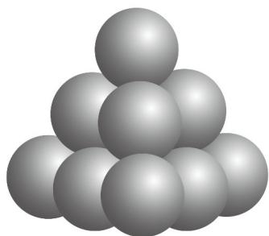

<!-- question-source:start -->
【变式1】如图的形状出现在南宋数学家杨辉所著的《详解九章算法·商功》中，后人称为“三角垛”·“三角垛”

的最上层有 $^{1}$ 个球，第二层有 $^{3}$ 个球，第三层有 $^{6}$ 个球，…，设各层球数构成一个数列 $\left\{a_{n}\right\}$ ，则 $a_{21}=$ （）

A. 58 B. 225 C. 210 D. 231
<!-- question-source:end -->

![[高中/课堂同步/题库/人教A版高中数学同步讲义(2026)/04_选择性必修第二册/第四章 数列/讲义/专题4_1_数列的概念_高效培优讲义_数学人教A版高二选择性必修第二册/_compact/answers/Q00061797A1.md]]
