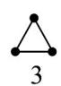
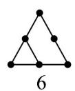
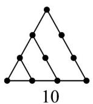
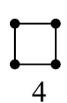
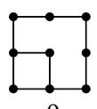
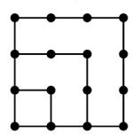
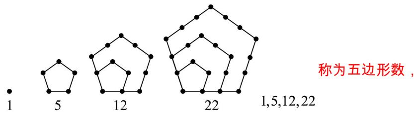

> [!faq]- 《专题4_1_数列的概念_高效培优讲义_数学人教A版高二选择性必修第二册》官方解析
>
> > [!success]- **【答案】** C
>
> > [!note]- **【分析】**
> > 利用 n 2 时， $a_{n}=S_{n}-S_{n-1}$ 得到 $a_{n}=\frac{2n+1}{n}(n-2)$ ，代入 n=4，求出答案.
>
> > [!note]- **【解析】**
> > 由题意可得 $a_{1} + 2a_{2} + 3a_{3} + \cdots + na_{n} = n \quad (n + 2)$ ①，
> >
> > 所以 n 2 时， $a_{1} + 2a_{2} + 3a_{3} + \cdots + (n-1)$ $a_{n-1} = (n-1)(n+1)$ ②，
> > - **①**：- ② 得 $na_{n} = 2n + 1$ ，所以 $a_{n} = \frac{2n + 1}{n}(n - 2)$
> >
> > 所以 $a_{4}=\frac{9}{4}$ .
> >
> > 故选：C.
> >
> > 3. 传说古希腊毕达哥拉斯学派的数学家用沙粒和小石子来研究数·他们根据沙粒或小石子所排列的形状把数
> >
> > 分成许多类，如图中第一行的 $^{1,3,6,10}$ 称为三角形数，第二行的 $^{1,4,9,16}$ 称为正方形数·则根据以上规律，可推
> >
> > 导出五边形数所构成的数列的第 $^{5}$ 项为（）
> >
> > •
> > 1
> >
> > 
> >
> > 
> >
> > 
> >
> > •
> > 1
> >
> > 
> >
> > 
> >
> > 
> >
> > 16
> >
> > A. 22 B. 26 C. 35 D. 51
> >
> > 【答案】C
> >
> > 【分析】类比三角形数和正方形数得到五边形数，再由从第二项起，后项与前项的差依次为 $4,7,10,13$ 求解
> >
> > 【详解】解：如图，
> >
> > 
> >
> > 从第二项起，后项与前项的差依次为 4,7,10,13，
> >
> > 所以五边形数的第 5 项为 $22 + 13 = 35$
> >
> > 故选 **C**.
