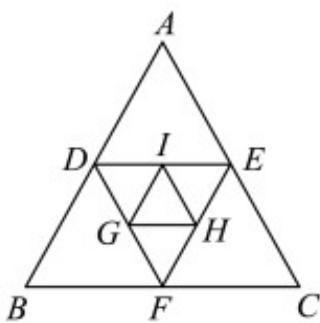

> [!faq]- 《专题4_3_1_等比数列的概念_高效培优讲义_数学人教A版高二选择性必》官方解析
>
> > [!success]- **【答案】** $\sqrt{3} \times \left( \frac{1}{4} \right)^{n - 2}$
>
> > [!note]- **【分析】**
> > 根据已知列出正三角形的面积，结合等比数列计算公比，再应用等比数列的通项公式计算·
>
> > [!note]- **【解析】**
> > 依题意，记各个正三角形的面积构成数列 $\{a_{n}\}$
> >
> > 依次为 $a_{1}=\frac{1}{2}\times4\times4\times\frac{\sqrt{3}}{2}=4\sqrt{3},a_{2}=\sqrt{3},a_{3}=\frac{\sqrt{3}}{4},\cdots$ ，由此可知，数列 $\left\{a_{n}\right\}$ 为等比数列，其公比 $q=\frac{1}{4}$
> >
> > 所以第 $n$ 个正三角形的面积为 $a_{n} = a_{1}q^{n - 1} = \sqrt{3}\times \left(\frac{1}{4}\right)^{n - 2}$
> >
> > 
> >
> > 故答案为： $\sqrt{3}\times\left(\frac{1}{4}\right)^{n-2}$
