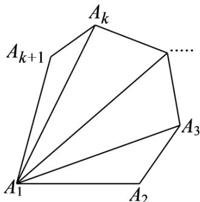

## 题型07 用数学归纳法证明几何问题

【典例1】用数学归纳法证明：凸 $n$ 边形的内角和 $f(n) = (n - 2)\cdot 180^{\circ}\left(n\quad 3,n\in \mathbf{N}^{*}\right)$

【答案】证明见解析

【分析】验证当 $n = 3$ 时，结论成立；假设当 $n = k(k \in \mathbf{N}^*)$ 时，结论成立，分析可知凸 $k + 1(k - 3, k \in \mathbf{N}^*)$ 边形

$A_{1}A_{2}\cdots A_{k}A_{k+1}$ 边形可以在以 $A_{1}A_{k}$ 为边的 $\triangle A_{1}A_{k}A_{k+1}$ 与凸 k 边形 $A_{1}A_{2}\cdots A_{k}$ 拼接而成，即可得出

$f(k + 1) = f(k) + 180^{\circ}$ 成立，这说明当 $n = k + 1$ 时，结论成立，再由归纳原理可证得结论成立

【详解】证明：当 $n = 3$ 时，三角形的内角和为 $180^{\circ}$ ，即 $f(3) = 180^{\circ} = (3 - 2)\cdot 180^{\circ}$ ，结论成立；

假设当 $n = k \left( k \in \mathbf{N}^{*}, k \quad 3 \right)$ 时，结论成立，即 $f(k) = (k - 2) \cdot 180^{\circ}$

假设凸 $k+1\left(k\quad3,k\in\mathbf{N}^{*}\right)$ 边形 $A_{1}A_{2}\cdots A_{k}A_{k+1}$ ，如下图所示：

则凸 $k+1(k\quad3,k\in\mathbf{N}^{*})$ 边形 $A_{1}A_{2}\cdots A_{k}A_{k+1}$ 边形可以在以 $A_{1}A_{k}$ 为边的 $\triangle A_{1}A_{k}A_{k+1}$ 与凸 k 边形 $A_{1}A_{2}\cdots A_{k}$ 拼接而成，

所以， $f(k + 1) = f(k) + 180^{\circ} = (k - 2)\cdot 180^{\circ} + 180^{\circ} = (k - 1)\cdot 180^{\circ}$

这说明当 $n = k + 1$ 时，结论成立，

故凸 n 边形的内角和 $f(n)=(n-2)\cdot180^{\circ}(n\quad3,n\in\mathbf{N}^{*})$ .

## 方法技巧

用数学归纳法证明几何问题的关键是“找项”，即几何元素从 $k$ 个变成 $(k + 1)$ 个时，所证的几何量将增

加多少．一般地，证明二步时，常用的方法是加1法，即在原来 $k$ 的基础上，再增加1个，当然我们也可以

从 $(k + 1)$ 个中分出1个来，剩下的 $k$ 个利用假设．几何问题的证明一要注意数形结合，二要注意要有必要

的文字说明．

![[高中/课堂同步/题库/人教A版高中数学同步讲义(2026)/04_选择性必修第二册/第四章 数列/讲义/专题4_4_数学归纳法_高效培优讲义_数学人教A版高二选择性必修第二册/_compact/Q00061983.md]]
![[高中/课堂同步/题库/人教A版高中数学同步讲义(2026)/04_选择性必修第二册/第四章 数列/讲义/专题4_4_数学归纳法_高效培优讲义_数学人教A版高二选择性必修第二册/_compact/Q00061984.md]]
![[高中/课堂同步/题库/人教A版高中数学同步讲义(2026)/04_选择性必修第二册/第四章 数列/讲义/专题4_4_数学归纳法_高效培优讲义_数学人教A版高二选择性必修第二册/_compact/Q00061985.md]]
