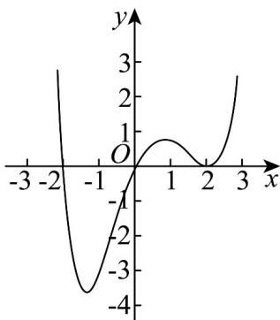

<!-- question-source:start -->
6．已知函数 $f(x)$ 的定义域为 R，且 $f(x)$ 的图象是一条连续不断的曲线， $f(x)$ 的导函数为 $f'(x)$ ，若函

数 $g(x) = (x + 2)f'(x)$ 的图象如图所示，则（）

A. $f(x)$ 的单调递减区间是 $(- \infty, 0)$

B. $f(x)$ 的单调递增区间是 $(-1, 1), (2, +\infty)$

C. 当 $x = 2$ 时， $f(x)$ 有极值

D. 当 $x = 1$ 时， $f'(x) < 0$
<!-- question-source:end -->

![[高中/课堂同步/题库/人教A版高中数学同步讲义(2026)/05_选择性必修第三册/月考/阶段测试/高二数学下学期第一次月考_人教A版_高效培优_强化卷_/一_选择题/questions/answers/Q00058816A1.md]]
