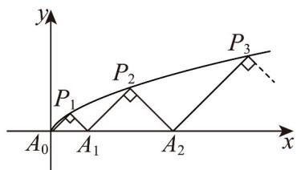

<!-- question-source:start -->
19. (17 分)

如图所示， $P_{1}(x_{1},y_{1})$ ， $P_{2}(x_{2},y_{2})$ ，…， $P_{n}(x_{n},y_{n})$ ，…是曲线 $C:y^{2}=\frac{1}{2}x(y0)$ 上的点， $A_{1}(a_{1},0)$ ， $A_{2}(a_{2},0)$ ，…， $A_{n}(a_{n},0)$ ，…是x轴正半轴上的点，且 $\triangle A_{0}A_{1}P_{1}$ ， $\triangle A_{1}A_{2}P_{2}$ ，…， $\triangle A_{n-1}A_{n}P_{n}$ ，…均为等腰直角三角形（ $A_{0}$ 为坐标原点）.

(1)计算 $a_{1}$ ， $a_{2}$ ， $a_{3}$ ，猜想 $\left\{a_{n}\right\}$ 的通项公式；

(2)用数学归纳法证明你的猜想；

(3)求数列 $\left\{\frac{1}{a_n}\right\}$ 的前 $n$ 项和 $S_{n}$ ：
<!-- question-source:end -->

![[高中/课堂同步/题库/人教A版高中数学同步讲义(2026)/05_选择性必修第三册/月考/阶段测试/高二数学下学期第一次月考_人教A版_高效培优_强化卷_/三_填空题/questions/answers/Q00058829A1.md]]
