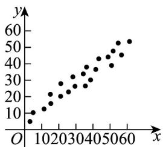
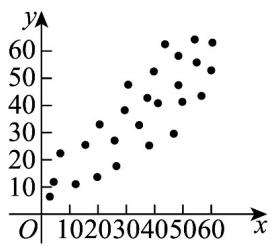
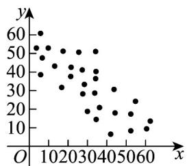

<!-- question-source:start -->
2. 对四组数据进行统计，获得如图所示的散点图，其中相关系数最小的是（）

图①(相关系数 $r_{1}$ )

图②(相关系数 $r_{2}$ )

图③(相关系数 $r_{3}$ )

图④(相关系数 $r_{4}$ )

A. $r_1$ B. $r_2$ C. $r_3$ D. $r_4$
<!-- question-source:end -->

![[高中/课堂同步/题库/人教A版高中数学同步讲义(2026)/05_选择性必修第三册/月考/阶段测试/高二数学下学期第三次月考卷_人教A版必修一_选修三全册_高效培优_/一_选择题_sec_02/questions/answers/Q00060035A1.md]]
