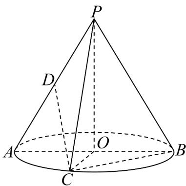

<!-- question-source:start -->
6．如图，圆锥 $PO$ 的底面圆周上有 $A, B, C$ 三点， $AB$ 为底面圆 $O$ 的直径，点 $C$ 是底面直径 $AB$ 所对弧的中

点，点 $D$ 是母线 $PA$ 的中点，若 $AB = PO = 2$ ，则直线 $CD$ 和平面 $PBC$ 所成角的正弦值为（）

A. $\frac{1}{3}$ B. $\frac{4}{9}$ C. $\frac{\sqrt{65}}{9}$ D. $\frac{2\sqrt{2}}{3}$
<!-- question-source:end -->

![[高中/课堂同步/题库/人教A版高中数学同步讲义(2026)/05_选择性必修第三册/月考/阶段测试/高二数学下学期第三次月考卷_人教A版必修一_选修三全册_高效培优_/一_选择题_sec_02/questions/answers/Q00060039A1.md]]
