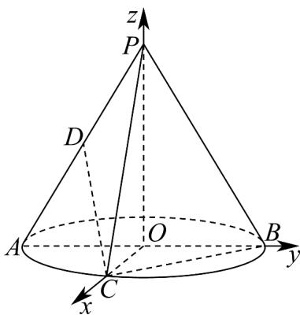

> [!faq]- 《高二数学下学期第三次月考卷_人教A版必修一_选修三全册_高效培优_》官方解析
>
> > [!success]- **【答案】** B
>
> > [!note]- **【解析】**
> > 点 C 是底面直径 AB 所对弧的中点，所以 $OC \perp AB$ ，建立空间直角坐标系如图所示：
> >
> > 
> >
> > 则 $O(0,0,0)$ ， $P(0,0,2)$ ， $A(0,-1,0)$ ， $B(0,1,0)$ ， $C(1,0,0)$ ， $D\left(0,-\frac{1}{2},1\right)$
> >
> > 可得 $\overset{\square\square\square}{PB} = (0,1,-2)$ ， $\overset{\square\square\square}{PC} = (1,0,-2)$ ， $\overset{\square\square\square}{DC} = \left(1,\frac{1}{2},-1\right)$
> >
> > 设平面 $PBC$ 的法向量为 $n = (x,y,z)$ ，则 $\left\{ \begin{array}{l} \square \square \square \\ PB \cdot n = y - 2z = 0 \\ \square \square \square \\ PC \cdot n = x - 2z = 0 \end{array} \right.$
> >
> > 令 z=1，则 x=y=2，可得 $n=(2,2,1)$
> >
> > 设直线 CD 和平面 PBC 所成角为 $\theta$ ，
> >
> > $\sin \theta = \left|\cos \left\langle \overrightarrow{DC}, n \right\rangle \right| = \frac{\left|\overrightarrow{DC} \cdot n\right|}{\left|DC\right|\left|n\right|} = \frac{\left|2 + 1 - 1\right|}{\sqrt{\frac{9}{4}} \times \sqrt{9}} = \frac{4}{9}$ . 可得
