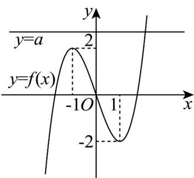

> [!faq]- 《高二数学下学期第一次月考（人教A版选择性必修数列 导数，高效培优·提升卷）[56877320]》官方解析
>
> > [!success]- **【答案】** $(-∞,-2)∪(2,+∞)$
>
> > [!note]- **【解析】**
> > 由题可得 $f'(x)=3x^{2}-3(x\in\mathbb{R})$
> >
> > 令 $f'(x)=3x^{2}-3=0$ ，得 $x=\pm1$
> >
> > 令 $f'(x)=3x^{2}-3>0$ ，得 x<-1 或 x>1 ，
> >
> > 令 $f'(x)=3x^{2}-3<0$ ，得 -1<x<1 ，
> >
> > 所以 $f(x)$ 的单调递增区间为： $(- \infty, -1)$ ， $(1, +\infty)$ ；减区间为： $(-1, 1)$ ，
> >
> > 可得极大值为 $f(-1)=2$ ，极小值为 $f(1)=-2$ ，
> >
> > $x \rightarrow -\infty$ $f(x) \rightarrow -\infty$ $x \rightarrow +\infty$ $f(x) \rightarrow +\infty$ 时，
> >
> > $y = f(x)$ 的大致图象如图，
> >
> > 
> >
> > 若函数 $f(x) = x^3 - 3x$ 的图象与直线 $y = a$ 有且仅有一个公共点，
> >
> > 观察图象得 a < -2 ，或 a > 2 时仅有一个公共点.
> >
> > 故答案为： $(-∞,-2)∪(2,+∞)$
> >
> > 13. 欧拉函数 $\varphi(n)$ ( $n \in \mathbf{N}^*$ ) 的函数值等于所有不超过正整数 $n$ ，且与 $n$ 互素的正整数的个数，例如 $n = 9$
> >
> > 时，满足的为 1, 2, 4, 5, 7, 8，则 $\varphi(9) = 6$ 。数列 $\left\{a_n\right\}$ 满足 $a_n = \varphi(3^n)$ ，则 $\left\{a_n\right\}$ 的前 $n$ 项和大于 1000 的
> >
> > 最小整数 $n =$
> >
> > 【答案】7
> >
> > 【详解】因为与 $3^{n}$ 互素的数为1,2,4,5,7,8,10,11,…, $3^{n}-1$ ，共有 $2\times3^{n-1}$
> >
> > 所以 $\varphi\left(3^{n}\right)=2\times3^{n-1}$ ，则 $a_{n}=\varphi\left(3^{n}\right)=2\times3^{n-1}$
> >
> > 于是 $S_{n} = \frac{2 - 2\times 3^{n}}{1 - 3} = 3^{n} - 1$
> >
> > 所以 $3^{n}-1>1000$ ，即 $3^{n}>1001$ ，
> >
> > 所以最小整数 n = 7 .
> >
> > 故答案为：7.
