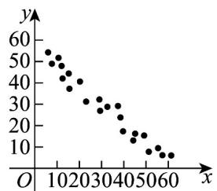

> [!faq]- 《高二数学下学期第三次月考卷（人教A版必修一-选修三全册，高效培优）》官方解析
>
> > [!success]- **【答案】**  图①(相关系数 $r_{1}$ )  图②(相关系数 $r_{2}$ )  图③(相关系数 $r_{3}$ )  图④(相关系数 $r_{4}$ ) A. $r_1$ B. $r_2$ C. $r_3$ D. $r_4$
>
> > [!note]- **【解析】**
> > 图①，数据点呈正线性相关，且相关性很强，所以 $r_{1}$ 接近1；
> >
> > 图②，数据点呈负线性相关，且相关性很强，所以 $r_{2}$ 接近-1；
> >
> > 图③，数据点呈正线性相关，且相关性比图①弱，所以 $0 < r_{3} < r_{1} < 1$
> >
> > 图④，数据点呈负线性相关，且相关性比图②弱，所以 $0 > r_{4} > r_{2} > -1$ ；
> >
> > 所以 $-1 < r_{2} < r_{4} < 0 < r_{3} < r_{1} < 1$
