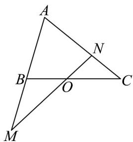
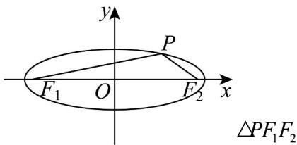

> [!faq]- 《高二数学下学期第三次月考卷（人教A版必修一-选修三全册，高效培优）》官方解析
>
> > [!success]- **【答案】**  A.2 B.8 C.9 D.18
>
> > [!note]- **【解析】**
> > 因为点 $O$ 是 $BC$ 的中点，则 $\overline{AO} = \frac{1}{2}\left(\overline{AB} +\overline{AC}\right)$ ，又 $\overline{AB} = m\overline{AM},\overline{AC} = n\overline{AN}$ ，则 $AO = \frac{1}{2} mAM + \frac{1}{2} nAN,$ 又三点共线，则，所以 $\left\{ \begin{array}{l}\frac{1}{2} m = \lambda \\ \frac{1}{2} n = 1 - \lambda \\ m + n = 2 \end{array} \right.$ 由 $m + n = 2$ ，得到 $3m + 3n + 2 = 8$ ，所以 $\frac{3}{m} +\frac{81}{3n + 2} = \frac{1}{8}\left(\frac{9}{3m} +\frac{81}{3n + 2}\right)(3m + 3n + 2) = \frac{1}{8}\left(9 + \frac{243m}{3n + 2} +\frac{9(3n + 2)}{3m} +81\right),$ 又 $m > 0,n > 0$ ，则 $\frac{243m}{3n + 2} +\frac{9(3n + 2)}{3m}\quad 2\sqrt{\frac{243m}{3n + 2}\cdot\frac{9(3n + 2)}{3m}} = 54$
> >
> > 当且仅当 $\left\{ \begin{array}{l} m + n = 2 \\ \frac{243m}{3n + 2} = \frac{9(3n + 2)}{3m} \end{array} \right.$ ，即 $m = \frac{2}{3}, n = \frac{4}{3}$ 时取等号，
> >
> > 所以 $\frac{3}{m} +\frac{81}{3n + 2}$ $\frac{1}{8}\big(9 + 54 + 81\big) = 18$
> >
> > 8. 点 $P$ 在以 $F_{1}, F_{2}$ 为焦点的椭圆 $\frac{x^{2}}{a^{2}} + \frac{y^{2}}{b^{2}} = 1 (a > b > 0)$ 上，若 $\angle PF_{1}F_{2} = \alpha, \angle PF_{2}F_{1} = \beta$ ，且
> >
> > $\alpha, \beta \in \left(0, \frac{\pi}{2}\right), \cos \alpha = \frac{\sqrt{2}}{2}, \tan (\alpha + \beta) = \frac{4}{3}$ ，则椭圆的离心率为（ ）A. $\frac{\sqrt{3}}{4}$ B. $\frac{\sqrt{2}}{3}$ C. $\frac{2\sqrt{2}}{3}$ D. $\frac{\sqrt{5}}{4}$
> >
> > 【答案】C
> >
> > 【详解】如图，
> >
> > 
> >
> > 中，若
> >
> > $$
> > \angle P F _ {1} F _ {2} = \alpha , \angle P F _ {2} F _ {1} = \beta , \quad \angle F _ {1} P F _ {2} = \pi - (\alpha + \beta)
> > $$
> >
> > 所以 $\sin\angle F_{1}PF_{2}=\sin(\alpha+\beta)$
> >
> > 因为 $\alpha\in\left(0,\frac{\pi}{2}\right),\cos\alpha=\frac{\sqrt{2}}{2}$ ，所以 $\sin\alpha=\sqrt{1-\cos^{2}\alpha}=\frac{\sqrt{2}}{2}$ ;
> >
> > 因为 $\alpha, \beta \in \left(0, \frac{\pi}{2}\right)$ , 所以 $\alpha + \beta \in (0, \pi)$
> >
> > 因为 $\tan\left(\alpha+\beta\right)=\frac{4}{3}>0,\quad\alpha+\beta\in\left(0,\frac{\pi}{2}\right)$
> >
> > 由 $\left\{ \begin{array}{l} \frac{\sin (\alpha + \beta)}{\cos (\alpha + \beta)} = \frac{4}{3} \\ \sin^2 (\alpha + \beta) + \cos^2 (\alpha + \beta) = 1 \end{array} \right.$ ，得 $\left\{ \begin{array}{l} \sin (\alpha + \beta) = \frac{4}{5} \\ \cos (\alpha + \beta) = \frac{3}{5} \end{array} \right.$ .
> >
> > 所以 $\sin \beta = \sin [(\alpha +\beta) - \alpha ] = \sin (\alpha +\beta)\cos \alpha -\cos (\alpha +\beta)\sin \alpha = \frac{4}{5}\times \frac{\sqrt{2}}{2} -\frac{3}{5}\times \frac{\sqrt{2}}{2} = \frac{\sqrt{2}}{10}.$
> >
> > 由正弦定理 $\frac{\left|PF_{1}\right|}{\sin\beta}=\frac{\left|PF_{2}\right|}{\sin\alpha}=\frac{\left|F_{1}F_{2}\right|}{\sin\angle F_{1}PF_{2}}$ ，得 $\frac{\left|PF_{1}\right|+\left|PF_{2}\right|}{\sin\alpha+\sin\beta}=\frac{\left|F_{1}F_{2}\right|}{\sin(\alpha+\beta)}$
> >
> > 设椭圆的焦距为 $\frac{2c}{a}$ ，则椭圆的离心率 $e=\frac{c}{a}=\frac{2c}{2a}=\frac{\sin(\alpha+\beta)}{\sin\alpha+\sin\beta}=\frac{\frac{4}{5}}{\frac{\sqrt{2}}{10}+\frac{\sqrt{2}}{2}}=\frac{2\sqrt{2}}{3}$
> >
> > ## 二、选择题：本题共3小题，每小题6分，共18分．在每小题给出的选项中，有多项符合题目要求．全部选对的得6分，部分选对的得部分分，有选错的得0分.
