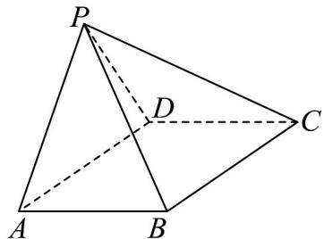

<!-- question-source:start -->
16．（15分）如图，在四棱锥 $P - ABCD$ 中， $\triangle PAD$ 为正三角形， $\angle ADC = 120^{\circ},AD = DC = 2,PC = \sqrt{10}$

(1)证明：平面 $PAD \perp$ 平面ABCD；

(2)若 $\angle ABC = 120^{\circ}$ ，且平面 $ABP$ 与平面 $APD$ 的夹角的余弦值为 $\frac{\sqrt{21}}{7}$ ，求 $AB$ 的长.
<!-- question-source:end -->

![[高中/课堂同步/题库/人教A版高中数学同步讲义(2026)/05_选择性必修第三册/月考/高二数学下学期第三次月考卷（人教A版必修一-选修三全册，高效培优）/四_解答题/questions/answers/Q00082648A1.md]]
