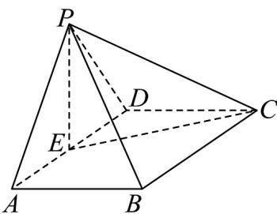
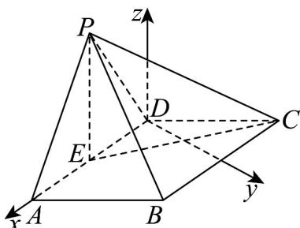

> [!faq]- 《高二数学下学期第三次月考卷（人教A版必修一-选修三全册，高效培优）》官方解析
>
> > [!success]- **【答案】** (1)证明见解析(2) $2\sqrt{2}$
>
> > [!note]- **【解析】**
> > （1）如图：取AD的中点E，连接PE,EC.
> >
> > 
> >
> > 因为 $AD = 2$ ，所以 $DE = 1$ ，在 $\triangle DEC$ 中， $\angle ADC = 120^{\circ},DC = 2$
> >
> > 由余弦定理得 $CE = \sqrt{CD^{2} + DE^{2} - 2CD \cdot DE \cdot \cos 120^{\circ}} = \sqrt{4 + 1 + 2 \times 2 \times 1 \times \frac{1}{2}} = \sqrt{7}$
> >
> > 因为 $\triangle PAD$ 为等边三角形，所以 $PE = \sqrt{3}$
> >
> > 在 $\triangle \mathrm{PEC}$ 中， $PC = \sqrt{10}$ ，则 $PE^2 +CE^2 = PC^2$ ，所以 $PE\bot CE$
> >
> > 因为 $PE \perp AD, AD \cap CE = E$ ， $AD, CE \subset$ 平面 $ABCD$ ，所以 $PE \perp$ 平面 $ABCD$
> >
> > 因为 $PE \subset$ 平面 PAD ，所以平面 $PAD \perp$ 平面 ABCD ；
> >
> > (2) 以 $D$ 为坐标原点， $DA$ 的方向为 $x$ 轴正方向，建立如图所示的空间直角坐标系 $D - xyz$
> >
> > 
> >
> > 因为 $\angle ABC = 120^{\circ},\angle ADC = 120^{\circ},AD = DC = 2$
> >
> > 因为 $360^{\circ} - \angle ADC = 2\angle ABC$
> >
> > 根据圆心角与圆周角关系可判断点 B 在以点 D 为圆心，半径为 2 的圆上，所以 BD = 2
> >
> > 三角形 PAD 为正三角形，所以 $PE \perp AD$ .
> >
> > 由（1）可知， $PE \perp$ 平面 ABCD ，所以 $PE \parallel z$ 轴，
> >
> > 所以由题设得 $A(2,0,0), P(1,0,\sqrt{3})$
> >
> > 设 $\angle ADB = \theta, 0 < \theta < \frac{2\pi}{3}$ ，故 $B(2\cos \theta, 2\sin \theta, 0)$ ，
> >
> > 则 $\overline{PA}=\left(1,0,-\sqrt{3}\right),\overline{AB}=\left(2\cos\theta-2,2\sin\theta,0\right)$
> >
> > 设平面 $PAD$ 的一个法向量 $m = (0,1,0)$ ，平面 $PAB$ 的一个法向量 $n = (x,y,z)$
> >
> > 则 $\left\{ \begin{array}{l} P A \cdot n = 0 \\ AB \cdot n = 0 \end{array} \right.$ ，即 $\left\{ \begin{array}{l} x - \sqrt{3} z = 0 \\ 2 (\cos \theta - 1) x + (2 \sin \theta) y = 0 \end{array} \right.$
> >
> > 可取 $n = \left(\sqrt{3}\sin \theta ,\sqrt{3}\left(1 - \cos \theta\right),\sin \theta\right)$
> >
> > 记平面 ABP 与平面 APD 的夹角为 $\alpha$ ，
> >
> > $$
> > \text {则} \cos \alpha = \frac {\left| m \cdot n \right|}{\left| m \right| \left| n \right|} = \frac {\sqrt {3} (1 - \cos \theta)}{\sqrt {1} \cdot \sqrt {3 \sin^ {2} \theta + 3 (1 - \cos \theta) ^ {2} + \sin^ {2} \theta}} = \frac {\sqrt {2 1}}{7},
> > $$
> >
> > $$
> > \text {其中} \sqrt {3 \sin^ {2} \theta + 3 (1 - \cos \theta) ^ {2} + \sin^ {2} \theta} = \sqrt {4 \sin^ {2} \theta + 3 (1 - 2 \cos \theta + \cos^ {2} \theta)}
> > $$
> >
> > $$
> > = \sqrt {4 (1 - \cos^ {2} \theta) + 3 - 6 \cos \theta + 3 \cos^ {2} \theta} = \sqrt {4 - 4 \cos^ {2} \theta + 3 - 6 \cos \theta + 3 \cos^ {2} \theta}
> > $$
> >
> > $$
> > = \sqrt {- \cos^ {2} \theta - 6 \cos \theta + 7} = \sqrt {(1 - \cos \theta) (7 + \cos \theta)}
> > $$
> >
> > 所以 $\cos\alpha=\frac{\left|\underset{\rightarrow}{m}\cdot n\right|}{\left|m\right|\left|n\right|}=\frac{\sqrt{3}(1-\cos\theta)}{\sqrt{(1-\cos\theta)(7+\cos\theta)}}=\frac{\sqrt{21}}{7},\cos\theta\neq1$
> >
> > 原式可约分得 $\frac{\sqrt{3}\cdot\sqrt{1-\cos\theta}}{\sqrt{7+\cos\theta}}=\frac{\sqrt{21}}{7}$
> >
> > 两边平方： $\frac{3(1 - \cos\theta)}{7 + \cos\theta} = \frac{21}{49} = \frac{3}{7}$ ，化简得 $7(1 - \cos \theta) = 7 + \cos \theta$
> >
> > 解得 $\cos \theta = 0$ ， $\theta = \frac{\pi}{2} + k\pi (k\in \mathbf{Z})$ ，由图可知 $\theta = \frac{\pi}{2}$
> >
> > 所以 $B(0,2,0)$ ，所以 $\overline{AB} = (-2,2,0)$ ，则 $AB = 2\sqrt{2}$
